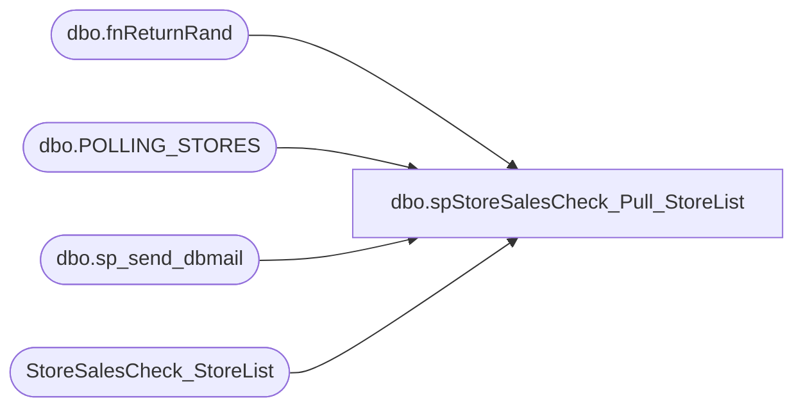

# dbo.spStoreSalesCheck_Pull_StoreList

**Database:** dw  
**Server:** papamart  

## Architecture Diagram



## Table Dependencies

| Referenced Table |
|---|
| dbo.fnReturnRand |
| dbo.POLLING_STORES |
| dbo.sp_send_dbmail |
| StoreSalesCheck_StoreList |

## Stored Procedure Code

```sql
-- =============================================================================================================
-- Name: spStoreSalesCheck_StoreList
--
-- Description:	
--		Pull a list of stores which need to have yesterday's sales validated
--		
--		This can vary based on the iCoalitionStore flag.  Paul Beckman and group will change this flag depending
--		on whether stores should be excluded, e.g., stadium stores during off periods.
--
--		Have to run this on a 2008 sql server because of the NTILE function.  
--
--		NOTE:  do not change the NTILE breakout unless you also modify the SSIS package.  This is used to 
--			parallel process the stores in hopes of speeding things up.  If you add more groups then add 
--			extra "foreach" loops.
--
--
--
-- Input:
--
-- Output: 
--
-- Dependencies: 
--
-- EXAMPLE:
--		exec dbo.spStoreSalesCheck_Pull_StoreList 
--
-- Revision History
--		Name:			Date:			Comments:
--		Dave Rice		8/11/2010		created
--		Dan TWeedie		20171009		Pointed query to new table that Paul Beckman setup for this purpose
-- =============================================================================================================

CREATE PROCEDURE [dbo].[spStoreSalesCheck_Pull_StoreList]
AS
BEGIN
-- SET NOCOUNT ON added to prevent extra result sets from
-- interfering with SELECT statements.
SET NOCOUNT ON;

-- send out an email saying we're chugging along
declare @subject varchar(100)
declare @recipients varchar(200)
declare @body nvarchar(4000)

set @subject = 'StoreSalesCheck - Started'
set @recipients = 'poll@buildabear.com;Databears@buildabear.com'


set @body = 
	'
	<html>
	<body>
	<STYLE TYPE="text/css">
	<!--
	TD{font-family: Arial; font-size: 9pt; text-align: right}
	--->
	</STYLE>
	Pulling Store List
	'
	
	set @body = @body +
	'
	<br>
	<font face =arial size = 1><i>This was run from papamart.dw.dbo.spStoreSalesCheck_Pull_StoreList.</i></font>
	</body>
	<html>
	'

EXEC msdb.dbo.sp_send_dbmail 
	@recipients = @recipients, 
    @subject = @subject,
	@body_format = 'HTML', @body = @body

-- ***************************************************************8

truncate table StoreSalesCheck_StoreList


----------------------------------
insert into StoreSalesCheck_StoreList(store_id, store_ip, store_group, server_name)
SELECT 
	cast(STORE_NUM as int) AS istoreid,
	concat('SW0',right(concat('0000', cast(store_num as varchar)),4),'00001') as store_ip, --USING SERVERNAME NOW, BUT DON'T WANT TO HAVE TO UPDATE SSIS SO JUST USING SAME COLUMN
	NTILE(6) OVER(ORDER BY dbo.fnReturnRand() ASC) StoreGroup,
	NULL as ServerName -->>THIS IS ACTUALLY THE IP, BUT WE DON'T NEED THIS, I SWAPPED THE COLUMNS IP AND SERVERNAME
FROM bedrockdb01.auditworks.dbo.POLLING_STORES
WHERE POLLING_VLDTN = 1
AND POLLING_VLDTN_DATE <= GETDATE()


END
```

