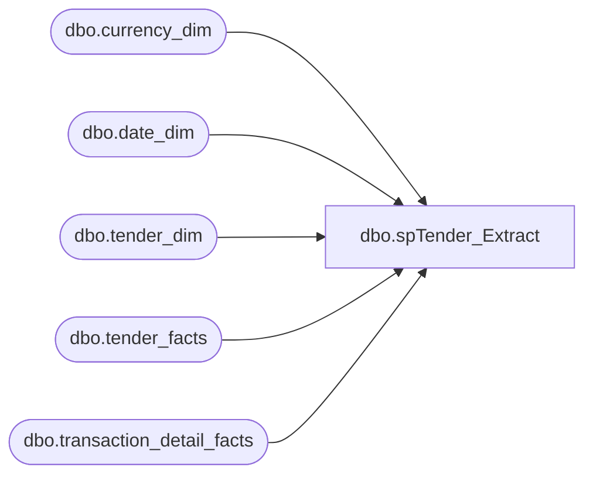

# dbo.spTender_Extract

**Database:** dw  
**Server:** papamart  

## Architecture Diagram



## Table Dependencies

| Referenced Table |
|---|
| dbo.currency_dim |
| dbo.date_dim |
| dbo.tender_dim |
| dbo.tender_facts |
| dbo.transaction_detail_facts |

## Stored Procedure Code

```sql
-- =============================================================================================================
-- Name: spTender_Extract
--
-- Description:	This will extract the information for the Giftcards that were submitted as Tender 
--		
--			This is normally submitted by Jack McCormick.
--
-- Input:		
--			@tender_code - Enter the desired tender code. For example: 699
--			@fromDate	- Enter the from calendar date
--			@thruDate	- Enter the through calendar date.
--
-- Output: 
--
-- Dependencies: 
--
-- Revision History
--		Name:					Date:			Comments:
---	Gary Murrish		1/2/2012	Changed Tender_Group_dim to tender_facts
--		Gary Murrish			5/17/2011		Initial release
-- =============================================================================================================
CREATE PROCEDURE [dbo].[spTender_Extract] @tender_code AS VARCHAR(5)
								   , @fromDate AS DATETIME
								   , @thruDate AS DATETIME
AS
BEGIN
	-- SET NOCOUNT ON added to prevent extra result sets from
	-- interfering with SELECT statements.
	SET NOCOUNT ON;
	IF OBJECT_ID('tempdb.dbo.#Tender')IS NOT NULL
		DROP TABLE
			 #Tender;

	SELECT --TOP 1000
		   dim.tender_code
		 , tdf.transaction_id
		 , DTE.fiscal_period
		 , dte.fiscal_year
		 , MIN(tender_amt)AS tender_amt
		 , CUR.currency_code INTO
								  #Tender
	  FROM
		   dbo.tender_facts TGD WITH (NOLOCK)
		   INNER JOIN dbo.transaction_detail_facts TDF WITH (NOLOCK)
			   ON TGD.transaction_id = TDF.transaction_id
		   INNER JOIN dbo.date_dim DTE WITH (NOLOCK)
			   ON TDF.date_key = DTE.date_key
		   INNER JOIN dbo.tender_dim DIM WITH (NOLOCK)
			   ON DIM.tender_key = tgd.tender_key
		   INNER JOIN dbo.currency_dim CUR WITH (NOLOCK)
			   ON TDF.currency_key = CUR.currency_key
	  WHERE DTE.actual_date BETWEEN @fromDate
		AND @thruDate
		AND DIM.tender_code = @tender_code
	  GROUP BY
			   dim.tender_code
			 , tdf.transaction_id
			 , DTE.fiscal_period
			 , dte.fiscal_year
			 , CUR.currency_code;

	SELECT
		   tender_code
		 , fiscal_year
		 , fiscal_period
		 , SUM(tender_amt)AS tender_amt
		 , currency_code
		 , COUNT(transaction_id)AS [# Transactions]
	  FROM #Tender WITH (NOLOCK)
	  GROUP BY
			   tender_code
			 , fiscal_year
			 , fiscal_period
			 , currency_code
	  ORDER BY
			   tender_code, fiscal_year, fiscal_period, currency_code;

END;
```

