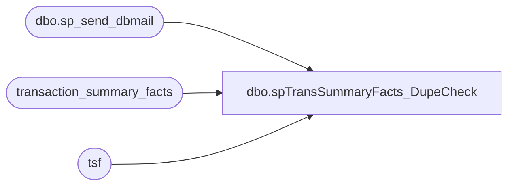

# dbo.spTransSummaryFacts_DupeCheck

**Database:** dw  
**Server:** papamart  

## Architecture Diagram



## Table Dependencies

| Referenced Table |
|---|
| dbo.sp_send_dbmail |
| transaction_summary_facts |
| tsf |

## Stored Procedure Code

```sql
--exec spTransSummaryFacts_DupeCheck

CREATE PROCEDURE [dbo].[spTransSummaryFacts_DupeCheck]
AS

-- =============================================================================================================
-- Name: [dbo].[spTransSummaryFacts_DupeCheck]
--
-- Description: 
--
-- Dependencies: 
--
-- Revision History
--		Name:					Date:			Comments:
--		Trista Parmentier		11/29/2011		modified to use sp_send_dbmail instead of xp_sendmail
--		?						?				original creation
-- =============================================================================================================

DECLARE @dupecnt int

select transaction_id,store_key,date_key,max(transaction_summary_key) as transaction_summary_key
into ##trans_summary_dupes_keep
from transaction_summary_facts (nolock)
group by transaction_id,store_key,date_key
having count(*) >1

select tsf.transaction_id, tsf.store_key, tsf.date_key, tsf.transaction_summary_key
into ##trans_summary_dupes_rid
from ##trans_summary_dupes_keep k
	join transaction_summary_facts tsf on k.transaction_id = tsf.transaction_id
		and k.store_key = tsf.store_key
		and k.date_key = tsf.date_key
		and k.transaction_summary_key <> tsf.transaction_summary_key


SET @dupecnt = (select count(*) from ##trans_summary_dupes_rid)

IF @dupecnt > 0
BEGIN
--NOTIFY OF ANY DUPES THAT WOULDN'T BE DELETED, BECAUSE THEY DIDN'T HAVE AMOUNT =0
	exec msdb.dbo.sp_send_dbmail @recipients='databears@buildabear.com', @subject ='Transaction_Summary_Facts Dupes PRE-FIX ', @query = 'select count(*) from ##trans_summary_dupes_rid d join dw..transaction_summary_facts tsf on tsf.transaction_summary_key = d.transaction_summary_key and tsf.store_key = d.store_key and tsf.transaction_id = d.transaction_id and tsf.date_key = d.date_key'

--REMOVE DUPES--
	delete tsf
	from ##trans_summary_dupes_rid d
		join transaction_summary_facts tsf on tsf.transaction_summary_key = d.transaction_summary_key 
			and tsf.store_key = d.store_key 
			and tsf.transaction_id = d.transaction_id
			and tsf.date_key = d.date_key
	

--POST CHECK---
	exec msdb.dbo.sp_send_dbmail @recipients='databears@buildabear.com', @subject ='Transaction_Summary_Facts Dupes POST-FIX CHECK (expect 0)', @query = 'select count(*) from dw..transaction_summary_facts (nolock) group by transaction_id,store_key,date_key having count(*) >1'
	END
ELSE
	BEGIN
	exec msdb.dbo.sp_send_dbmail @recipients='databears@buildabear.com', @subject ='Transaction_Summary_Facts NO Dupes'
	END
```

