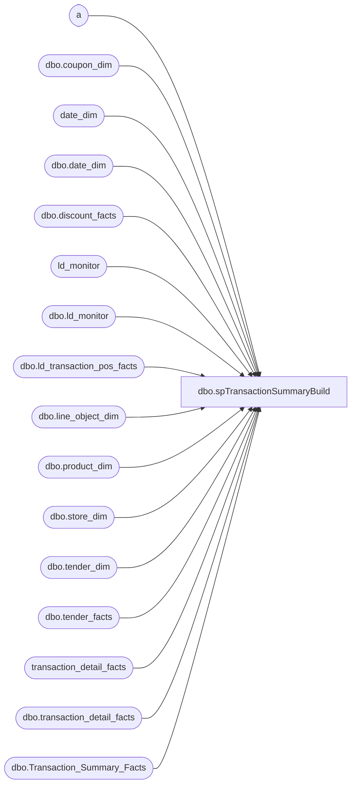

# dbo.spTransactionSummaryBuild

**Database:** dw  
**Server:** papamart  

## Architecture Diagram



## Table Dependencies

| Referenced Table |
|---|
| a |
| dbo.coupon_dim |
| date_dim |
| dbo.date_dim |
| dbo.discount_facts |
| ld_monitor |
| dbo.ld_monitor |
| dbo.ld_transaction_pos_facts |
| dbo.line_object_dim |
| dbo.product_dim |
| dbo.store_dim |
| dbo.tender_dim |
| dbo.tender_facts |
| transaction_detail_facts |
| dbo.transaction_detail_facts |
| dbo.Transaction_Summary_Facts |

## Stored Procedure Code

```sql
CREATE PROCEDURE [dbo].[spTransactionSummaryBuild]
	-- =============================================================================================================
	-- Name: spTransactionSummaryBuild
	--
	-- Description:	loads data into Transaction_Summary_Facts
	--
	-- Input:		
	--
	-- Output: 
	--
	-- Dependencies: 
	--
	-- Revision History
	--		Name:			Date:			Comments:
	--		Gary Murrish	5/5/2014		Moved SFS Cert Redemptions to Discounts from Tender
	--		Gary Murrish	7/1/2013		Added fin_GAAP_Sales and upsell_discount_amount
	--		Gary Murrish	2/21/2011		Added line object 104 as merchandise
	--		Keith Missey	5/19/2009		added GAAP line objects 296,1630,1631,102,l03
	--		Rick Caminiti	10/24/2011		Changed references from tender_group_dim to new table tender_facts
	-- =============================================================================================================
	/* ===== ARGUMENTS ===== */
	@StartDate datetime = NULL,
	@EndDate datetime = NULL,
	@bDebugFl bit = 0 -- Debug Flag

AS
	SET NOCOUNT ON

	/* ===== DECLARATIONS ===== */
	DECLARE	@iRowCnt int -- Used to save @@rowcount
			,
			@iErrNbr int -- Used to save @@error
			,
			@iRtnCd int -- Return code of procedure
			,
			@dStartDt datetime -- Time this procedure started
			,
			@dStopDt datetime -- Time this procedure ended
			,
			@SQLi varchar(8000),
			@sDateKeyList varchar(8000),
			@curDay char(2),
			@curMon char(2),
			@curYr char(4),
			@curDate datetime,
			@wkCurTY int
	--	,@StartDate datetime
	--	,@EndDate 	datetime
	--	,@bDebugFl	BIT 

	/* ===== INITIALIZE VARIABLES ===== */
	SELECT
		@iRtnCd = 0

	--SET	@StartDate = '11/26/2000'
	--SET	@EndDate = '12/30/2000'

	/* ============================================================================= */
	/* ================================  BEGIN  ==================================== */
	/* ============================================================================= */

	/********* PREPARE LOG TABLE*************************************/
	TRUNCATE TABLE ld_monitor

	INSERT INTO dbo.ld_monitor
		(	step,
			process_name,
			step_name,
			status,
			process_date)
	VALUES
		(	1,
			'Informatica',
			'Prod_Register_Load.wf_History_Load_wTax',
			'complete',
			GETDATE())
	INSERT INTO dbo.ld_monitor
		(	step,
			process_name,
			step_name,
			status,
			process_date)
	VALUES
		(	2,
			'spTransactionSummaryBuild',
			'Delete old metrics',
			NULL,
			NULL)
	INSERT INTO dbo.ld_monitor
		(	step,
			process_name,
			step_name,
			status,
			process_date)
	VALUES
		(	3,
			'spTransactionSummaryBuild',
			'Build ld_transaction_pos_facts',
			NULL,
			NULL)
	INSERT INTO dbo.ld_monitor
		(	step,
			process_name,
			step_name,
			status,
			process_date)
	VALUES
		(	4,
			'spTransactionSummaryBuild',
			'Discounts',
			NULL,
			NULL)
	INSERT INTO dbo.ld_monitor
		(	step,
			process_name,
			step_name,
			status,
			process_date)
	VALUES
		(	5,
			'spTransactionSummaryBuild',
			'Tenders',
			NULL,
			NULL)
	INSERT INTO dbo.ld_monitor
		(	step,
			process_name,
			step_name,
			status,
			process_date)
	VALUES
		(	6,
			'spTransactionSummaryBuild',
			'Collect totals',
			NULL,
			NULL)
	INSERT INTO dbo.ld_monitor
		(	step,
			process_name,
			step_name,
			status,
			process_date)
	VALUES
		(	7,
			'spTransactionSummaryBuild',
			'Insert into TSF',
			NULL,
			NULL)
	INSERT INTO dbo.ld_monitor
		(	step,
			process_name,
			step_name,
			status,
			process_date)
	VALUES
		(	8,
			'spMetricsBuild',
			'delete old rows',
			NULL,
			NULL)
	INSERT INTO dbo.ld_monitor
		(	step,
			process_name,
			step_name,
			status,
			process_date)
	VALUES
		(	9,
			'spMetricsBuild',
			'Transaction Rollup',
			NULL,
			NULL)
	INSERT INTO dbo.ld_monitor
		(	step,
			process_name,
			step_name,
			status,
			process_date)
	VALUES
		(	10,
			'spMetricsBuild',
			'Units by dept',
			NULL,
			NULL)
	INSERT INTO dbo.ld_monitor
		(	step,
			process_name,
			step_name,
			status,
			process_date)
	VALUES
		(	11,
			'spMetricsBuild',
			'Insert Metrics',
			NULL,
			NULL)
	INSERT INTO dbo.ld_monitor
		(	step,
			process_name,
			step_name,
			status,
			process_date)
	VALUES
		(	12,
			'spMetricsBuild',
			'Registrations',
			NULL,
			NULL)
	INSERT INTO dbo.ld_monitor
		(	step,
			process_name,
			step_name,
			status,
			process_date)
	VALUES
		(	13,
			'spMetricsBuild',
			'Populate missing date_keys',
			NULL,
			NULL)
	INSERT INTO dbo.ld_monitor
		(	step,
			process_name,
			step_name,
			status,
			process_date)
	VALUES
		(	14,
			'Ld_AWtoDWprep',
			'compare AW to DW',
			NULL,
			NULL)
	INSERT INTO dbo.ld_monitor
		(	step,
			process_name,
			step_name,
			status,
			process_date)
	VALUES
		(	15,
			'PollingReport_FlashSales',
			'email report',
			NULL,
			NULL)
	/****************************************************************/


	SET @curDay = DATEPART(dd, GETDATE())
	SET @curMon = DATEPART(mm, GETDATE())
	SET @curYr = DATEPART(yy, GETDATE())


	SET @curDate = CAST((@curMon + '/' + @curDay + '/' + @curYr) AS datetime)

	--SELECT @StartDate ='11/21/2003'
	--SELECT @EndDate ='12/4/2003'
	IF @StartDate IS NULL
	BEGIN
		SELECT
			@StartDate = DATEADD(dd, -31, @curDate)
		SELECT
			@EndDate = DATEADD(dd, -1, @curDate)
	END
	--select @StartDate,@EndDate


	/* ----- DEBUG */
	IF @bDebugFl = 1

	BEGIN
		PRINT 'Trans Summary ROLLUP'
		PRINT ' '
		PRINT @@SERVERNAME + '/' + DB_NAME()
		PRINT 'Procedure Name: ' + OBJECT_NAME(@@PROCID)
		PRINT 'Parmameter @StartDate: ' + CAST(@StartDate AS varchar)
		PRINT 'Parmameter @EndDate: ' + CAST(@EndDate AS varchar)
		PRINT ' '
	END


	/***************************************************************/
	/*********************  DELETE PAST WEEK **********************/
	/***************************************************************/


	DELETE --dbo.Transaction_Summary_Facts
	FROM dbo.Transaction_Summary_Facts
	WHERE date_key IN (SELECT
				date_key
			FROM
				dbo.date_dim
			--WHERE actual_date BETWEEN '2004-07-07 00:00:00.000' AND '2004-07-13 00:00:00.000')				
			WHERE
				actual_date BETWEEN @StartDate AND @EndDate)
	--and Transaction_Summary_key in (select Transaction_Summary_key from Transaction_Summary_Dim)

	SELECT
		@iRowCnt = @@RowCount,
		@iErrNbr = @@Error

	/* ----- DEBUG */

	IF @bDebugFl = 1

		PRINT 'Rows deleted from Transaction_Summary_Facts for past week: ' + LTRIM(STR(@iRowCnt))

	--log------------------------------------------------------------
	UPDATE dbo.ld_monitor
		SET	status = 'complete',
			process_date = GETDATE()
	WHERE step = 2
	-----------------------------------------------------------------

	/***************************************************************/
	/************ Prep build:  ld_transaction_pos_facts ************/
	/***************************************************************/
	IF EXISTS (SELECT
				*
			FROM
				sysobjects
			WHERE
				id = OBJECT_ID('dbo.ld_transaction_pos_facts')
				AND sysstat & 0xf = 3)
	BEGIN
		DROP TABLE dbo.ld_transaction_pos_facts
	END

	SELECT /*tdf.tender_group_key - removed because this column will no longer be used due to adding tender_facts table*/
		tdf.store_key,
		tdf.date_key,
		tdf.time_key,
		tdf.line_object_key,
		tdf.product_key,
		tdf.transaction_id,
		tdf.Transaction_No,
		tdf.register_num,
		tdf.party_y_n,
		tdf.transaction_type_key,
		tdf.unit_gross_amount,
		tdf.unit_disc_amount,
		tdf.Units,
		tdf.upsell_disc_allocated
	INTO dbo.ld_transaction_pos_facts
	FROM
		transaction_detail_facts tdf
		JOIN date_dim dd
			ON tdf.date_key = dd.date_key
	WHERE
		dd.actual_date BETWEEN @StartDate AND @EndDate
		AND transaction_line_seq > 0

	--CREATE  clustered index idxC_NU_ld_transaction_pos_facts_date_key on dbo.ld_transaction_pos_facts (date_key, store_key, product_key, line_object_key, tender_group_key, transaction_id, register_num, transaction_type_key, transaction_line_seq)
	CREATE INDEX idxN_NU_ld_transaction_pos_facts_ix1 ON dbo.ld_transaction_pos_facts (/*tender_group_key - removed column from table, */ store_key, date_key, transaction_id, register_num)
	CREATE INDEX idxN_NU_ld_transaction_pos_facts_ix2 ON dbo.ld_transaction_pos_facts (store_key, date_key, line_object_key, product_key, transaction_id, register_num, party_y_n, transaction_type_key, unit_gross_amount, unit_disc_amount, Units)


	--log------------------------------------------------------------
	UPDATE dbo.ld_monitor
		SET	status = 'complete',
			process_date = GETDATE()
	WHERE step = 3
	-----------------------------------------------------------------

	/***************************************************************/
	/************************ COUPONS ******************************/
	/***************************************************************/
	--this gets total coupon amount that needs to be subtracted out of total sale


	IF (OBJECT_ID('tempdb..#tempdiscdetail') IS NOT NULL)
		DROP TABLE #tempdiscdetail

	SELECT
		df.transaction_id,
		df.store_key,
		df.date_key,
		lo.Line_Object_Type,
		lo.Line_Object,
		cd.Retail_Pro,
		--lo.Line_Object_Description,
		--CASE WHEN cd.Retail_Pro IN (6764,106764) THEN isnull(df.unit_gross_amount,0)/3.86
		--     ELSE isnull(df.unit_gross_amount,0) END as discountAmt,
		ISNULL(df.unit_gross_amount, 0) AS discountAmt,
		ISNULL(df.Units, 0) AS discountUnits,
		CASE
			WHEN lo.Line_Object = -1617 THEN df.unit_gross_amount
			ELSE 0
		END AS upsell_discount_amount

	INTO #tempdiscdetail

	FROM
		dbo.discount_facts df
		JOIN dbo.store_dim s
			ON s.store_key = df.store_key

		JOIN dbo.date_dim d
			ON d.date_key = df.date_key
		JOIN dbo.line_object_dim lo
			ON lo.line_object_key = df.line_object_key
		LEFT JOIN dbo.coupon_dim cd
			ON df.coupon_key = cd.coupon_key
	WHERE
		d.actual_date BETWEEN @StartDate AND @EndDate
	--WHERE d.actual_date BETWEEN '12/1/2004' AND '12/1/2004 23:59'
	--AND s.store_id = 3
	--AND transaction_id = 18996603

	--select * from #tempdiscdetail where transaction_id = 25739492


	CREATE CLUSTERED INDEX IX_TMPDiscDet ON #tempdiscdetail (store_key, date_key)


	--CREATE  INDEX IX_TMPDiscDet_tranID on #tmpdiscountdetail (transaction_id, register_num)
	CREATE INDEX IX_TMPDiscDet_tranID ON #tempdiscdetail (transaction_id)

	--where l.line_object IN (100,200,202,203,204,206,210,250,290,291,293,295,623,640,690,691)

	IF (OBJECT_ID('tempdb..#tempdiscRollup') IS NOT NULL)
		DROP TABLE #tempdiscRollup

	SELECT
		dd.transaction_id,
		dd.store_key,
		dd.date_key,
		SUM(ISNULL(CASE
			WHEN dd.Line_Object IN (290, 295, 1600, 1610, 1611, 1615, 1618, 1802, 1803, 1806, 1809) THEN dd.discountAmt
		END, 0)) AS ttlCouponAmount,
		SUM(ISNULL(CASE
			WHEN dd.Line_Object IN (290, 295, 1600, 1610, 1611, 1615, 1618, 1802, 1803, 1806, 1809) THEN dd.discountUnits
		END, 0)) AS ttlCouponUnits,
		SUM(ISNULL(CASE
			WHEN dd.Line_Object IN (1625) THEN dd.discountAmt
		END, 0)) AS ttlGAAPdiscAmount,
		SUM(ISNULL(CASE
			WHEN dd.Line_Object NOT IN (290, 295, 1600, 1610, 1611, 1615, 1618, 1802, 1803, 1806, 1809, -1617) THEN dd.discountAmt
		END, 0)) AS ttlDiscountAmount,
		SUM(dd.upsell_discount_amount) AS upsell_discount_amount,
		SUM(ISNULL(CASE
			WHEN dd.Line_Object = 640 THEN dd.discountAmt
		END, 0)) AS TtlRewardCert


	--sum(isnull(CASE WHEN t.tender_key = 10 THEN t.tender_amt END,0)) as TtlMallGC
	INTO #tempdiscRollup

	FROM
		#tempdiscdetail dd

	GROUP BY	dd.transaction_id,
				dd.store_key,
				dd.date_key


	/**
coupon line_object
290,295,1600,1610,1611,1615,1618,1802,1803,1806,1809
**/
	--select * from #tempdiscRollup where transaction_id = 25739492


	/****END: Cece added on 1/6/05 to replace above coupon section*****/


	/* ===== ALTER  INDEX ON COUPON ROLLUP TABLE ===== */
	-- Commented out by DanM 9/3/03
	-- ALTER    INDEX IX_TMPCoupon on #tmpcouponrollup (transaction_id, store_key, date_key, register_num)
	CREATE CLUSTERED INDEX IX_TMPDiscount ON #tempdiscRollup (store_key, date_key)


	CREATE INDEX IX_TMPDiscount_tranID ON #tempdiscRollup (transaction_id)

	--log------------------------------------------------------------
	UPDATE dbo.ld_monitor
		SET	status = 'complete',
			process_date = GETDATE()
	WHERE step = 4
	-----------------------------------------------------------------

	/***************************************************************/
	/************************ TENDER TTL BY TYPE *******************/
	/***************************************************************/
	--get all tender amounts (by transaction and by tender type)
	--need to subtract bbux, gc and bystuff redemptions out of total sale amount  
	IF (OBJECT_ID('tempdb..#temptenderbytype') IS NOT NULL)
		DROP TABLE #temptenderbytype
	SELECT
		a.transaction_id,
		a.Transaction_No,
		a.store_key,
		a.date_key,
		a.register_num,
		--sum(isnull(a.tender_amt,0)) as TtlTenderAmt,		
		--sum(isnull(CASE WHEN a.tender_code <> -1 THEN a.tender_amt END,0)) as TtlTenderNoTax,
		SUM(ISNULL(CASE
			WHEN a.tender_code = -1 THEN a.tender_amt
		END, 0)) AS TtlTax,
		SUM(ISNULL(CASE
			WHEN a.tender_code = 600 THEN a.tender_amt
		END, 0)) AS TtlCash,
		SUM(ISNULL(CASE
			WHEN a.tender_code = 601 THEN a.tender_amt
		END, 0)) AS TtlCheck,
		SUM(ISNULL(CASE
			WHEN a.tender_code = 604 THEN a.tender_amt
		END, 0)) AS TtlVisa,
		SUM(ISNULL(CASE
			WHEN a.tender_code = 605 THEN a.tender_amt
		END, 0)) AS TtlMasterCard,
		SUM(ISNULL(CASE
			WHEN a.tender_code = 606 THEN a.tender_amt
		END, 0)) AS TtlAmex,
		SUM(ISNULL(CASE
			WHEN a.tender_code = 608 THEN a.tender_amt
		END, 0)) AS TtlDiscover,
		SUM(ISNULL(CASE
			WHEN a.tender_code = 621 THEN a.tender_amt
		END, 0)) AS TtlBearBuck,
		SUM(ISNULL(CASE
			WHEN a.tender_code = 633 THEN a.tender_amt
		END, 0)) AS TtlGiftCard,
		SUM(ISNULL(CASE
			WHEN a.tender_code = 690 THEN a.tender_amt
		END, 0)) AS TtlBuyStuff,
		SUM(ISNULL(CASE
			WHEN a.tender_code IN (621, 633, 690) THEN a.tender_amt
		END, 0)) AS TtlRedemptions,
		-- 	sum(isnull(CASE WHEN a.tender_code >= 6000 
		-- 			 and a.tender_code <= 6999 THEN a.tender_amt END,0)) as TtlPartyDep,
		SUM(ISNULL(CASE
			WHEN a.tender_code NOT IN (-1, 600, 601, 604, 605, 606, 608, 621, 633, 690)
			AND a.tender_code < 6000 THEN a.tender_amt
		END, 0)) AS TtlOtherTender

	INTO #temptenderbytype
	FROM
		(SELECT DISTINCT
				tf.[transaction_id],
				ISNULL(t.[transaction_no], 0) AS transaction_no,
				tf.[store_key],
				tf.[date_key],
				t.[register_num],
				tf.[tender_key],
				tf.[tender_amt],
				td.[tender_code]
			FROM
				[dbo].[tender_facts] tf
				INNER JOIN [dbo].[tender_dim] td
					ON td.[tender_key] = tf.[tender_key]
				INNER JOIN [dbo].[transaction_detail_facts] t
					ON tf.[transaction_id] = t.[transaction_id]
				INNER JOIN [dbo].[store_dim] s
					ON s.[store_key] = t.[store_key]
				INNER JOIN [dbo].[date_dim] d
					ON d.[date_key] = t.[date_key]
			WHERE
				d.actual_date BETWEEN @StartDate AND @EndDate --WHERE d.actual_date BETWEEN '12/1/2004' AND '12/1/2004 23:59'
		--AND s.store_id = 3
		--AND t.[transaction_id] = 183760083

		) a

	GROUP BY	a.transaction_id,
				a.Transaction_No,
				a.store_key,
				a.date_key,
				a.register_num


	/* ===== CREATE INDEX ON TENDER BYTYPE TABLE ===== */
	CREATE INDEX IX_TMPTenderType_tranId ON #temptenderbytype (transaction_id, store_key, date_key)
	--CREATE INDEX IX_TMPTenderType_tender_key on #temptenderbytype (tender_key)
	--select * from #temptenderbytype where transaction_id = 25769502


	--log------------------------------------------------------------
	UPDATE dbo.ld_monitor
		SET	status = 'complete',
			process_date = GETDATE()
	WHERE step = 5
	-----------------------------------------------------------------


	/***************************************************************/
	/********* UNIT GROSS, UNIT DISCOUNT, PARTY DEP ****************/
	/***************************************************************/

	IF (OBJECT_ID('tempdb..#temptransrollup') IS NOT NULL)
		DROP TABLE #temptransrollup
	SELECT
		a.transaction_id,
		a.Transaction_No,
		a.store_key,
		a.date_key,
		a.time_key,
		a.register_num,
		a.party_y_n,
		a.transaction_type_key,
		a.ttlUGA,
		a.ttlMerchandise,
		a.ttlDonations,
		a.ttlPaidOuts,
		a.ttlGiftCardSold,
		a.ttlShipping,
		a.ttlOtherFee,
		a.ttlCubCash,
		a.ttlGiftCardDiscount,
		a.ttlpartyDep,
		a.ttlStuffingAndSupplies,
		a.ttlMerchUnits,
		a.ttlunits,
		CASE
			WHEN a.ttlMerchandise = 0 AND a.ttlDonations <> 0
			AND a.ttlGiftCardSold = 0
			AND a.ttlpartyDep = 0 THEN 1
			ELSE 0
		END AS DonationOnly_y_n,
		CASE
			WHEN a.ttlMerchandise = 0 AND a.ttlGiftCardSold <> 0
			AND a.ttlDonations = 0
			AND a.ttlpartyDep = 0 THEN 1
			ELSE 0
		END AS GiftCardOnly_y_n,
		CASE
			WHEN a.ttlMerchandise = 0 AND a.ttlpartyDep <> 0
			AND a.ttlDonations = 0
			AND a.ttlGiftCardSold = 0 THEN 1
			ELSE 0
		END AS PartyDepOnly_y_n,
		(ISNULL(a.ttlMerchandise, 0) +
		ISNULL(disc.ttlCouponAmount, 0) +
		ISNULL(disc.ttlDiscountAmount, 0) +
		ISNULL(tt.ttlredemptions, 0) +
		ISNULL(a.ttlGiftCardSold, 0) +
		ISNULL(a.ttlCubCash, 0) +
		ISNULL(a.ttlpartyDep, 0) +
		ISNULL(a.ttlShipping, 0) +
		ISNULL(a.ttlOtherFee, 0) +
		ISNULL(a.ttlStuffingAndSupplies, 0)) AS ttlNetSales,
		(ISNULL(a.ttlMerchandise, 0) +
			ISNULL(disc.ttlCouponAmount, 0) +
			ISNULL(disc.ttlDiscountAmount, 0) -
			ISNULL(a.ttlGiftCardDiscountLessUpsell, 0) +
			ISNULL(a.ttlCubCash, 0) +
			ISNULL(tt.TtlBuyStuff, 0) +
			ISNULL(a.ttlShipping, 0) +
			ISNULL(a.ttlOtherFee, 0) +
			ISNULL(a.ttlStuffingAndSupplies, 0)) AS ttlGAAPsales,
		(ISNULL(a.ttlMerchandise, 0) +
		ISNULL(a.ttlGiftCardSold, 0) +
		ISNULL(a.ttlDonations, 0) +
		ISNULL(a.ttlStuffingAndSupplies, 0) +
		ISNULL(disc.ttlCouponAmount, 0) +
		ISNULL(disc.ttlDiscountAmount, 0) +
		ISNULL(a.ttlpartyDep, 0) +
		ISNULL(tt.ttltax, 0) +
		ISNULL(tt.ttlredemptions, 0) +
		ISNULL(a.ttlShipping, 0) +
		ISNULL(a.TtlOtherFee, 0)) AS receipt_ttl,
		disc.ttlDiscountAmount,
		disc.ttlGAAPdiscAmount,
		disc.ttlCouponAmount,
		(ISNULL(a.ttlMerchandise, 0) +
		-- 		isnull(disc.ttlGAAPdiscAmount,0) +
		ISNULL(disc.ttlCouponAmount, 0) +
		ISNULL(disc.ttlDiscountAmount, 0) -
		ISNULL(a.ttlGiftCardDiscountLessUpsell, 0) +
		ISNULL(a.ttlCubCash, 0) +
		ISNULL(tt.TtlBuyStuff, 0) +
		ISNULL(a.ttlShipping, 0) +
		ISNULL(a.ttlOtherFee, 0) +
		ISNULL(a.ttlStuffingAndSupplies, 0) + 
		ISNULL(disc.upsell_discount_amount, 0)) AS finGAAPsales,
		ISNULL(disc.upsell_discount_amount, 0) AS upsell_discount_amount

	INTO #temptransrollup
	FROM
		(SELECT
				t.transaction_id,
				t.Transaction_No,
				t.store_key,
				t.date_key,
				t.time_key,
				t.register_num,
				MAX(t.party_y_n) AS party_y_n,
				MAX(t.transaction_type_key) AS transaction_type_key,
				SUM(ISNULL(t.unit_gross_amount, 0)) AS ttlUGA,

				SUM(ISNULL(CASE
					WHEN lo.Line_Object IN (100, 102, 103, 104) --				AND p.sku NOT IN (7067,7068,7072,7073)
					THEN t.unit_gross_amount
				END, 0)) AS ttlMerchandise,

				SUM(ISNULL(CASE
					WHEN lo.Line_Object IN (101, 292) --				OR p.sku IN (7067,7068,7072,7073)
					THEN t.unit_gross_amount
				END, 0)) AS ttlDonations,

				SUM(ISNULL(CASE
					WHEN lo.Line_Object IN (700, 701, 710, 711, 712, 713, 714) THEN t.unit_gross_amount * -1
				END, 0)) AS ttlPaidOuts,

				SUM(ISNULL(CASE
					WHEN lo.Line_Object IN (294, 400, 401, 402, 403, 404, 410, 1625) THEN t.unit_gross_amount
				END, 0)) AS ttlGiftCardSold,

				SUM(ISNULL(CASE
					WHEN lo.Line_Object IN (200, 203) THEN t.unit_gross_amount
				END, 0)) AS ttlShipping,

				SUM(ISNULL(CASE
					WHEN lo.Line_Object IN (202, 204, 205, 206, 296) THEN t.unit_gross_amount
				END, 0)) AS ttlOtherFee,

				SUM(ISNULL(CASE
					WHEN lo.Line_Object = 291 THEN t.unit_gross_amount
				END, 0)) AS ttlCubCash,

				SUM(ISNULL(CASE
					WHEN t.unit_gross_amount >= 0 AND lo.Line_Object IN (101, 294, 400, 401, 402, 403, 404, 410) --including heart donation line obj 
					THEN (t.unit_disc_amount * -1)
					WHEN t.unit_gross_amount < 0 AND lo.Line_Object IN (101, 294, 400, 401, 402, 403, 404, 410) THEN t.unit_disc_amount
				END, 0)) AS ttlGiftCardDiscount,

				SUM(ISNULL(CASE
					WHEN t.unit_gross_amount >= 0 AND lo.Line_Object IN (101, 294, 400, 401, 402, 403, 404, 410) --including heart donation line obj 
					THEN ((t.unit_disc_amount - t.upsell_disc_allocated) * -1)
					WHEN t.unit_gross_amount < 0 AND lo.Line_Object IN (101, 294, 400, 401, 402, 403, 404, 410) THEN (t.unit_disc_amount - t.upsell_disc_allocated)
				END, 0)) AS ttlGiftCardDiscountLessUpsell,

				SUM(ISNULL(CASE
					WHEN t.product_key = -18 THEN t.unit_gross_amount
				END, 0)) AS ttlpartyDep,

				SUM(ISNULL(CASE
					WHEN lo.Line_Object IN (210, 250) THEN t.unit_gross_amount
				END, 0)) AS ttlStuffingAndSupplies,

				SUM(ISNULL(CASE
					WHEN lo.Line_Object IN (100, 102, 103, 104) THEN t.Units
				END, 0)) AS ttlMerchUnits,

				SUM(ISNULL(t.Units, 0)) AS ttlunits

			--INTO #temptransrollup	
			FROM
				dbo.ld_transaction_pos_facts t
				--FROM transaction_detail_facts t
				JOIN dbo.store_dim s
					ON s.store_key = t.store_key
				JOIN dbo.date_dim d
					ON d.date_key = t.date_key
				LEFT JOIN dbo.line_object_dim lo
					ON lo.line_object_key = t.line_object_key
				LEFT JOIN dbo.product_dim p
					ON t.product_key = p.product_key

			WHERE
				d.actual_date BETWEEN @StartDate AND @EndDate
			--WHERE d.actual_date BETWEEN '12/1/2004' AND '12/1/2004 23:59'
			--AND s.store_id = 3
			--AND transaction_id = 18996603


			--WHERE d.actual_date BETWEEN '11/11/2004' AND '11/11/2004 23:59'
			--AND s.store_id = 5
			--AND (t.transaction_line_seq >=0)
			--AND (t.product_key <> -18)


			GROUP BY	t.transaction_id,
						t.Transaction_No,
						t.store_key,
						t.date_key,
						t.time_key,
						t.register_num --ORDER BY transaction_id


		) a
		LEFT JOIN #temptenderbytype tt
			ON a.transaction_id = tt.transaction_id
			AND a.store_key = tt.store_key
			AND a.date_key = tt.date_key

		LEFT JOIN #tempdiscRollup disc
			ON a.transaction_id = disc.transaction_id
			AND a.store_key = disc.store_key
			AND a.date_key = disc.date_key

	ORDER BY a.transaction_id

	--log------------------------------------------------------------
	UPDATE dbo.ld_monitor
		SET	status = 'complete',
			process_date = GETDATE()
	WHERE step = 6
	-----------------------------------------------------------------


	/* ===== CREATE  INDEX ON TRANS ROLLUP TABLE ===== */
	CREATE CLUSTERED INDEX IX_TMPTrans ON #temptransrollup (store_key, date_key)
	CREATE INDEX IX_TMPTrans_tranID ON #temptransrollup (transaction_id, register_num)
	--select * from #temptransrollup where transaction_id = 25769502

	/****** DanM added 7/27/06 *****/
	DELETE a
		FROM #temptransrollup a
		JOIN (SELECT
				trans.store_key,
				trans.date_key,
				trans.transaction_id
			FROM
				#temptransrollup trans

				LEFT JOIN #tempdiscRollup disc
					ON trans.store_key = disc.store_key
					AND trans.date_key = disc.date_key
					--AND trans.register_num = coup.register_num
					AND trans.transaction_id = disc.transaction_id

				LEFT JOIN #temptenderbytype tbt
					ON trans.store_key = tbt.store_key
					AND trans.date_key = tbt.date_key
					AND trans.register_num = tbt.register_num
					AND trans.transaction_id = tbt.transaction_id
			GROUP BY	trans.store_key,
						trans.date_key,
						trans.transaction_id
			HAVING COUNT(*) > 1) b
			ON a.store_key = b.store_key AND a.date_key = b.date_key AND a.transaction_id = b.transaction_id

	--delete from #temptenderbytype where ttlcash >= 1000000

	/******************************/


	--[Tender_Total],[Tender_Ttl_No_Tax],
	INSERT INTO [dbo].[Transaction_Summary_Facts]
		(	[process_name],
			[process_date],
			[store_key],
			[date_key],
			[time_key],
			[Register_No],
			[transaction_id],
			[transaction_type_key],
			[Gift_Card_Tender],
			[Tax_Tender],
			[Cash_Tender],
			[Check_Tender],
			[BuyStuff_Tender],
			[Other_Tender],
			[Amex_Tender],
			[Discover_Tender],
			[MasterCard_Tender],
			[Visa_Tender],
			[Bear_Buck_Tender],
			--[Party_Deposit_Tender],
			[Reward_Cert_Tender],
			[Party_Deposit_Merch],
			[Discounts],
			[GiftCardDiscounts],
			[Gift_Card_Sold],
			[Coupon_Amt],
			[Coupon_Units],
			[Units],
			[UGA],
			[Merchandise_UGA],
			[Donations],
			[StuffingAndSupplies],
			[Cub_Cash],
			[Paid_Outs],
			[Shipping],
			[Other_Fee],
			[GAAP_Sale],
			[Net_Sale],
			[Receipt_Ttl],
			[Donation_Only],
			[Gift_Card_Only],
			[Party_Dep_Only],
			[party_y_n],
			[Transaction_No],
			fin_GAAP_sales,
			upsell_discount_amount)

		--tbt.TtlTenderAmt,tbt.TtlTenderNoTax,
		SELECT
			'spTransactionSummaryBuild',
			GETDATE(),
			trans.store_key,
			trans.date_key,
			trans.time_key,
			trans.register_num,
			trans.transaction_id,
			trans.transaction_type_key,
			tbt.TtlGiftCard,
			tbt.TtlTax,
			tbt.TtlCash,
			tbt.TtlCheck,
			tbt.TtlBuyStuff,
			tbt.TtlOtherTender,
			tbt.TtlAmex,
			tbt.TtlDiscover,
			tbt.TtlMasterCard,
			tbt.TtlVisa,
			tbt.TtlBearBuck,
			--tbt.TtlPartyDep,
			ISNULL(disc.TtlRewardCert,0),
			trans.ttlpartyDep,
			ISNULL(disc.ttlDiscountAmount,0),
			trans.ttlGiftCardDiscount,
			trans.ttlGiftCardSold,
			ISNULL(disc.ttlCouponAmount,0),
			ISNULL(disc.ttlCouponUnits,0),
			trans.ttlunits,
			trans.ttlUGA,
			trans.ttlMerchandise,
			trans.ttlDonations,
			trans.ttlStuffingAndSupplies,
			trans.ttlCubCash,
			trans.ttlPaidOuts,
			trans.ttlShipping,
			trans.ttlOtherFee,
			trans.TtlGAAPsales,
			trans.TtlNetSales,
			trans.Receipt_Ttl,
			trans.DonationOnly_y_n,
			trans.GiftCardOnly_y_n,
			trans.PartyDepOnly_y_n,
			trans.party_y_n,
			trans.Transaction_No,
			trans.finGAAPsales,
			trans.upsell_discount_amount
		FROM
			#temptransrollup trans

			LEFT JOIN #tempdiscRollup disc
				ON trans.store_key = disc.store_key
				AND trans.date_key = disc.date_key
				--AND trans.register_num = coup.register_num
				AND trans.transaction_id = disc.transaction_id

			LEFT JOIN #temptenderbytype tbt
				ON trans.store_key = tbt.store_key
				AND trans.date_key = tbt.date_key
				AND trans.register_num = tbt.register_num
				AND trans.transaction_id = tbt.transaction_id
		ORDER BY trans.transaction_id

	--log------------------------------------------------------------
	UPDATE dbo.ld_monitor
		SET	status = 'complete',
			process_date = GETDATE()
	WHERE step = 7
	-----------------------------------------------------------------

	SET NOCOUNT OFF
	RETURN (@iRtnCd)
```

