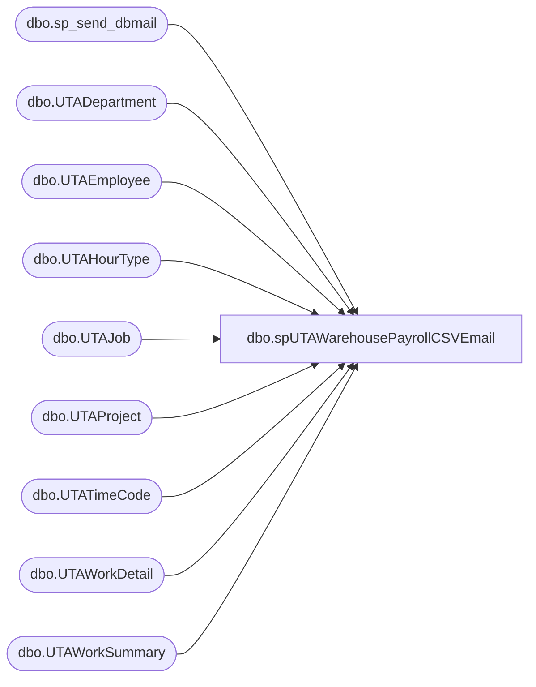

# dbo.spUTAWarehousePayrollCSVEmail

**Database:** dw  
**Server:** papamart  

## Architecture Diagram



## Table Dependencies

| Referenced Table |
|---|
| dbo.sp_send_dbmail |
| dbo.UTADepartment |
| dbo.UTAEmployee |
| dbo.UTAHourType |
| dbo.UTAJob |
| dbo.UTAProject |
| dbo.UTATimeCode |
| dbo.UTAWorkDetail |
| dbo.UTAWorkSummary |

## Stored Procedure Code

```sql
CREATE PROCEDURE [dbo].[spUTAWarehousePayrollCSVEmail]
	@endDate AS DATE
AS

-- Name: spUTAWarehousePayrollCSVEmail
--
-- Description:	Emails Warehouse 
-- 
-- Output: email
-- 
-- Available actions: 
--
-- Dependency: 
--		
--
-- Revision History
--		Name:			Date:			Comments:
--		Ben Barud		04/16/2019		Creation


BEGIN
	-- SET NOCOUNT ON added to prevent extra result sets from
	-- interfering with SELECT statements.
	SET NOCOUNT ON;

	PRINT @endDate
	--SELECT @endDate
    -- Insert statements for procedure here
	IF OBJECT_ID('tempdb..##tmp_PayrollExport') IS NOT NULL 
        DROP TABLE dbo.##tmp_PayrollExport

IF OBJECT_ID('tempdb..##tmpHeader') IS NOT NULL 
	DROP TABLE dbo.##tmpHeader;

--DECLARE @endDate AS DATE
--SET @endDate = '2019-04-14';

WITH BHSHours
AS
(
SELECT emp.Emp_Name
	  ,emp.Emp_Fullname
	  ,det.Wrkd_Rate
	  ,dep.DEPT_ID
	  ,CAST(det.Wrkd_Work_Date AS DATE) 'PunchDate'
	  ,ht.Htype_Name
	  ,CAST(Wrkd_Minutes AS decimal)/60.00 AS 'PunchHours'
	  ,CAST(Wrkd_Start_Time AS TIME) AS 'rawInTime'
	  ,FORMAT(Wrkd_Start_Time, 'hh:mm:ss tt') AS 'InTime'
	  --,CAST(Wrkd_End_Time AS TIME) AS 'OutTime'
	  ,FORMAT(Wrkd_End_Time, 'hh:mm:ss tt') AS 'OutTime'
	  ,det.Job_ID
	  ,j.Job_Name
	  ,tc.TCODE_NAME
      ,[Wrks_Work_Date]
      ,[Paygrp_ID]
	  ,p.[PROJ_NAME] 
  FROM [dw].[dbo].[UTAWorkSummary] ws WITH(NOLOCK)
  INNER JOIN [dw].[dbo].[UTAEmployee] emp WITH(NOLOCK) ON ws.Emp_ID = emp.Emp_ID
  LEFT JOIN [dw].[dbo].[UTAWorkDetail] det WITH(NOLOCK)  ON ws.Wrks_ID = det.Wrks_ID
  LEFT JOIN [dw].[dbo].[UTADepartment] dep WITH(NOLOCK) ON det.Dept_ID = dep.DEPT_ID
  LEFT JOIN [dw].[dbo].[UTAHourType] ht WITH(NOLOCK) ON det.Htype_ID = ht.Htype_ID
  LEFT JOIN [dw].[dbo].[UTAJob] j WITH(NOLOCK) ON det.Job_ID = j.Job_ID
  LEFT JOIN [dw].[dbo].[UTATimeCode] tc WITH(NOLOCK) ON det.Tcode_ID = tc.TCODE_ID
  LEFT JOIN [dw].[dbo].[UTAProject] p WITH(NOLOCK) ON det.proj_ID = p.PROJ_ID
  --WHERE CAST(Wrks_Work_Date AS DATE) > '2019-03-11'
  --WHERE emp.Emp_Fullname LIKE '%Kahrica%'
  --WHERE Htype_Name IN ('REG')
  --WHERE Htype_Name LIKE ('OT%')
  WHERE Calcgrp_ID IN (10006, 10007)
    AND CAST(Wrks_Work_Date AS DATE) BETWEEN DATEADD(DAY, -8, @endDate) AND DATEADD(DAY, -2, @endDate)
    AND det.Wrkd_Work_Date IS NOT NULL
    AND Htype_Name NOT IN ('UNPAID')
	--AND ws.Emp_ID = 13349
	--AND CAST(det.Wrkd_Work_Date AS DATE) = '2019-03-22'
)
SELECT Emp_Name
      ,Emp_Fullname
	  ,Wrkd_Rate AS 'PayRate'
	  ,DEPT_ID AS 'Department'
	  ,PunchDate
	  ,Htype_Name AS 'Category'
	  ,CASE 
		 WHEN Htype_Name = 'REG' THEN PunchHours
		 ELSE 0.0
	   END AS 'NonOTHours'
	  ,CASE 
		 WHEN Htype_Name LIKE 'OT%' THEN PunchHours
		 ELSE 0.0
	   END AS 'OTHours'
	  ,rawInTime
	  ,InTime
	  ,OutTime
	  ,Job_ID AS 'JobCode'
	  ,Job_Name AS 'JobName'
	  ,CASE
	    WHEN TCODE_NAME = 'HONEY' THEN 'PTO'
		WHEN TCODE_NAME = 'BD' THEN 'BIRTHDAY'
		WHEN TCODE_NAME = 'BRV' THEN 'BEREAVEMENT'
		ELSE TCODE_NAME
	   END AS 'TimeCode'
	  ,PunchHours AS 'Hours'
	  ,(Wrkd_Rate * PunchHours) AS 'Pay'
      ,Paygrp_ID AS 'PayGroup'
	  ,PROJ_NAME AS 'WorkArea'
  INTO ##tmp_PayrollExport
  FROM BHSHours
  --WHERE Emp_Name = '0060550'
  --0060550
  
  DECLARE @outputsql VARCHAR(1000)
        ,@bcpsql VARCHAR(4000)
		,@header VARCHAR(500)
		,@filename VARCHAR(100)
		,@tmpFileName VARCHAR(100)
		,@copy1 VARCHAR(4000)
		,@delCopy1 VARCHAR (4000)
		,@attachment VARCHAR(4000)	

  SET @tmpFileName = 'tmp.csv'

SELECT 'LastName' AS 'LastName'
      ,'FirstName' AS 'FirstName'
	  ,'PayRate' AS 'PayRate'
	  ,'Department' AS 'Department'
	  ,'PunchDate' AS 'PunchDate'
	  ,'Category' AS 'Category'
	  ,'NonOTHours' AS 'NonOTHours'
	  ,'OTHours' AS 'OTHours'
	  ,'InTime' AS 'InTime'
	  ,'OutTime' AS 'OutTime'
	  ,'JobCode' AS 'JobCode'
	  ,'JobName' AS 'JobName'
	  ,'TimeCode' AS 'TimeCode'
	  ,'Hours' AS 'Hours'
	  ,'Pay' AS 'Pay'
	  ,'PayGroup' AS 'PayGroup'
	  ,'WorkArea' AS 'WorkArea'
INTO ##tmpHeader

SET @outputsql = 'SELECT Emp_FullName, PayRate, Department, PunchDate, Category, NonOTHours, OTHours, InTime, OutTime, JobCode, JobName, TimeCode, Hours, Pay, PayGroup, WorkArea FROM dbo.##tmp_PayrollExport ORDER BY PunchDate, Emp_Name, rawInTime'
SET @header = 'SELECT * FROM ##tmpHeader'

SELECT @filename = 'WeekEnding' + REPLACE(REPLACE(REPLACE(CONVERT(CHAR(19), DATEADD(DAY, -2, @endDate), 110), '-', ''), ':', ''), ' ', '') + '.csv'

SET @bcpsql = 'bcp "' + @header + '" queryout "\\kermode\FileRepository\BJB\' + @fileName
        + '" -t, -T -c -S "' + @@SERVERNAME + '"'

--SELECT @outputsql

SET @copy1 = 'type \\kermode\FileRepository\BJB\' + @tmpFileName + ' + >> \\kermode\FileRepository\BJB\' + @filename
SET @delCopy1 = 'del \\kermode\FileRepository\BJB\' + @tmpFileName

EXEC master..xp_cmdshell @bcpsql

SET @bcpsql = 'bcp "' + @outputsql + '" queryout "\\kermode\FileRepository\BJB\' + @tmpFileName
        + '" -t, -T -c -S "' + @@SERVERNAME + '"'

EXEC master..xp_cmdshell @bcpsql
--SELECT @copy1
EXEC master..xp_cmdshell @copy1	
EXEC master..xp_cmdshell @delCopy1					        


DECLARE @recipients NVARCHAR(2000),
@copy_recipients NVARCHAR(2000) ,
@blind_recipients NVARCHAR(2000),
@subject NVARCHAR(1000) 

SELECT @recipients = 'LarryW@buildabear.com; ChrisTh@buildabear.com; benb@buildabear.com',
--@recipients = 'benb@buildabear.com',
@copy_recipients = '',
@blind_recipients = 'ianw@buildabear.com',
@subject = 'labor hours week ending ' + REPLACE(REPLACE(REPLACE(CONVERT(CHAR(19), DATEADD(DAY, -2, @endDate), 110), '-', '.'), ':', ''), ' ', ''),
@attachment = '\\kermode\FileRepository\BJB\' + @filename 


		Declare @Body varchar(8000),
			  @TableHead varchar(max),
			  @TableTail varchar(max)
		 
		SET NOCOUNT ON
		
		Set @TableTail = '</table><br><br><br>This email has been generated from PAPAMART.DW.dbo.spUTAWarehousePayrollCSVEmail</body></html>';
exec msdb.dbo.sp_send_dbmail
       @profile_name = 'BIAdmin', 
       @recipients = @recipients,
	   @blind_copy_recipients = @blind_recipients,
       @body = @TableTail,
       @subject = @subject, 
       @body_format = 'HTML', --optional
       @file_attachments = @attachment

END
```

