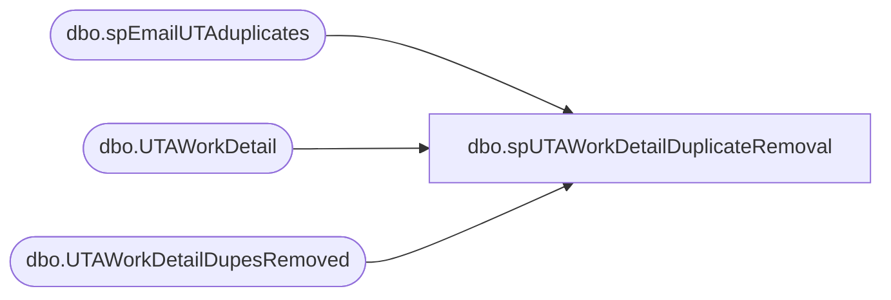

# dbo.spUTAWorkDetailDuplicateRemoval

**Database:** dw  
**Server:** papamart  

## Architecture Diagram



## Table Dependencies

| Referenced Table |
|---|
| dbo.spEmailUTAduplicates |
| dbo.UTAWorkDetail |
| dbo.UTAWorkDetailDupesRemoved |

## Stored Procedure Code

```sql
CREATE proc [dbo].[spUTAWorkDetailDuplicateRemoval]

as 

-------------------------------------------------------------------------------------------------------
-- Ian Wallace	2021-08-25	Created Proc to remove duplicate shifts 
-------------------------------------------------------------------------------------------------------

set nocount on

declare @shiftID bigint

declare @shiftID2 bigint

--============= Dupe table insert cursor  --======================================================================

declare UTA_dupe_fix CURSOR FOR

select d.Wrks_ID from [dbo].[UTAWorkDetail] d
where cast(d.Wrkd_Work_Date as date) > '01/01/2021' 
group by d.Wrks_ID, d.Wrkd_Start_Time, d.Wrkd_End_Time, d.Wrkd_Minutes, d.Wbt_ID, d.Tcode_ID, d.Wrkd_Rate, d.Wrkd_Work_Date, d.Job_ID, d.Dept_ID
having count(*) > 1


open UTA_dupe_fix 
fetch next from UTA_dupe_fix into @shiftID
while @@fetch_status = 0
begin

;
with
group1
as
(
select Wrks_ID, Wrkd_ID, [Wrkd_Minutes] from [dbo].[UTAWorkDetail] where Wrks_ID in 
(
select d.Wrks_ID as 'wrksID' from [dbo].[UTAWorkDetail] d
where cast(d.Wrkd_Work_Date as date) > '01/01/2021'
--and Tcode_ID = 1 and Htype_ID = 1
and Wrks_ID = @shiftID
group by d.Wrks_ID,  d.Wrkd_Start_Time having count(*) > 1
) 
and Wrkd_Start_Time in  
(
select  d.Wrkd_Start_Time from [dbo].[UTAWorkDetail] d
where cast(d.Wrkd_Work_Date as date) > '01/01/2021' 
--and Tcode_ID = 1 and Htype_ID = 1
and Wrks_ID = @shiftID
group by d.Wrks_ID,  d.Wrkd_Start_Time having count(*) > 1
)
--order by wrkd_ID asc 
)


INSERT INTO [dbo].[UTAWorkDetailDupesRemoved]
([Wrks_ID],[Wrkd_ID],[Wrkd_Start_Time],[Wrkd_End_Time],[Wrkd_Minutes]
,[Wbt_ID],[Tcode_ID],[Htype_ID],[Wrkd_Rate],[Wrkd_Work_Date]
,[Job_ID],[Dept_ID],[InsertDate],[UpdateDate],[proj_ID],[DupeInsertDate])

select *, getdate() from [dbo].[UTAWorkDetail] where Wrks_ID = @shiftID
and Wrkd_ID in
(
select Wrkd_ID from group1 where Wrkd_ID not in 
(
select min(Wrkd_ID) from group1
)
)


--delete from [dbo].[UTAWorkDetail] where Wrks_ID = @shiftID
--and Wrkd_ID in
--(
--select Wrkd_ID from group1 where Wrkd_ID not in 
--(
--select min(Wrkd_ID) from group1
--)
--)

fetch next from UTA_dupe_fix into @shiftID
end
close UTA_dupe_fix
deallocate UTA_dupe_fix


--==========  DELETE CURSOR ===================================================================================================
declare UTA_dupe_fix2 CURSOR FOR

select d.Wrks_ID from [dbo].[UTAWorkDetail] d
where cast(d.Wrkd_Work_Date as date) > '01/01/2021' 
group by d.Wrks_ID, d.Wrkd_Start_Time, d.Wrkd_End_Time, d.Wrkd_Minutes, d.Wbt_ID, d.Tcode_ID, d.Wrkd_Rate, d.Wrkd_Work_Date, d.Job_ID, d.Dept_ID
having count(*) > 1


open UTA_dupe_fix2
fetch next from UTA_dupe_fix2 into @shiftID2
while @@fetch_status = 0
begin

;
with
group2
as
(
select Wrks_ID, Wrkd_ID, [Wrkd_Minutes] from [dbo].[UTAWorkDetail] where Wrks_ID in 
(
select d.Wrks_ID as 'wrksID' from [dbo].[UTAWorkDetail] d
where cast(d.Wrkd_Work_Date as date) > '01/01/2021'
--and Tcode_ID = 1 and Htype_ID = 1
and Wrks_ID = @shiftID2
group by d.Wrks_ID,  d.Wrkd_Start_Time having count(*) > 1
) 
and Wrkd_Start_Time in  
(
select  d.Wrkd_Start_Time from [dbo].[UTAWorkDetail] d
where cast(d.Wrkd_Work_Date as date) > '01/01/2021' 
--and Tcode_ID = 1 and Htype_ID = 1
and Wrks_ID = @shiftID2
group by d.Wrks_ID,  d.Wrkd_Start_Time having count(*) > 1
)
--order by wrkd_ID asc 
)


delete from [dbo].[UTAWorkDetail] where Wrks_ID = @shiftID2
and Wrkd_ID in
(
select Wrkd_ID from group2 where Wrkd_ID not in 
(
select min(Wrkd_ID) from group2
)
)

fetch next from UTA_dupe_fix2 into @shiftID2
end
close UTA_dupe_fix2
deallocate UTA_dupe_fix2


--==========  Execute email procedure  --==============

exec [dbo].[spEmailUTAduplicates]
```

