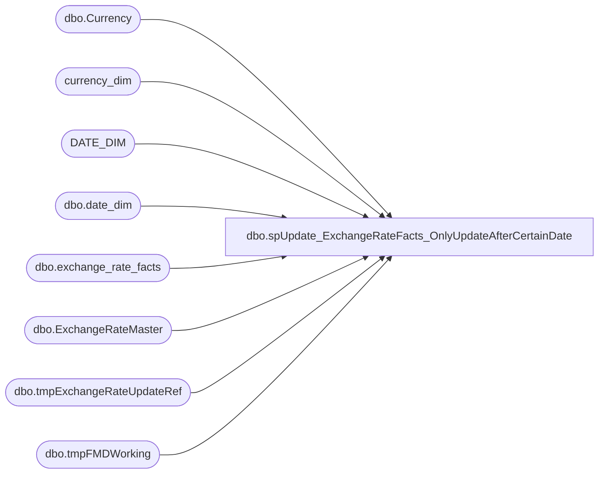

# dbo.spUpdate_ExchangeRateFacts_OnlyUpdateAfterCertainDate

**Database:** dw  
**Server:** papamart  

## Architecture Diagram



## Table Dependencies

| Referenced Table |
|---|
| dbo.Currency |
| currency_dim |
| DATE_DIM |
| dbo.date_dim |
| dbo.exchange_rate_facts |
| dbo.ExchangeRateMaster |
| dbo.tmpExchangeRateUpdateRef |
| dbo.tmpFMDWorking |

## Stored Procedure Code

```sql
CREATE PROCEDURE [dbo].[spUpdate_ExchangeRateFacts_OnlyUpdateAfterCertainDate]
	@DateToStartUpdate DATE
AS

/******************************************************************************
**
**	Name:		[spUpdate_ExchangeRateFacts_OnlyUpdateAfterCertainDate]
**
**	Description: 	Updates dbo.exchange_rate_facts with the exchange rate from the Franchisee Sales Information
**
**
**	Parameters:	none
**
** 	Returns:	result set
**
**	Examples:	EXEC [spUpdate_ExchangeRateFacts_OnlyUpdateAfterCertainDate] '1/25/2015'
**			
**
**	History:	
**  Date 			Author 				Purpose
**	2015-03-12		Kevin Shyr			Update subset of exchange rate to go faster
**  2015-05-04		Kevin Shyr			Replaced cursor logic with update reference table
******************************************************************************/

SET NOCOUNT ON;

DECLARE @DateKeyToStart INT
	, @LastDateInTheFranchMstrDataTableDate DATE

-- Get the date_key from date_dim
SELECT @DateKeyToStart = dd.date_key
FROM dbo.date_dim dd WITH(READCOMMITTED)
WHERE dd.actual_date = @DateToStartUpdate

-- Get the last AsOfDate from table
SELECT @LastDateInTheFranchMstrDataTableDate = MAX(erm.asOfDate)
FROM KODIAK.FranchMstrData.dbo.ExchangeRateMaster erm WITH(READCOMMITTED)
WHERE erm.asOfDate < @DateToStartUpdate

--PRINT 'Got the last AsOfDate at ' + CAST(GETDATE() AS VARCHAR(50))


--IF OBJECT_ID('tempdb..#FMDWorking') IS NOT NULL
--    DROP TABLE #FMDWorking
	
IF OBJECT_ID('dwstaging..tmpFMDWorking') IS NOT NULL
    DROP TABLE dwstaging.dbo.tmpFMDWorking
IF OBJECT_ID('dwstaging..tmpExchangeRateUpdateRef') IS NOT NULL
    DROP TABLE dwstaging.dbo.tmpExchangeRateUpdateRef
CREATE TABLE dwstaging.dbo.tmpExchangeRateUpdateRef
	(PREVasOfDate_key INT
	, THISasOfDate_key INT
	, frmCurrency_key INT
	, toCurrency_key INT
	, bbw_rate DECIMAL(15, 8)
	)

--get data from StoreMDM, but do not get the exchange rates that are static
SELECT frC.currency_code frmCurrency_code, toC.currency_code toCurrency_code, asOfDate, bbw_rate
INTO dwstaging.dbo.tmpFMDWorking
FROM KODIAK.FranchMstrData.dbo.ExchangeRateMaster erm WITH(READCOMMITTED)
	INNER JOIN KODIAK.FranchMstrData.dbo.Currency toC WITH(READCOMMITTED)
		ON erm.toCurrencyID = toC.currencyID
	INNER JOIN KODIAK.FranchMstrData.dbo.Currency frC WITH(READCOMMITTED)
		ON erm.fromCurrencyID = frC.currencyID
WHERE toC.currency_code NOT IN ('USD', 'EUR', 'GBP', 'CDN', 'DKK')
	AND erm.asOfDate >= @LastDateInTheFranchMstrDataTableDate

--PRINT 'Got data from StoreMDM at ' + CAST(GETDATE() AS VARCHAR(50))


---- Cursor variables and startup condition
--DECLARE @toCurrency_key INT, @prevTOCurrency_key int, @frmCurrency_key INT, @prevFRMCurrency_key int, @THISasOfDate_key INT, @PREVasOfDate_key INT, @bbw_rate DECIMAL(15,8)
--SELECT @PREVasOfDate_key = @DateKeyToStart, @prevTOCurrency_key = 0, @prevFRMCurrency_key = 0

---- Cursor select to churn through each currency and date range
---- This is set up so that the first pass of every currency will update 0 record because @DateToStartUpdate should be greater than @LastDateInTheFranchMstrDataTableDate
--DECLARE erf_cursor CURSOR FOR 
--	SELECT TOcd.currency_key to_currency_key
--		, FRMcd.currency_key from_Currency_key
--		, dd.date_key
--		, bbw_rate
--	FROM dwstaging.dbo.tmpFMDWorking fmd 
--		INNER JOIN DATE_DIM dd WITH(READCOMMITTED)
--			ON fmd.asofDate = dd.actual_date
--		INNER JOIN currency_dim TOcd WITH(READCOMMITTED)
--			ON fmd.toCurrency_code = TOcd.currency_code
--		INNER JOIN currency_dim FRMcd WITH(READCOMMITTED)
--			ON fmd.frmCurrency_code = FRMcd.currency_code
--	ORDER BY TOcd.currency_key, FRMcd.currency_key, asOfDate
--OPEN erf_cursor

--PRINT 'Cursor created at ' + CAST(GETDATE() AS VARCHAR(50))


--FETCH NEXT FROM erf_cursor INTO @toCurrency_key, @frmCurrency_key, @THISasOfDate_key, @bbw_rate

	--WHILE @@FETCH_STATUS = 0
	--BEGIN
	--	IF NOT (@prevTOCurrency_key = @toCurrency_key AND @prevFRMCurrency_key = @frmCurrency_key) 
	--	begin
	--		--print 'reset the previous date'
	--		SET @PREVasOfDate_key = @DateKeyToStart
	--	end

INSERT INTO dwstaging.dbo.tmpExchangeRateUpdateRef
	(PREVasOfDate_key, THISasOfDate_key, frmCurrency_key, toCurrency_key, bbw_rate)
SELECT 
	@DateKeyToStart
	, dd.date_key
	, FRMcd.currency_key from_Currency_key
	, TOcd.currency_key to_currency_key
	, bbw_rate
FROM dwstaging.dbo.tmpFMDWorking fmd 
	INNER JOIN DATE_DIM dd WITH(READCOMMITTED)
		ON fmd.asofDate = dd.actual_date
	INNER JOIN currency_dim TOcd WITH(READCOMMITTED)
		ON fmd.toCurrency_code = TOcd.currency_code
	INNER JOIN currency_dim FRMcd WITH(READCOMMITTED)
		ON fmd.frmCurrency_code = FRMcd.currency_code
ORDER BY TOcd.currency_key, FRMcd.currency_key, asOfDate

--SELECT eru1.*
--	, (SELECT MAX(eru2.THISasOfDate_key)
--		FROM dwstaging.dbo.tmpExchangeRateUpdateRef eru2
--			WHERE eru2.frmCurrency_key = eru1.frmCurrency_key
--				AND eru2.toCurrency_key = eru1.toCurrency_key
--				AND eru2.THISasOfDate_key < eru1.THISasOfDate_key)
UPDATE eru1
SET PREVasOfDate_key = (SELECT MAX(eru2.THISasOfDate_key) + 1
		FROM dwstaging.dbo.tmpExchangeRateUpdateRef eru2
			WHERE eru2.frmCurrency_key = eru1.frmCurrency_key
				AND eru2.toCurrency_key = eru1.toCurrency_key
				AND eru2.THISasOfDate_key < eru1.THISasOfDate_key)
FROM dwstaging.dbo.tmpExchangeRateUpdateRef eru1

-- remove the rows that fall out of the date range we care about
DELETE
FROM dwstaging.dbo.tmpExchangeRateUpdateRef
WHERE PREVasOfDate_key IS NULL


--SELECT *
--FROM dwstaging.dbo.tmpExchangeRateUpdateRef WITH(NOLOCK)

-- update exchange rate for the changed bbw_rate
--SELECT erf.*
UPDATE erf SET bbw_rate = terur.bbw_rate
FROM dbo.exchange_rate_facts erf 
	INNER JOIN dwstaging.dbo.tmpExchangeRateUpdateRef terur
		ON erf.date_key BETWEEN terur.PREVasOfDate_key AND terur.THISasOfDate_key
			AND erf.from_currency_key = terur.frmCurrency_key 
			AND erf.to_currency_key = terur.toCurrency_key
			AND erf.bbw_rate <> terur.bbw_rate

		--UPDATE dbo.exchange_rate_facts
		--SET bbw_rate = @bbw_rate
		--WHERE date_key > @PREVasOfDate_key 
		--	AND date_key <= @THISasOfDate_key
		--	AND from_currency_key = @frmCurrency_key 
		--	AND to_currency_key = @toCurrency_key
		--	AND bbw_rate <> @bbw_rate
			
--PRINT 'Exchange_rate_facts updated at ' + CAST(GETDATE() AS VARCHAR(50))


--		EndOfCursor:
--		SELECT @PREVasOfDate_key = @THISasOfDate_key, @prevTOCurrency_key = @toCurrency_key, @prevFRMCurrency_key = @frmCurrency_key
--		FETCH NEXT FROM erf_cursor INTO @toCurrency_key, @frmCurrency_key, @THISasOfDate_key, @bbw_rate
--	END 

--CLOSE erf_cursor 
--DEALLOCATE erf_cursor 


/************** Updating ****************/

--UPDATE dbo.exchange_rate_facts
--SET bbw_rate = @bbw_rate
--WHERE date_key > @PREVasOfDate_key 
--	AND date_key <= @THISasOfDate_key
--	AND from_currency_key = @frmCurrency_key 
--	AND to_currency_key = @toCurrency_key
--	AND bbw_rate <> @bbw_rate

----Remaining records
--UPDATE erf
--SET bbw_rate = qry2.bbw_rate
--FROM exchange_rate_facts erf
--LEFT JOIN (
--	SELECT TOcd.currency_key to_currency_key, FRMcd.currency_key from_Currency_key, qry.maxdate_key, fmd.bbw_rate
--	FROM dwstaging.dbo.tmpFMDWorking fmd 
--	INNER JOIN DATE_DIM dd (nolock) ON fmd.asofDate = dd.actual_date
--	INNER JOIN (
--		SELECT toCurrency_code, frmCurrency_code, MAX(dd.date_key) maxdate_key
--		FROM dwstaging.dbo.tmpFMDWorking fmd 
--			INNER JOIN DATE_DIM dd (nolock) ON fmd.asofDate = dd.actual_date
--		GROUP BY toCurrency_code, frmCurrency_code
--	) qry ON fmd.toCurrency_code = qry.toCurrency_code AND fmd.frmCurrency_code = qry.frmCurrency_code AND dd.date_key= qry.maxdate_key
--	INNER JOIN currency_dim TOcd (nolock) ON fmd.toCurrency_code = TOcd.currency_code
--	INNER JOIN currency_dim FRMcd (nolock) ON fmd.frmCurrency_code = FRMcd.currency_code
--) qry2 ON erf.from_currency_key = qry2.from_Currency_key AND erf.to_currency_key = qry2.to_currency_key
--WHERE erf.date_key > qry2.maxdate_key AND  erf.bbw_rate <> qry2.bbw_rate
			
--PRINT 'The rest of the records updated at ' + CAST(GETDATE() AS VARCHAR(50))

dbo,usp_KioskCRM_UpdateStatistics,-- =============================================
-- Author:		<Author,,Name>
-- Create date: <Create Date,,>
-- Description:	<Description,,>
-- =============================================
create PROCEDURE [dbo].[usp_KioskCRM_UpdateStatistics]
AS
BEGIN

update statistics dw..clnsd_addr_dim
update statistics dw..clnsd_addr_dim_hist
update statistics dw..clnsd_addr_dim_rjct
update statistics dw..ADDR_SUM_FACT
update statistics dw..clnsd_gst_dim
update statistics dw..clnsd_gst_dim_hist
update statistics dw..clnsd_gst_dim_rjct
update statistics dw..EMAIL_ADDR_DIM
update statistics dw..EMAIL_ADDR_DIM_HIST
update statistics dw..EMAIL_ADDR_DIM_RJCT
update statistics dw..EMAIL_ADDR_PRSNLZTN_ATTR_DIM
update statistics dw..EMAIL_ADDR_STAT_FACT
update statistics dw..raw_addr_dim
update statistics dw..raw_addr_dim_rjct
update statistics dw..raw_gst_dim_rjct
update statistics dw..raw_rcpnt_dim
update statistics dw..raw_rcpnt_dim_rjct
update statistics dw..trn_ksk_fact
update statistics dw..TKF_CLNSD_GST_BRDG

update statistics dwstaging..crm_stg
update statistics dwstaging..crm_stg_rjct
update statistics dwstaging..ksk_regis_stg
update statistics dwstaging..ksk_regis_stg_rjct
------update statistics dwstaging..load_rec_id_cntrl
------update statistics dwstaging..load_rec_id_cntrl_tmp
update statistics dwstaging..vldtn_prcs_instnc
update statistics dwstaging..vldtn_prcs_instnc_dtl_miss_key
update statistics dwstaging..vldtn_prcs_instnc_dtl_prcs_spfc
update statistics dwstaging..vldtn_prcs_instnc_dtl_rec_cnt
update statistics dwstaging..vldtn_prcs_instnc_dtl_ref_intgrty
update statistics dwstaging..vldtn_prcs_instnc_dtl_trn_sum
update statistics dwstaging..etl_prcs_cntrl


update statistics dw..tblZipTop1_historical_us_ca
update statistics dw..tblZipTop1_historical_gb
update statistics dw..tblZipTop1_historical_fr
update statistics dw..tblZipTop1_historical_rz

END
```

