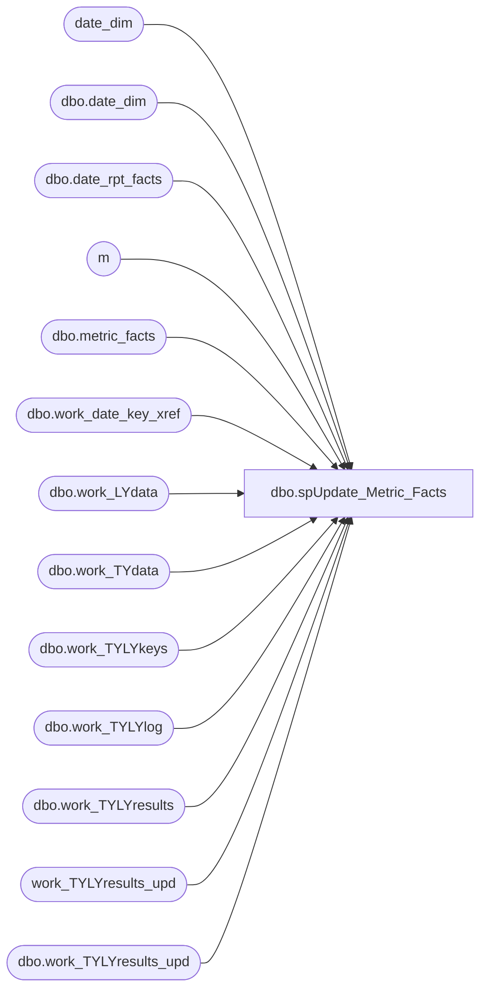

# dbo.spUpdate_Metric_Facts

**Database:** dw  
**Server:** papamart  

## Architecture Diagram



## Table Dependencies

| Referenced Table |
|---|
| date_dim |
| dbo.date_dim |
| dbo.date_rpt_facts |
| m |
| dbo.metric_facts |
| dbo.work_date_key_xref |
| dbo.work_LYdata |
| dbo.work_TYdata |
| dbo.work_TYLYkeys |
| dbo.work_TYLYlog |
| dbo.work_TYLYresults |
| work_TYLYresults_upd |
| dbo.work_TYLYresults_upd |

## Stored Procedure Code

```sql
/******************************************************************************
**
**	Name:		spUpdate_Metric_Facts
**
**	Description: 	Updates dbo.Metric_Facts with last year amount and date_key.
**
**
**	Parameters:	none
**
** 	Returns:	result set
**
**	Examples:	EXEC spUpdate_Metric_Facts
**			
**
**	History:	
**  Date 		Author 				Purpose
**  11/29/2011	Trista Parmentier	Qualified all tables with dbo schema. Proc will be run as pm_repo now and tables need to to be created under dbo schema
**  12/22/04		CC and Dan		Created
******************************************************************************/
CREATE PROCEDURE  [dbo].[spUpdate_Metric_Facts]
/* ===== ARGUMENTS ===== */	

@StartDate 	datetime = NULL, 
@EndDate 	datetime = NULL

AS
SET NOCOUNT ON


DECLARE
 @curDay char(2)
,@curMon char(2)
,@curYr char(4)
,@curDate datetime


 --DECLARE @StartDate datetime
 --DECLARE @EndDate datetime
 
 --Set @StartDate = '1/1/96'
 --Set @EndDate = '1/17/07'


SET @curDay = datepart(dd,getdate())
SET @curMon = datepart(mm,getdate())
SET @curYr = datepart(yy,getdate())


SET @curDate = cast((@curMon+'/'+@curDay+'/'+@curYr) as Datetime)
--SET @curDate = dateadd(dd, -1,@curDate)


--SELECT @StartDate ='11/21/2003'
--SELECT @EndDate ='12/4/2003'
IF @StartDate is NULL
BEGIN
	SELECT @StartDate = dateadd(dd, -21,@curDate)  
	SELECT @EndDate =  dateadd(dd, -1,@curDate) 
END
--select @StartDate,@EndDate


/**get TY and LY date keys **/
IF (Object_ID('dw.dbo.work_date_key_xref') IS NOT NULL) DROP TABLE dbo.work_date_key_xref

select date_key_TY, date_key_LY
into dbo.work_date_key_xref 
from dbo.date_rpt_facts drf 		
	join dbo.date_dim dd on drf.date_key_TY = dd.date_key
	join dbo.date_dim ddly on drf.date_key_LY = ddly.date_key
	where dd.actual_date BETWEEN @StartDate and  @EndDate --BETWEEN '12/27/2004' AND '12/30/2004'

create index idx_temp_date_key_TY on dbo.work_date_key_xref(date_key_TY)
create index idx_temp_date_key_LY on dbo.work_date_key_xref(date_key_LY)

--select * from work_date_key_xref
--select * from date_dim where date_key in (2553,2189)


IF (Object_ID('dw.dbo.work_TYdata') IS NOT NULL) DROP TABLE dbo.work_TYdata

--populate table with TY data
select 	mf1.store_key,
	dd.date_key ,
	mf1.metric_dim_key,
	mf1.metric_facts_key	
into dbo.work_TYdata
from dbo.metric_facts mf1
	join dbo.date_dim dd on mf1.date_key = dd.date_key
where dd.date_key in (select date_key_TY from dbo.work_date_key_xref)
--04:00 (51178545 row(s) affected)	
create index idx_tempTYdata_date_key_TY on dbo.work_TYdata(date_key)
--08:22
--select * from work_TYdata

IF (Object_ID('dw.dbo.work_LYdata') IS NOT NULL) DROP TABLE dbo.work_LYdata
--populate table with LY data
select 	
	mf1.amount as 'LYamount',
	mf1.store_key,
	dd.date_key ,
	mf1.metric_dim_key
into dbo.work_LYdata
from dbo.metric_facts mf1
	join date_dim dd on mf1.date_key = dd.date_key
where dd.date_key in (select date_key_LY from dbo.work_date_key_xref)
--04:42 (35295610 row(s) affected)

create index idx_tempLYdata_date_key_TY on dbo.work_LYdata(date_key)
--

--select * from work_LYdata

IF (Object_ID('dw.dbo.work_TYLYkeys') IS NOT NULL) DROP TABLE dbo.work_TYLYkeys

--add LY date key to TY results
select * 
into dbo.work_TYLYkeys
from dbo.work_TYdata t
	join dbo.work_date_key_xref x on t.date_key = x.date_key_TY
--select * from work_TYLYkeys
IF (Object_ID('dw.dbo.work_TYLYresults') IS NOT NULL) DROP TABLE dbo.work_TYLYresults

--join to get LY amount
--create new table work_TYLYresults
select k.*,l.LYamount
into dbo.work_TYLYresults
from dbo.work_TYLYkeys k
	left join dbo.work_LYdata l on k.date_key_LY = l.date_key
		and k.store_key = l.store_key
		and k.metric_dim_key = l.metric_dim_key
--select * from work_TYLYresults

create index idx_work_TYLYresults_mf_key_TY on dbo.work_TYLYresults(metric_facts_key, LYamount)

IF (Object_ID('dw.dbo.work_TYLYresults_upd') IS NOT NULL) DROP TABLE dbo.work_TYLYresults_upd
select identity(int,1,1) as uid, w.*
into dbo.work_TYLYresults_upd
FROM dbo.metric_facts mf
	join dbo.work_TYLYresults w on mf.metric_facts_key = w.metric_facts_key
where w.LYamount <> mf.ly_amount
--select * from work_TYLYresults_upd

/**< update loop >**/
DECLARE @uid int, @nextuid int, @maxuid int
SET @uid = 1
SET @nextuid = 15000
SET @maxuid = (select max(uid) from work_TYLYresults_upd)

IF (Object_ID('dw.dbo.work_TYLYlog') IS NOT NULL) DROP TABLE dbo.work_TYLYlog
create table dbo.work_TYLYlog (uid int, nextuid int, maxuid int, dtime datetime)
--select @uid as uid, @nextuid as nextuid, @maxuid as maxuid, getdate() as dtime
--into ##TYLYlog

WHILE @uid < @maxuid
BEGIN

	UPDATE m
	SET   ly_date_key = COALESCE(date_key_ly,0)
		, ly_amount = COALESCE(LYamount,0)
	FROM dbo.metric_facts m 
		join dbo.work_TYLYresults_upd w on m.metric_facts_key = w.metric_facts_key
	WHERE uid >= @uid and uid <@nextuid

	insert dbo.work_TYLYlog (uid, nextuid, maxuid, dtime)
	values (@uid, @nextuid, @maxuid, getdate())
	
	SET @uid = @nextuid
	SET @nextuid = @uid + 15000

END

SET ANSI_NULLS OFF
```

