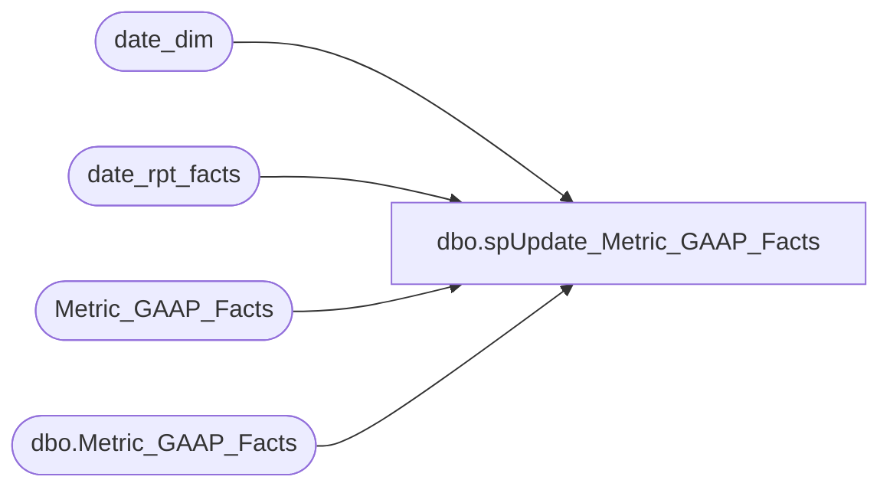

# dbo.spUpdate_Metric_GAAP_Facts

**Database:** dw  
**Server:** papamart  

## Architecture Diagram



## Table Dependencies

| Referenced Table |
|---|
| date_dim |
| date_rpt_facts |
| Metric_GAAP_Facts |
| dbo.Metric_GAAP_Facts |

## Stored Procedure Code

```sql
/******************************************************************************
**
**	Name:		spUpdate_Metric_GAAP_Facts
**
**	Description: 	Updates dbo.Metric_GAAP_Facts with last year amount and date_key.
**
**
**	Parameters:	none
**
** 	Returns:	result set
**
**	Examples:	EXEC spUpdate_Metric_GAAP_Facts
**			
**
**	History:	
**  Date 		Author 		Purpose
**  04/18/05		CC and Dan	Created
******************************************************************************/
CREATE    PROCEDURE  spUpdate_Metric_GAAP_Facts
/* ===== ARGUMENTS ===== */	

@StartDate 	datetime = NULL, 
@EndDate 	datetime = NULL

AS
SET NOCOUNT ON


DECLARE
 @curDay char(2)
,@curMon char(2)
,@curYr char(4)
,@curDate datetime


-- DECLARE @StartDate datetime
-- DECLARE @EndDate datetime
-- 
-- Set @StartDate = '1/1/04'
-- Set @EndDate = '1/1/04'


SET @curDay = datepart(dd,getdate())
SET @curMon = datepart(mm,getdate())
SET @curYr = datepart(yy,getdate())


SET @curDate = cast((@curMon+'/'+@curDay+'/'+@curYr) as Datetime)
--SET @curDate = dateadd(dd, -1,@curDate)


--SELECT @StartDate ='11/21/2003'
--SELECT @EndDate ='12/4/2003'
IF @StartDate is NULL
BEGIN
	SELECT @StartDate = dateadd(dd, -15,@curDate)  
	SELECT @EndDate =  dateadd(dd, 14,@curDate) 
END
--select @StartDate,@EndDate


/**get TY and LY date keys **/
IF (Object_ID('tempdb..#date_key_xref') IS NOT NULL) DROP TABLE #date_key_xref

select date_key_TY, date_key_LY
into #date_key_xref 
from date_rpt_facts drf 		
	join date_dim dd on drf.date_key_TY = dd.date_key
	join date_dim ddly on drf.date_key_LY = ddly.date_key
	where dd.actual_date BETWEEN @StartDate and  @EndDate --BETWEEN '12/27/2004' AND '12/30/2004'

create index idx_temp_date_key_TY on #date_key_xref(date_key_TY)
create index idx_temp_date_key_LY on #date_key_xref(date_key_LY)

--select * from #date_key_xref
--select * from date_dim where date_key in (2553,2189)


IF (Object_ID('tempdb..#TYdata') IS NOT NULL) DROP TABLE #TYdata

--populate table with TY data
select 	mf1.store_key,
	dd.date_key ,
	mf1.metric_dim_key,
	mf1.Metric_GAAP_Facts_key	
into #TYdata
from Metric_GAAP_Facts mf1
	join date_dim dd on mf1.date_key = dd.date_key
where dd.date_key in (select date_key_TY from #date_key_xref)

create index idx_tempTYdata_date_key_TY on #TYdata(date_key)

--select * from #TYdata

IF (Object_ID('tempdb..#LYdata') IS NOT NULL) DROP TABLE #LYdata


--populate table with LY data
select 	
	mf1.amount as 'LYamount',
	mf1.store_key,
	dd.date_key ,
	mf1.metric_dim_key
into #LYdata
from Metric_GAAP_Facts mf1
	join date_dim dd on mf1.date_key = dd.date_key
where dd.date_key in (select date_key_LY from #date_key_xref)
	

create index idx_tempLYdata_date_key_TY on #LYdata(date_key)
--select * from #LYdata

IF (Object_ID('tempdb..#TYLYkeys') IS NOT NULL) DROP TABLE #TYLYkeys

--add LY date key to TY results
select * 
into #TYLYkeys
from #TYdata t
	join #date_key_xref x on t.date_key = x.date_key_TY
--select * from #TYLYkeys
IF (Object_ID('tempdb..#TYLYresults') IS NOT NULL) DROP TABLE #TYLYresults

--join to get LY amount
--create new table #TYLYresults
select k.*,l.LYamount
into #TYLYresults
from #TYLYkeys k
	left join #LYdata l on k.date_key_LY = l.date_key
		and k.store_key = l.store_key
		and k.metric_dim_key = l.metric_dim_key


create index idx_#TYLYresults_mf_key_TY on #TYLYresults(Metric_GAAP_Facts_key)

--select * from #TYLYresults

UPDATE dbo.Metric_GAAP_Facts
SET   ly_date_key = COALESCE(date_key_ly,0)
	, ly_amount = COALESCE(LYamount,0)
FROM Metric_GAAP_Facts, #TYLYresults 
WHERE Metric_GAAP_Facts.Metric_GAAP_Facts_key = #TYLYresults.Metric_GAAP_Facts_key
```

