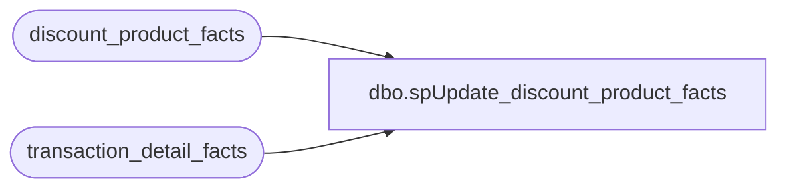

# dbo.spUpdate_discount_product_facts

**Database:** dw  
**Server:** papamart  

## Architecture Diagram



## Table Dependencies

| Referenced Table |
|---|
| discount_product_facts |
| transaction_detail_facts |

## Stored Procedure Code

```sql
CREATE PROCEDURE [dbo].[spUpdate_discount_product_facts]
AS
SET NOCOUNT ON
/* ============================================================================= */
/* ================================  BEGIN  ==================================== */
/* ============================================================================= */

IF (Object_ID('tempdb..#transaction_id') IS NOT NULL) DROP TABLE #transaction_id
select distinct transaction_id, transaction_line_seq
into #transaction_id
from discount_product_facts
where product_key is null

declare @transaction_id bigint
declare @transaction_line_seq int
declare @i int
--set @i = 1

declare curDiscount cursor
for	select transaction_id, transaction_line_seq from #transaction_id order by transaction_id, transaction_line_seq
open curDiscount
 
fetch next from curDiscount into @transaction_id, @transaction_line_seq
while (@@fetch_STATUS <> -1)
begin
--	print @i

	update discount_product_facts
	set product_key = (
		select top 1 product_key 
		from transaction_detail_facts with (nolock)
		where transaction_id = @transaction_id
			and transaction_line_seq < @transaction_line_seq
		order by transaction_line_seq desc
	)
	where transaction_id = @transaction_id
		and transaction_line_seq = @transaction_line_seq

--	set @i = @i + 1
	fetch next from curDiscount into @transaction_id, @transaction_line_seq
end
close curDiscount
deallocate curDiscount

SET NOCOUNT OFF

/* ============================================================================= */
/* =================================  END  ===================================== */
/* ============================================================================= */
```

