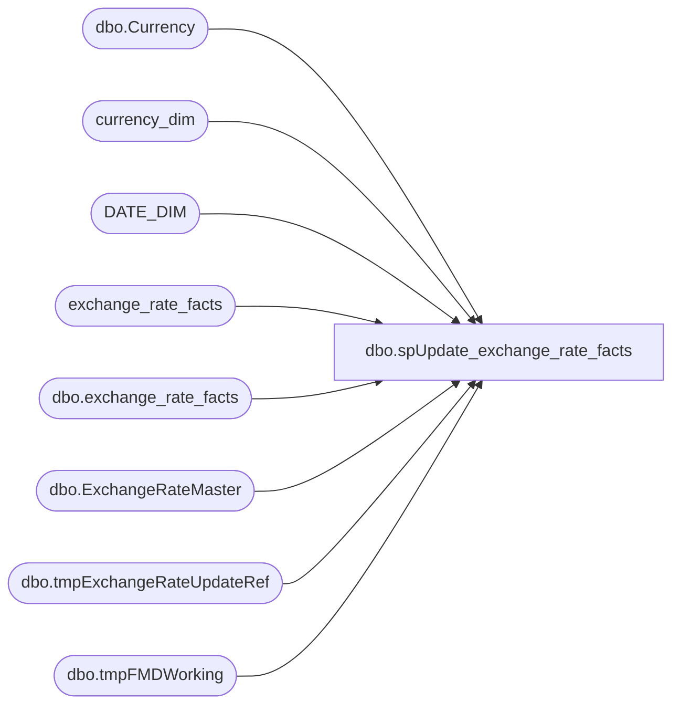

# dbo.spUpdate_exchange_rate_facts

**Database:** dw  
**Server:** papamart  

## Architecture Diagram



## Table Dependencies

| Referenced Table |
|---|
| dbo.Currency |
| currency_dim |
| DATE_DIM |
| exchange_rate_facts |
| dbo.exchange_rate_facts |
| dbo.ExchangeRateMaster |
| dbo.tmpExchangeRateUpdateRef |
| dbo.tmpFMDWorking |

## Stored Procedure Code

```sql
CREATE PROCEDURE [dbo].[spUpdate_exchange_rate_facts]
AS

/******************************************************************************
**
**	Name:		spUpdate_exchange_rate_facts
**
**	Description: 	Updates dbo.exchange_rate_facts with the exchange rate from the Franchisee Sales Information
**
**
**	Parameters:	none
**
** 	Returns:	result set
**
**	Examples:	EXEC spUpdate_exchange_rate_facts
**			
**
**	History:	
**  Date 			Author 				Purpose
**  6/4/2012		Gary Murrish		Created
**  03/18/2013		Mike Pelikan		Modified to populate dw.dbo.exchange_rate_facts from StoreMDM
**	04/29/2014		Mike Pelikan		Changed FranchMstrData linked server reference
**	2/18/2015		Kevin Shyr			Added DKK filter
**	3/11/2015		Kevin Shyr			Reorg comment section
**  5/4/2015		Kevin Shyr			Replaced cursor logic
******************************************************************************/

SET NOCOUNT ON 

IF OBJECT_ID('dwstaging..tmpFMDWorking') IS NOT NULL
    DROP TABLE dwstaging.dbo.tmpFMDWorking
IF OBJECT_ID('dwstaging..tmpExchangeRateUpdateRef') IS NOT NULL
    DROP TABLE dwstaging.dbo.tmpExchangeRateUpdateRef
CREATE TABLE dwstaging.dbo.tmpExchangeRateUpdateRef
	(PREVasOfDate_key INT
	, THISasOfDate_key INT
	, frmCurrency_key INT
	, toCurrency_key INT
	, bbw_rate DECIMAL(15, 8)
	)

--get data from StoreMDM, but do not get the exchange rates that are static
SELECT frC.currency_code frmCurrency_code, toC.currency_code toCurrency_code, asOfDate, bbw_rate
INTO dwstaging.dbo.tmpFMDWorking
FROM KODIAK.FranchMstrData.dbo.ExchangeRateMaster erm WITH(NOLOCK)
	INNER JOIN KODIAK.FranchMstrData.dbo.Currency toC WITH(NOLOCK)
		ON erm.toCurrencyID = toC.currencyID
	INNER JOIN KODIAK.FranchMstrData.dbo.Currency frC WITH(NOLOCK)
		ON erm.fromCurrencyID = frC.currencyID
WHERE toC.currency_code NOT IN ('USD', 'EUR', 'GBP', 'CDN', 'DKK')


INSERT INTO dwstaging.dbo.tmpExchangeRateUpdateRef
	(PREVasOfDate_key, THISasOfDate_key, frmCurrency_key, toCurrency_key, bbw_rate)
SELECT 
	1
	, dd.date_key
	, FRMcd.currency_key from_Currency_key
	, TOcd.currency_key to_currency_key
	, bbw_rate
FROM dwstaging.dbo.tmpFMDWorking fmd 
	INNER JOIN DATE_DIM dd WITH(READCOMMITTED)
		ON fmd.asofDate = dd.actual_date
	INNER JOIN currency_dim TOcd WITH(READCOMMITTED)
		ON fmd.toCurrency_code = TOcd.currency_code
	INNER JOIN currency_dim FRMcd WITH(READCOMMITTED)
		ON fmd.frmCurrency_code = FRMcd.currency_code
ORDER BY TOcd.currency_key, FRMcd.currency_key, asOfDate


UPDATE eru1
SET PREVasOfDate_key = (SELECT MAX(eru2.THISasOfDate_key) + 1
		FROM dwstaging.dbo.tmpExchangeRateUpdateRef eru2
			WHERE eru2.frmCurrency_key = eru1.frmCurrency_key
				AND eru2.toCurrency_key = eru1.toCurrency_key
				AND eru2.THISasOfDate_key < eru1.THISasOfDate_key)
FROM dwstaging.dbo.tmpExchangeRateUpdateRef eru1

-- remove the rows that fall out of the date range we care about
DELETE
FROM dwstaging.dbo.tmpExchangeRateUpdateRef
WHERE PREVasOfDate_key IS NULL


-- update exchange rate for the changed bbw_rate
--SELECT erf.*
UPDATE erf SET bbw_rate = terur.bbw_rate
FROM dbo.exchange_rate_facts erf 
	INNER JOIN dwstaging.dbo.tmpExchangeRateUpdateRef terur
		ON erf.date_key BETWEEN terur.PREVasOfDate_key AND terur.THISasOfDate_key
			AND erf.from_currency_key = terur.frmCurrency_key 
			AND erf.to_currency_key = terur.toCurrency_key
			AND erf.bbw_rate <> terur.bbw_rate


/******************  old cursor logic   ********************************/
--IF OBJECT_ID('tempdb..#FMDWorking') IS NOT NULL
--    DROP TABLE #FMDWorking
----get data from StoreMDM, but do not get the exchange rates that are static
--SELECT frC.currency_code frmCurrency_code, toC.currency_code toCurrency_code, asOfDate, bbw_rate
--INTO #FMDWorking
--FROM KODIAK.FranchMstrData.dbo.ExchangeRateMaster erm
--INNER JOIN KODIAK.FranchMstrData.dbo.Currency toC ON erm.toCurrencyID = toC.currencyID
--INNER JOIN KODIAK.FranchMstrData.dbo.Currency frC ON erm.fromCurrencyID = frC.currencyID
--WHERE toC.currency_code NOT IN ('USD', 'EUR', 'GBP', 'CDN', 'DKK')


--DECLARE @toCurrency_key INT, @prevTOCurrency_key int, @frmCurrency_key INT, @prevFRMCurrency_key int, @THISasOfDate_key INT, @PREVasOfDate_key INT, @bbw_rate DECIMAL(15,8)
--SELECT @PREVasOfDate_key = 1, @prevTOCurrency_key = 0, @prevFRMCurrency_key = 0

--DECLARE erf_cursor CURSOR FOR 
--SELECT TOcd.currency_key to_currency_key, FRMcd.currency_key from_Currency_key, dd.date_key, bbw_rate
--FROM #FMDWorking fmd 
--INNER JOIN DATE_DIM dd (nolock) ON fmd.asofDate = dd.actual_date
--INNER JOIN currency_dim TOcd (nolock) ON fmd.toCurrency_code = TOcd.currency_code
--INNER JOIN currency_dim FRMcd (nolock) ON fmd.frmCurrency_code = FRMcd.currency_code
--ORDER BY TOcd.currency_key, FRMcd.currency_key, asOfDate
--OPEN erf_cursor

--FETCH NEXT FROM erf_cursor INTO @toCurrency_key, @frmCurrency_key, @THISasOfDate_key, @bbw_rate
--WHILE @@FETCH_STATUS = 0
--BEGIN
--	IF NOT (@prevTOCurrency_key = @toCurrency_key AND @prevFRMCurrency_key = @frmCurrency_key) 
--	begin
--		--print 'reset the previous date'
--		SET @PREVasOfDate_key = 1
--	end

--	UPDATE dbo.exchange_rate_facts
--	SET bbw_rate = @bbw_rate
--	WHERE date_key > @PREVasOfDate_key AND date_key <= @THISasOfDate_key
--	AND from_currency_key = @frmCurrency_key AND to_currency_key = @toCurrency_key
--	AND bbw_rate <> @bbw_rate

--	EndOfCursor:
--	SELECT @PREVasOfDate_key = @THISasOfDate_key, @prevTOCurrency_key = @toCurrency_key, @prevFRMCurrency_key = @frmCurrency_key
--	FETCH NEXT FROM erf_cursor INTO @toCurrency_key, @frmCurrency_key, @THISasOfDate_key, @bbw_rate
--END 
--CLOSE erf_cursor 
--DEALLOCATE erf_cursor 

--Remaining records
UPDATE erf
SET bbw_rate = qry2.bbw_rate
FROM exchange_rate_facts erf
LEFT JOIN (
	SELECT TOcd.currency_key to_currency_key, FRMcd.currency_key from_Currency_key, qry.maxdate_key, fmd.bbw_rate
	FROM dwstaging.dbo.tmpFMDWorking fmd 
	INNER JOIN DATE_DIM dd (nolock) ON fmd.asofDate = dd.actual_date
	INNER JOIN (
		SELECT toCurrency_code, frmCurrency_code, MAX(dd.date_key) maxdate_key
		FROM dwstaging.dbo.tmpFMDWorking fmd 
		INNER JOIN DATE_DIM dd (nolock) ON fmd.asofDate = dd.actual_date
		GROUP BY toCurrency_code, frmCurrency_code
	) qry ON fmd.toCurrency_code = qry.toCurrency_code AND fmd.frmCurrency_code = qry.frmCurrency_code AND dd.date_key= qry.maxdate_key
	INNER JOIN currency_dim TOcd (nolock) ON fmd.toCurrency_code = TOcd.currency_code
	INNER JOIN currency_dim FRMcd (nolock) ON fmd.frmCurrency_code = FRMcd.currency_code
) qry2 ON erf.from_currency_key = qry2.from_Currency_key AND erf.to_currency_key = qry2.to_currency_key
WHERE erf.date_key > qry2.maxdate_key AND  erf.bbw_rate <> qry2.bbw_rate
```

