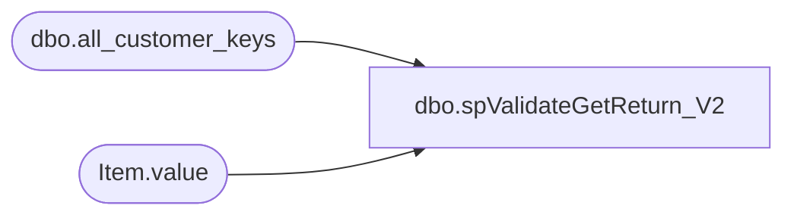

# dbo.spValidateGetReturn_V2

**Database:** dw  
**Server:** papamart  

## Architecture Diagram



## Table Dependencies

| Referenced Table |
|---|
| dbo.all_customer_keys |
| Item.value |

## Stored Procedure Code

```sql
CREATE PROCEDURE [dbo].[spValidateGetReturn_V2]
	@XMLToValidate AS XML

-- =============================================================================================================
-- Name: spValidateGetReturn
--
-- Description:	
--
-- Output: 
--	ds
-- Dependencies: 
--
-- Revision History
--		Name:			Date:			Comments:
--		Ben Barud		05/07/2018		Initial Creation
--		Tim Bytnar		06/07/2018		Changed the lookup table to the all_customer_keys table in CRM
--		Ben Barud		11/14/2018		Updated to point to new CRM server for CRM Updgrade
-- =============================================================================================================

AS
BEGIN
	-- SET NOCOUNT ON added to prevent extra result sets from
	-- interfering with SELECT statements.
	SET NOCOUNT ON;
	--DECLARE @XMLToValidate AS XML
	--SET @XMLToValidate = '<?xml version="1.0" encoding="utf-8"?><ValidateGetReturn><ValidationID>1</ValidationID><CustomerID>4D5A567F-EF99-4966-B41B-5FD91F627ECB</CustomerID></ValidateGetReturn>'
    DECLARE @ValidationID AS INT, @CustUID AS UNIQUEIDENTIFIER

	--SELECT @ValidationID = T.Item.value('VaidationID[1]', 'INT'),
	--       @guid = T.Item.value('CustUID[1]', 'UNIQUEIDENTIFIER')
	--FROM @XMLToValidate.nodes('/XMLToValid/ValidationID') AS T(Item)
	SELECT @ValidationID = T.Item.value('ValidationID[1]', 'INT')
	FROM @XMLToValidate.nodes('/ValidateGetReturn') AS T(Item)

	IF @ValidationID = 1
	BEGIN
		SELECT @CustUID = T.Item.value('CustomerID[1]', 'UNIQUEIDENTIFIER')
		FROM @XMLToValidate.nodes('/ValidateGetReturn') AS T(Item)

		PRINT CAST(@XMLToValidate AS VARCHAR(MAX))
		PRINT @ValidationID
		PRINT @CustUID

		SELECT '<?xml version="1.0" encoding="UTF-8"?>' + 
		CAST((
		SELECT @ValidationID AS 'ValidationID', [customer_no] AS 'CustomerNo'
        FROM [STL-CRMDB-P-01].[crm].[dbo].[all_customer_keys]
		WHERE cust_uid = @CustUID
		FOR XML PATH ('ValidateGetReturn'), type
		) AS VARCHAR(MAX))
	END
	IF @ValidationID = 2
	BEGIN
		SELECT @CustUID = T.Item.value('CustomerID[1]', 'UNIQUEIDENTIFIER')
		FROM @XMLToValidate.nodes('/ValidateGetReturn') AS T(Item)

		SELECT CAST([customer_no] AS VARCHAR(20))
        FROM [STL-CRMDB-P-01].[crm].[dbo].[all_customer_keys]
		WHERE cust_uid = @CustUID
	END
END
```

