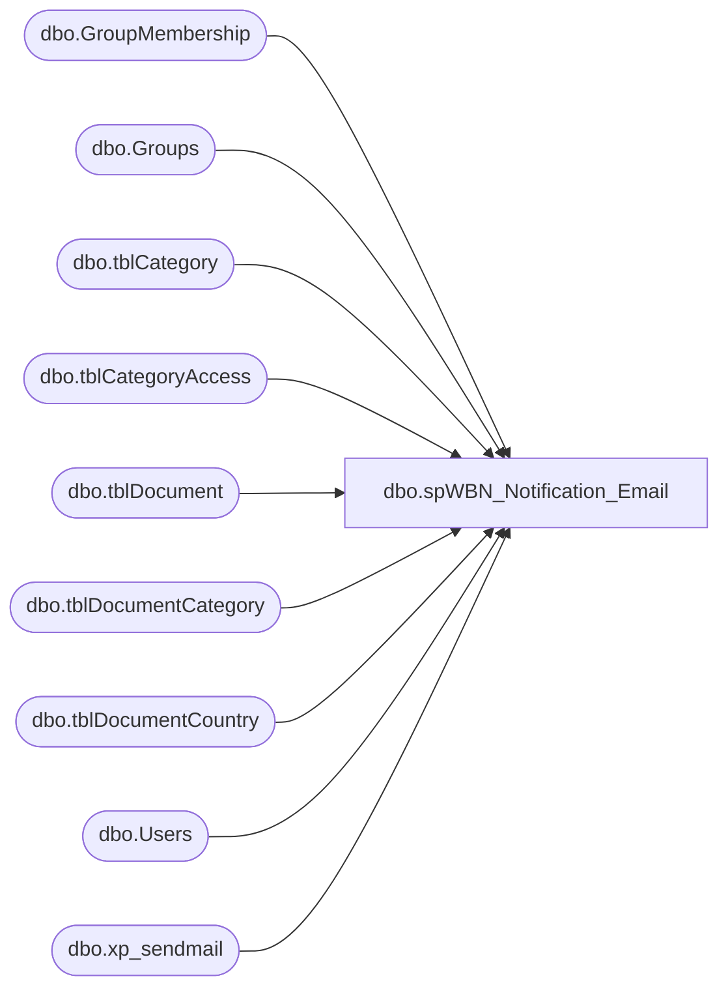

# dbo.spWBN_Notification_Email

**Database:** dw  
**Server:** papamart  

## Architecture Diagram



## Table Dependencies

| Referenced Table |
|---|
| dbo.GroupMembership |
| dbo.Groups |
| dbo.tblCategory |
| dbo.tblCategoryAccess |
| dbo.tblDocument |
| dbo.tblDocumentCategory |
| dbo.tblDocumentCountry |
| dbo.Users |
| dbo.xp_sendmail |

## Stored Procedure Code

```sql
CREATE PROCEDURE spWBN_Notification_Email
AS

SET NOCOUNT ON

declare @email varchar(100), @UserRoles varchar(25), @God bit, @Financial bit, @UserID int
declare @DateUploaded varchar(25), @DocumentName varchar(100), @CategoryName varchar(50)

declare @DateNotified datetime
set @DateNotified = convert(varchar, getdate(), 101)

-- set @DateNotified = '2004-05-25 00:00:00.000'

update wbn1.buildabear.dbo.tblDocument set DateNotified = @DateNotified where DateNotified is null


declare @MySubject varchar(8000)
declare @MyCopy_Recipients varchar(8000)
declare @MyRecipient varchar(8000)
declare @MyMessage varchar(8000)

-- are there new documents 
if (select count(*) from wbn1.buildabear.dbo.tblDocument where DateNotified = @DateNotified) > 0 
begin
	IF (Object_ID('tempdb..#docs') IS NOT NULL) DROP TABLE #docs
	create table #docs  (
		DateUploaded	datetime,
		DocumentID	int,
		DocumentName	varchar(75),
		ParentCategory	varchar(50),
		CategoryName	varchar(50),
		CodeKey		varchar(50)
	)

	declare curUserIDs cursor fast_forward
	FOR
		select 	UserID,
			email, 
			UserRoles, 
			case when charindex('A', UserRoles) > 0 then 1 else 0 end, 
 			case when charindex('F', UserRoles) > 0 then 1 else 0 end
		from wbn1.buildabear.dbo.Users
		order by email
	open curUserIDs

	-- loop through the users
	fetch next from curUserIDs into @UserID, @email, @UserRoles, @God, @Financial
	while (@@fetch_STATUS <> -1)
	begin
-- 		print @email + ' ' + @UserRoles
	
		truncate table #docs

		-- gods can see everything
		if @God = 1
		begin
-- 			print 'god like being'

			insert into #docs
			SELECT DISTINCT d.DateUpload, D.DocumentID, D.DocumentName, PC.CategoryName AS ParentCategory, C.CategoryName, null
			FROM wbn1.buildabear.dbo.tblDocument D
			LEFT OUTER JOIN wbn1.buildabear.dbo.tblDocumentCategory DC ON D.DocumentID = DC.DocumentID
			LEFT OUTER JOIN wbn1.buildabear.dbo.tblDocumentCountry DCT ON D.DocumentID = DCT.DocumentID
			LEFT OUTER JOIN wbn1.buildabear.dbo.tblCategory C ON DC.CategoryID = C.CategoryID
			LEFT OUTER JOIN wbn1.buildabear.dbo.tblCategory PC ON C.ParentKey = PC.CodeKey
			WHERE 
				D.IsWorkInProgress = 0 
				AND D.DateNotified = @DateNotified
			ORDER BY D.DocumentID			
		end

		-- if they are tied to a country, they can see their country/s documents
		else if (select count(*)
				FROM wbn1.buildabear.dbo.Groups g
				INNER JOIN wbn1.buildabear.dbo.GroupMembership gm ON g.GroupID = gm.GroupID 
				WHERE gm.UserID = @UserID AND GroupDesc LIKE '%country%')
			> 0
		begin
-- 			print 'going with country'			

			insert into #docs
			SELECT DISTINCT d.DateUpload, D.DocumentID, D.DocumentName, PC.CategoryName AS ParentCategory, C.CategoryName, null
			FROM wbn1.buildabear.dbo.tblDocument D
				LEFT OUTER JOIN wbn1.buildabear.dbo.tblDocumentCategory DC ON D.DocumentID = DC.DocumentID
				LEFT OUTER JOIN wbn1.buildabear.dbo.tblDocumentCountry DCT ON D.DocumentID = DCT.DocumentID
				LEFT OUTER JOIN wbn1.buildabear.dbo.tblCategory C ON DC.CategoryID = C.CategoryID
				LEFT OUTER JOIN wbn1.buildabear.dbo.tblCategory PC ON C.ParentKey = PC.CodeKey
			WHERE 
			-- This will get top level categories
			((DC.CategoryID IN (SELECT CategoryID FROM wbn1.buildabear.dbo.tblCategoryAccess WHERE GroupID IN (SELECT GroupID FROM wbn1.buildabear.dbo.GroupMembership WHERE UserID = @UserID) AND CanDownload = 1)
			OR (DC.CategoryID IN (SELECT C.CategoryID FROM wbn1.buildabear.dbo.tblCategory C LEFT OUTER JOIN wbn1.buildabear.dbo.tblCategory PC ON C.ParentKey = PC.CodeKey 
			WHERE PC.CategoryID IN (SELECT CategoryID FROM wbn1.buildabear.dbo.tblCategoryAccess WHERE GroupID IN (SELECT GroupID FROM wbn1.buildabear.dbo.GroupMembership WHERE UserID = @UserID) AND CanDownload = 1)))))
			AND (DCT.GroupID IN (SELECT GroupID FROM wbn1.buildabear.dbo.GroupMembership WHERE UserID = @UserID) OR DCT.GroupID IS NULL OR D.IsAllCountries = 1)
			AND D.IsWorkInProgress = 0
			AND D.DateNotified = @DateNotified
			ORDER BY D.DocumentID

		end

		-- they must really be a nobody.
		else
		begin
-- 			print ' ****************************************** help'			

			insert into #docs
			SELECT DISTINCT d.DateUpload, D.DocumentID, D.DocumentName, PC.CategoryName AS ParentCategory, C.CategoryName, C.CodeKey
			FROM 	wbn1.buildabear.dbo.tblDocument D
				LEFT OUTER JOIN wbn1.buildabear.dbo.tblDocumentCategory DC ON D.DocumentID = DC.DocumentID
				LEFT OUTER JOIN wbn1.buildabear.dbo.tblCategory C ON DC.CategoryID = C.CategoryID
				LEFT OUTER JOIN wbn1.buildabear.dbo.tblCategory PC ON C.ParentKey = PC.CodeKey
			WHERE 
				-- This will get top level categories
				(DC.CategoryID IN (SELECT CategoryID FROM wbn1.buildabear.dbo.tblCategoryAccess WHERE GroupID IN (SELECT GroupID FROM wbn1.buildabear.dbo.GroupMembership WHERE UserID = @UserID) AND CanDownload = 1)
				OR DC.CategoryID IN (SELECT C.CategoryID FROM wbn1.buildabear.dbo.tblCategory C LEFT OUTER JOIN wbn1.buildabear.dbo.tblCategory PC ON C.ParentKey = PC.CodeKey WHERE PC.CategoryID IN (SELECT CategoryID FROM wbn1.buildabear.dbo.tblCategoryAccess WHERE GroupID IN (SELECT GroupID FROM wbn1.buildabear.dbo.GroupMembership WHERE UserID = @UserID) AND CanDownload = 1))
				)
				AND D.IsWorkInProgress = 0
				AND D.DateNotified = @DateNotified
			ORDER BY D.DocumentID

			-- if they don't have the financial category, then stop them from seeing any financial notices
			if @Financial = 0
			begin
-- 				print '%%%%%%%%%%%%%%%%%%%%%%%%%%%%%%%%%%%%%%%%%%%%%%%%%%%%%%%%%%%%%%%%%%%%%%%%%%%%%%%%%'
				delete from #docs where CodeKey = 'Financial'
			end
		end


		if (select count(*) from #docs) > 0 
		begin
			declare curDocs cursor
			FOR
				select 	convert(varchar, DateUploaded, 101), DocumentName, CategoryName
				from #docs
				order by DateUploaded, DocumentName
			open curDocs
		
			set @MyMessage = ''
			fetch next from curDocs into @DateUploaded, @DocumentName, @CategoryName
	
			while (@@fetch_STATUS <> -1)
			begin
				set @MyMessage = @MyMessage + @DocumentName + char(13)			

-- 				set @MyMessage = @MyMessage + '<tr><td><font size=2>' + @DateUploaded + 
-- 					'</font></td><td><font size=2>' + @DocumentName +
-- 					'</font></td><td><font size=2>' + @CategoryName +'</font></td></tr>'
				fetch next from curDocs into @DateUploaded, @DocumentName, @CategoryName
			end		
	
			close curDocs
			deallocate curDocs
-- print @MyMessage

			set @MyMessage = 
				'The following documents are now available for you to view at the World BearNet web site.' + char(13) + char(13) +
				@MyMessage

-- 			set @MyMessage = 
-- '
-- <html>
-- <body>
-- <font face=arial size=2 color="#000066">
-- ' + @email+'
-- The following documents are now available for you to view at the World BearNet web site.<br><br>
-- <table border="1" cellspacing="0" cellpadding="3" bordercolor="#000066">
-- <tr>
-- <td bgcolor=#000066><font size=2 color=white><b>Date Uploaded</b></font></td>
-- <td bgcolor=#000066><font size=2 color=white><b>Document Name</b></font></td>
-- <td bgcolor=#000066><font size=2 color=white><b>Category Name</b></font></td>
-- </tr>
-- '
-- + @MyMessage +
-- '
-- </table>
-- </font>
-- </body>
-- <html>
-- '
-- 			SET @MyRecipient = 'davidr@buildabear.com'
-- 			SET @MySubject = 'New World BearNet Documents Available'
-- 			SET @MyCopy_Recipients = ''
-- 		
-- 			exec sp_Mail_cdosys 'WBNadmin@buildabear.com', @MyRecipient, @MyCopy_Recipients, @MySubject, @MyMessage
-- print 'mail sent'	

		set @MyRecipient = @email
--		set @MyRecipient = @email + ';davidr@buildabear.com'
		exec master.dbo.xp_sendmail 
			@recipients = @MyRecipient, 
-- 			@recipients = @email + ';davidr@buildabear.com', 
-- 			@recipients = 'davidr@buildabear.com', 
-- 			@query = 'select DateUploaded, DocumentName from tempdb..#docs',
			@subject = 'New World BearNet Documents Available',
			@message = @MyMessage,
			@width = 250

		end
	
		fetch next from curUserIDs into @UserID, @email, @UserRoles, @God, @Financial
	END

	close curUserIDs
	deallocate curUserIDs
end


-- select * from wbn1.buildabear.dbo.tblDocument
```

