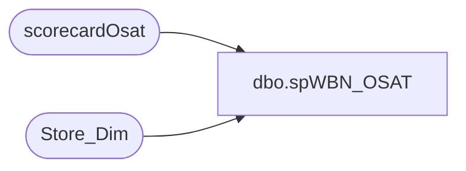

# dbo.spWBN_OSAT

**Database:** dw  
**Server:** papamart  

## Architecture Diagram



## Table Dependencies

| Referenced Table |
|---|
| scorecardOsat |
| Store_Dim |

## Stored Procedure Code

```sql
CREATE PROCEDURE spWBN_OSAT
AS
BEGIN
-- WBN Report
--	These should be the Top 10 OSAT stores for the current period.  
--	For instance, right now, we are showing the Top 10 stores from the 2/12 posting, 
--	and these will stay there until 3/5.
--	If there are ties, we do show more than 10 stores.

	SET NOCOUNT ON;

	DECLARE @Period_Id INT

	SELECT @Period_Id = MAX(Period_Id) FROM scorecardOsat

	SELECT sd.Store_Id, Store_Name, Rollingosat FROM scorecardOsat O
		JOIN Store_Dim sd ON sd.Store_Key = O.Store_Key
	WHERE Period_Id = @Period_Id 
		AND rollingosat in (
							SELECT TOP 10 rollingosat
							FROM scorecardOsat 
							WHERE Period_Id = @Period_Id
							ORDER BY rollingOSAT DESC
							)
	Order BY  RollingOSAT DESC
END
```

