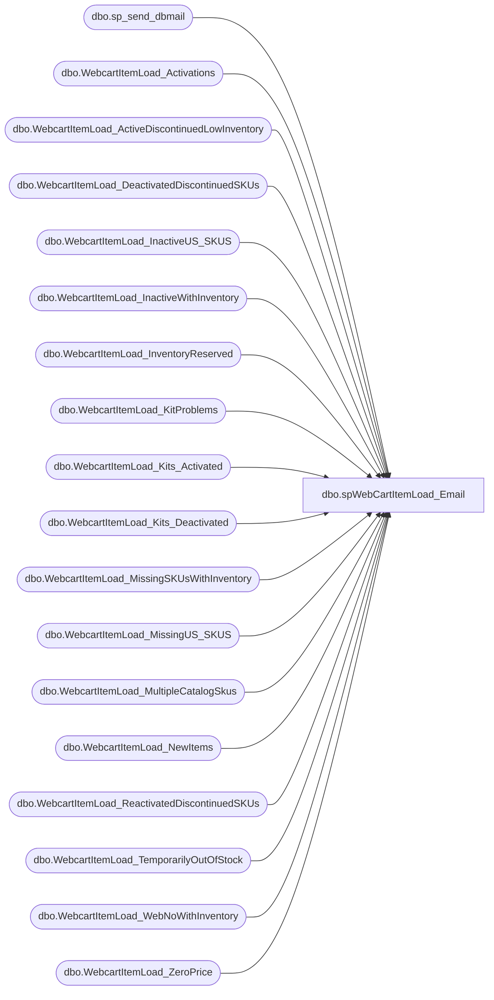

# dbo.spWebCartItemLoad_Email

**Database:** dw  
**Server:** papamart  

## Architecture Diagram



## Table Dependencies

| Referenced Table |
|---|
| dbo.sp_send_dbmail |
| dbo.WebcartItemLoad_Activations |
| dbo.WebcartItemLoad_ActiveDiscontinuedLowInventory |
| dbo.WebcartItemLoad_DeactivatedDiscontinuedSKUs |
| dbo.WebcartItemLoad_InactiveUS_SKUS |
| dbo.WebcartItemLoad_InactiveWithInventory |
| dbo.WebcartItemLoad_InventoryReserved |
| dbo.WebcartItemLoad_KitProblems |
| dbo.WebcartItemLoad_Kits_Activated |
| dbo.WebcartItemLoad_Kits_Deactivated |
| dbo.WebcartItemLoad_MissingSKUsWithInventory |
| dbo.WebcartItemLoad_MissingUS_SKUS |
| dbo.WebcartItemLoad_MultipleCatalogSkus |
| dbo.WebcartItemLoad_NewItems |
| dbo.WebcartItemLoad_ReactivatedDiscontinuedSKUs |
| dbo.WebcartItemLoad_TemporarilyOutOfStock |
| dbo.WebcartItemLoad_WebNoWithInventory |
| dbo.WebcartItemLoad_ZeroPrice |

## Stored Procedure Code

```sql
CREATE PROCEDURE [dbo].[spWebCartItemLoad_Email]
AS
 
-- =============================================
-- Author:		
-- Create date: 
-- Description:	Emails webcart items
-- name		date			change
-- garyd	20081121		set nocount on
-- edinp	20120404		removed Radhika and Donovan from mailing list
-- mikep	20130617		removed CorieB from mailing list
-- mikep    20140114		removed MonicaJ from mailing list
-- mikep	20140319		changed to use databasemail
-- justind	20141009		remove web inventory and teresa t from mailing list
--	mikep	20150109		removed jayb from mailling list
-- =============================================

set nocount on

IF (Object_ID('tempdb..##WebcartItemLoad_NewItems') IS NOT NULL) DROP TABLE ##WebcartItemLoad_NewItems
select *
into ##WebcartItemLoad_NewItems
from bearwebdb.webcart_commerce.dbo.WebcartItemLoad_NewItems

IF (Object_ID('tempdb..##WebcartItemLoad_Activations') IS NOT NULL) DROP TABLE ##WebcartItemLoad_Activations
select *
into ##WebcartItemLoad_Activations
from bearwebdb.webcart_commerce.dbo.WebcartItemLoad_Activations

IF (Object_ID('tempdb..##WebcartItemLoad_DeactivatedDiscontinuedSKUs') IS NOT NULL) DROP TABLE ##WebcartItemLoad_DeactivatedDiscontinuedSKUs
select *
into ##WebcartItemLoad_DeactivatedDiscontinuedSKUs
from bearwebdb.webcart_commerce.dbo.WebcartItemLoad_DeactivatedDiscontinuedSKUs

IF (Object_ID('tempdb..##WebcartItemLoad_ReactivatedDiscontinuedSKUs') IS NOT NULL) DROP TABLE ##WebcartItemLoad_ReactivatedDiscontinuedSKUs
select *
into ##WebcartItemLoad_ReactivatedDiscontinuedSKUs
from bearwebdb.webcart_commerce.dbo.WebcartItemLoad_ReactivatedDiscontinuedSKUs

IF (Object_ID('tempdb..##WebcartItemLoad_ZeroPrice') IS NOT NULL) DROP TABLE ##WebcartItemLoad_ZeroPrice
select *
into ##WebcartItemLoad_ZeroPrice
from bearwebdb.webcart_commerce.dbo.WebcartItemLoad_ZeroPrice
IF (Object_ID('tempdb..##WebcartItemLoad_MissingUS_SKUS') IS NOT NULL) DROP TABLE ##WebcartItemLoad_MissingUS_SKUS
select *
into ##WebcartItemLoad_MissingUS_SKUS
from bearwebdb.webcart_commerce.dbo.WebcartItemLoad_MissingUS_SKUS

IF (Object_ID('tempdb..##WebcartItemLoad_InactiveUS_SKUS') IS NOT NULL) DROP TABLE ##WebcartItemLoad_InactiveUS_SKUS
select *
into ##WebcartItemLoad_InactiveUS_SKUS
from bearwebdb.webcart_commerce.dbo.WebcartItemLoad_InactiveUS_SKUS

IF (Object_ID('tempdb..##WebcartItemLoad_MultipleCatalogSkus') IS NOT NULL) DROP TABLE ##WebcartItemLoad_MultipleCatalogSkus
select *
into ##WebcartItemLoad_MultipleCatalogSkus
from bearwebdb.webcart_commerce.dbo.WebcartItemLoad_MultipleCatalogSkus

IF (Object_ID('tempdb..##WebcartItemLoad_InactiveWithInventory') IS NOT NULL) DROP TABLE ##WebcartItemLoad_InactiveWithInventory
select *
into ##WebcartItemLoad_InactiveWithInventory
from bearwebdb.webcart_commerce.dbo.WebcartItemLoad_InactiveWithInventory

IF (Object_ID('tempdb..##WebcartItemLoad_MissingSKUsWithInventory') IS NOT NULL) DROP TABLE ##WebcartItemLoad_MissingSKUsWithInventory
select *
into ##WebcartItemLoad_MissingSKUsWithInventory
from bearwebdb.webcart_commerce.dbo.WebcartItemLoad_MissingSKUsWithInventory

IF (Object_ID('tempdb..##WebcartItemLoad_WebNoWithInventory') IS NOT NULL) DROP TABLE ##WebcartItemLoad_WebNoWithInventory
select *
into ##WebcartItemLoad_WebNoWithInventory
from bearwebdb.webcart_commerce.dbo.WebcartItemLoad_WebNoWithInventory

IF (Object_ID('tempdb..##WebcartItemLoad_Kits_Deactivated') IS NOT NULL) DROP TABLE ##WebcartItemLoad_Kits_Deactivated
select *
into ##WebcartItemLoad_Kits_Deactivated
from bearwebdb.webcart_commerce.dbo.WebcartItemLoad_Kits_Deactivated

IF (Object_ID('tempdb..##WebcartItemLoad_Kits_Activated') IS NOT NULL) DROP TABLE ##WebcartItemLoad_Kits_Activated
select *
into ##WebcartItemLoad_Kits_Activated
from bearwebdb.webcart_commerce.dbo.WebcartItemLoad_Kits_Activated

IF (Object_ID('tempdb..##WebcartItemLoad_KitProblems') IS NOT NULL) DROP TABLE ##WebcartItemLoad_KitProblems
select *
into ##WebcartItemLoad_KitProblems
from bearwebdb.webcart_commerce.dbo.WebcartItemLoad_KitProblems

IF (Object_ID('tempdb..##WebcartItemLoad_ActiveDiscontinuedLowInventory') IS NOT NULL) DROP TABLE ##WebcartItemLoad_ActiveDiscontinuedLowInventory
select *
into ##WebcartItemLoad_ActiveDiscontinuedLowInventory
from bearwebdb.webcart_commerce.dbo.WebcartItemLoad_ActiveDiscontinuedLowInventory

IF (Object_ID('tempdb..##WebcartItemLoad_InventoryReserved') IS NOT NULL) DROP TABLE ##WebcartItemLoad_InventoryReserved
select *
into ##WebcartItemLoad_InventoryReserved
from bearwebdb.webcart_commerce.dbo.WebcartItemLoad_InventoryReserved

IF (Object_ID('tempdb..##WebcartItemLoad_TemporarilyOutOfStock') IS NOT NULL) DROP TABLE ##WebcartItemLoad_TemporarilyOutOfStock
select *
into ##WebcartItemLoad_TemporarilyOutOfStock
from bearwebdb.webcart_commerce.dbo.WebcartItemLoad_TemporarilyOutOfStock


exec msdb.dbo.sp_send_dbmail 
@recipients = 'WebTeam@buildabear.com',
@subject='WebCart - Item Load', 
@query_result_width = 250,
@query= '
select ''New Items''
select cast(Catalog as char(7)) Catalog, cast(SKU as char(8)) SKU, cast(Descrip as char(20)) Description from ##WebcartItemLoad_NewItems
order by Catalog, SKU

select ''Items Activated (Inventory Finally Found)''
select distinct cast(Catalog as char(7)) Catalog, cast(SKU as char(8)) SKU, cast(Descrip as char(20)) Description
from ##WebcartItemLoad_Activations
order by Catalog, SKU

select ''Discontinued Deactivated SKUs that have No Remaining Inventory''
select cast(Catalog as char(7)) Catalog, cast(SKU as char(8)) SKU, cast(Descrip as char(20)) Description
from ##WebcartItemLoad_DeactivatedDiscontinuedSKUs
order by Catalog, SKU

select ''Discontinued Reactivated SKUs that now have Inventory''select cast(Catalog as char(7)) Catalog, cast(SKU as char(8)) SKU, cast(Descrip as char(20)) Description
from ##WebcartItemLoad_ReactivatedDiscontinuedSKUs
order by Catalog, SKU
select ''Items with $0 price''
select cast(Catalog as char(7)) Catalog, cast(SKU as char(8)) SKU, cast(Descrip as char(20)) Description, cast(OriginalPrice as char(13)) OriginalPrice, cast(cy_List_price as char(13)) cy_List_price 
from ##WebcartItemLoad_ZeroPrice
order by Catalog, SKU

select ''Active CA SKUs Missing Corresponding US SKUs - These have been deactivated!''
select * from ##WebcartItemLoad_MissingUS_SKUS

select ''Active CA SKUs but Inactive US SKUs - These have been deactivated!''
select * from ##WebcartItemLoad_InactiveUS_SKUS

select ''SKUs in Multiple Catalogs''
select cast(SKU as char(8)) SKU, cast(Catalog1 as char(7)) Catalog1, cast(Catalog2 as char(7)) Catalog2
from ##WebcartItemLoad_MultipleCatalogSkus

select ''Inactive SKUs with more than 10 units of inventory available''
select * from ##WebcartItemLoad_InactiveWithInventory

select ''Missing Catalog Items that the Webshop has Inventory''
select cast(Catalog as char(7)) Catalog, cast(SKU as char(8)) SKU, actual_units, cast(description as char(20)) Description
from ##WebcartItemLoad_MissingSKUsWithInventory
order by catalog,sku

select ''WebNo Items that the Webshop has Inventory''
select cast(SKU as char(8)) SKU, actual_units, cast(long_desc as char(25)) Description
from ##WebcartItemLoad_WebNoWithInventory
order by sku

select ''Kits Deactivated due to Missing or Inactive SKUs''
select cast(Catalog as char(7)) Catalog, cast(kp.KitDisplayName as varchar(40)) KitDisplayName, cast(kp.KitSKUs as varchar(40)) KitSKUs
from ##WebcartItemLoad_Kits_Deactivated kp
order by Catalog, KitDisplayName

select ''Kits Activated''
select cast(Catalog as char(7)) Catalog, cast(kp.KitDisplayName as varchar(40)) KitDisplayName, cast(kp.KitSKUs as varchar(40)) KitSKUs
from ##WebcartItemLoad_Kits_Activated kp
order by Catalog, KitDisplayName

select ''Problem SKUs in Active Kits''
select cast(kp.Catalog as char(7)) Catalog, cast(kp.KitDisplayName as varchar(40)) KitDisplayName, cast(kp.KitSKUs as varchar(40)) KitSKUs, Problem, cast(kp.SKU as varchar(25)) SKU
from ##WebcartItemLoad_KitProblems kp
where KitIsActive = ''Yes''
order by kp.Catalog, KitDisplayName, SKU

select  ''Active Discontinued Items with Low Inventory (fudge factor not applied)''
select * from ##WebcartItemLoad_ActiveDiscontinuedLowInventory
where isnumeric(sku) = 1
order by Catalog, cast(SKU as integer)

select  ''Reserved Inventory - Active Orders (Purchased and in Baskets) but not shipped ''
select * from ##WebcartItemLoad_InventoryReserved
where isnumeric(sku) = 1
order by Catalog, cast(SKU as integer)

select ''Temporarily Out Of Stock - Not Discontinued''
select cast(Catalog as char(7)) Catalog, cast(SKU as char(8)) SKU, cast(Descrip as char(20)) Description, OnHand, Reserved, BackOrdered
from ##WebcartItemLoad_TemporarilyOutOfStock
order by Catalog, SKU'
```

