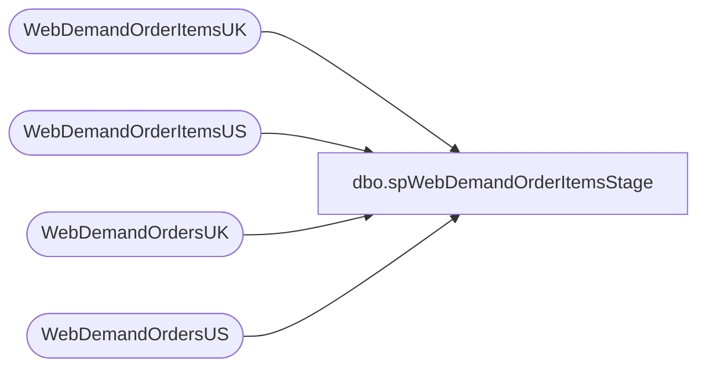

# dbo.spWebDemandOrderItemsStage

**Database:** dw  
**Server:** papamart  

## Architecture Diagram



## Table Dependencies

| Referenced Table |
|---|
| WebDemandOrderItemsUK |
| WebDemandOrderItemsUS |
| WebDemandOrdersUK |
| WebDemandOrdersUS |

## Stored Procedure Code

```sql
create proc spWebDemandOrderItemsStage

as

set nocount on

		select
			o.OrderNumber,
			max(o.LastUpdateDateUTC) MaxUpdate,
			max(o.InsertDate) MaxInsert
		into #tmpWebOrderMaxUpdate
		from WebDemandOrdersUS o with (nolock)
		where OrderStatus='Completed'
		and datediff(dd, o.LastUpdateDateUTC, getdate()) <= 30
		group by OrderNumber
		UNION 
		select
			o.OrderNumber,
			max(o.LastUpdateDateUTC) MaxUpdate,
			max(o.InsertDate) MaxInsert
		from WebDemandOrdersUK o with (nolock)
		where OrderStatus='Completed'
		and datediff(dd, o.LastUpdateDateUTC, getdate()) <= 30
		group by OrderNumber

		select
			o.OrderNumber,
			o.OrderLineNumber,
			max(o.LastUpdateDateUTC) MaxUpdate,
			max(o.InsertDate) MaxInsert
		into #tmpWebOrderItemsMaxUpdate
		from WebDemandOrderItemsUS o with (nolock)
		join #tmpWebOrderMaxUpdate oi on o.OrderNumber=oi.OrderNumber
		where datediff(dd, o.LastUpdateDateUTC, getdate()) <= 30
		group by o.OrderNumber,o.OrderLineNumber
		UNION 
		select
			o.OrderNumber,
			o.OrderLineNumber,
			max(o.LastUpdateDateUTC) MaxUpdate,
			max(o.InsertDate) MaxInsert
		from WebDemandOrderItemsUK o with (nolock)
		join #tmpWebOrderMaxUpdate oi on o.OrderNumber=oi.OrderNumber
		where datediff(dd, o.LastUpdateDateUTC, getdate()) <= 30
		group by o.OrderNumber,o.OrderLineNumber
	
IF (Object_ID('dwstaging.dbo.WebDemandOrderItemsStage') IS NOT NULL) DROP TABLE dwstaging.dbo.WebDemandOrderItemsStage
select
	oi.OrderNumber,	
	oi.UPC,	
	oi.ItemStatus,	
	oi.OrderItemTypeName,	
	oi.OrderDiscount,	
	oi.ItemDiscount,	
	oi.GiftCardNumber,	
	oi.ToName,	
	oi.ToEmail,	
	oi.FromName,	
	oi.FromEmail,	
	oi.Message,	
	oi.OrderLineNumber,	
	oi.LastUpdateDateUTC,	
	oi.SKU,	
	oi.Quantity,	
	oi.Price,	
	oi.SubTotal,	
	oi.USSalesTotal as SalesTotal,
	NULL as VAT, 
	oi.Tax,	
	oi.Total,	
	oi.Custom1,	
	oi.Custom2,	
	oi.Custom3,	
	oi.Custom4,	
	oi.Custom5,	
	oi.CustomExtendedAttributes,	
	oi.OrderShipmentID,	
	oi.EstimatedShipDateUTC,	
	oi.EndEstimatedShipDateUTC,	
	oi.ShippingMethod,	
	oi.ShippingMethodCode,	
	oi.ShippedDateUTC,	
	oi.OrderReturnID,	
	oi.DateReturnedUTC,	
	oi.ReturnReason,	
	oi.ReturnType,	
	oi.ItemStatusCode,	
	oi.GiftCardType,	
	oi.Balance,	
	oi.DeliveryType,	
	oi.WarehouseCode,	
	oi.WarehouseLocation,	
	oi.ShippingErrorID,	
	oi.OrderPaymentID,	
	oi.OrderItemPromotionIds,	
	oi.OrderItemCampaignIds,	
	oi.OrderItemCoupons,	
	oi.OrderPromotionIds,	
	oi.OrderCampaignIds,	
	oi.OrderCoupons,	
	oi.OrderPlacementDateUTC,	
	oi.ReturnNodeLocation,	
	oi.ReturnNodeCode,	
	oi.ReturnUser,	
	oi.FulfillmentNodeType,	
	oi.Brand,	
	oi.Cost,	
	oi.SiteCode	
into dwstaging.dbo.WebDemandOrderItemsStage
from WebDemandOrderItemsUS oi
join #tmpWebOrderItemsMaxUpdate oim 
	on oi.OrderNumber=oim.OrderNumber
	and oi.OrderLineNumber=oim.OrderLineNumber
	and oi.LastUpdateDateUTC=oim.MaxUpdate
	and oi.InsertDate=oim.MaxInsert
UNION
select
	oi.OrderNumber,	
	oi.UPC,	
	oi.ItemStatus,	
	oi.OrderItemTypeName,	
	oi.OrderDiscount,	
	oi.ItemDiscount,	
	oi.GiftCardNumber,	
	oi.ToName,	
	oi.ToEmail,	
	oi.FromName,	
	oi.FromEmail,	
	oi.Message,	
	oi.OrderLineNumber,	
	oi.LastUpdateDateUTC,	
	oi.SKU,	
	oi.Quantity,	
	oi.Price,	
	oi.SubTotal,	
	NULL as SalesTotal,
	oi.VAT, 
	oi.Tax,	
	oi.Total,	
	oi.Custom1,	
	oi.Custom2,	
	oi.Custom3,	
	oi.Custom4,	
	oi.Custom5,	
	oi.CustomExtendedAttributes,	
	oi.OrderShipmentID,	
	oi.EstimatedShipDateUTC,	
	oi.EndEstimatedShipDateUTC,	
	oi.ShippingMethod,	
	oi.ShippingMethodCode,	
	oi.ShippedDateUTC,	
	oi.OrderReturnID,	
	oi.DateReturnedUTC,	
	oi.ReturnReason,	
	oi.ReturnType,	
	oi.ItemStatusCode,	
	oi.GiftCardType,	
	oi.Balance,	
	oi.DeliveryType,	
	oi.WarehouseCode,	
	oi.WarehouseLocation,	
	oi.ShippingErrorID,	
	oi.OrderPaymentID,	
	oi.OrderItemPromotionIds,	
	oi.OrderItemCampaignIds,	
	oi.OrderItemCoupons,	
	oi.OrderPromotionIds,	
	oi.OrderCampaignIds,	
	oi.OrderCoupons,	
	oi.OrderPlacementDateUTC,	
	oi.ReturnNodeLocation,	
	oi.ReturnNodeCode,	
	oi.ReturnUser,	
	oi.FulfillmentNodeType,	
	oi.Brand,	
	oi.Cost,	
	oi.SiteCode	
from WebDemandOrderItemsUK oi
join #tmpWebOrderItemsMaxUpdate oim 
	on oi.OrderNumber=oim.OrderNumber
	and oi.OrderLineNumber=oim.OrderLineNumber
	and oi.LastUpdateDateUTC=oim.MaxUpdate
	and oi.InsertDate=oim.MaxInsert
```

