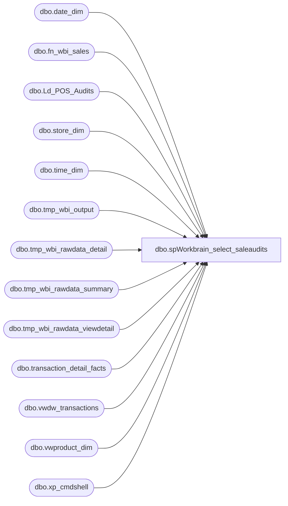

# dbo.spWorkbrain_select_saleaudits

**Database:** dw  
**Server:** papamart  

## Architecture Diagram



## Table Dependencies

| Referenced Table |
|---|
| dbo.date_dim |
| dbo.fn_wbi_sales |
| dbo.Ld_POS_Audits |
| dbo.store_dim |
| dbo.time_dim |
| dbo.tmp_wbi_output |
| dbo.tmp_wbi_rawdata_detail |
| dbo.tmp_wbi_rawdata_summary |
| dbo.tmp_wbi_rawdata_viewdetail |
| dbo.transaction_detail_facts |
| dbo.vwdw_transactions |
| dbo.vwproduct_dim |
| dbo.xp_cmdshell |

## Stored Procedure Code

```sql
CREATE PROC [dbo].[spWorkbrain_select_saleaudits]
@ac_filename varchar(100)

WITH EXECUTE AS 'BAB\SQLServices'
AS
-- =============================================================================================================
-- Name: [spWorkbrain_select_saleaudits]
--
-- Description:	load process for audited sales data into Workbrain
--
-- Input:		@ac_filename		filename for output
--
-- Output: returns records in textfile through bcp command
--
-- Dependencies: requires 1 fn_wbi_xx udfs
--
-- Revision History
--		Name:			Date:			Comments:
--		Keith Missey	2/27/2009		Created
--		Keith Missey	6/16/2009		removed dino and dolls groups
--		Keith Missey	8/26/2009		removed product division
--		Keith Missey	8/19/2009		Update server name for SA 5.0.
--		Mike Pelikan	02/24/2015		Added Execute as
-- =============================================================================================================
SET NOCOUNT ON
--DROP TABLES IF EXIST IN DATABASE
IF  EXISTS (SELECT * FROM dbo.sysobjects WHERE id = OBJECT_ID(N'[dbo].[tmp_wbi_rawdata_viewdetail]')) 
DROP TABLE dbo.tmp_wbi_rawdata_viewdetail

IF  EXISTS (SELECT * FROM dbo.sysobjects WHERE id = OBJECT_ID(N'[dbo].[tmp_wbi_rawdata_detail]')) 
DROP TABLE dbo.tmp_wbi_rawdata_detail

IF  EXISTS (SELECT * FROM dbo.sysobjects WHERE id = OBJECT_ID(N'[dbo].[tmp_wbi_rawdata_summary]')) 
DROP TABLE dbo.tmp_wbi_rawdata_summary

IF  EXISTS (SELECT * FROM dbo.sysobjects WHERE id = OBJECT_ID(N'[dbo].[tmp_wbi_output]')) 
DROP TABLE dbo.tmp_wbi_output

CREATE TABLE dbo.tmp_wbi_output 
(
	SKDGRP_NAME varchar(40),
	INVTYP_ID smallint,
	RESDET_DATE char(10),
	RESDET_TIME char(8),
	RESDET_VOLUME money,
	INPUT_INVTYP_ID smallint,
	OLD_SKDGRP_NAME varchar(40),
	VOLTYPE_NAME varchar(200)
)

CREATE TABLE dbo.tmp_wbi_rawdata_viewdetail(
	[transaction_id] [decimal](12, 0) NOT NULL,
	[store_id] [varchar](8000) NULL,
	[actual_date] [datetime] NULL,
	[gaapsales] [decimal](38, 2) NULL,
	[merchandiseunits] [int] NULL,
	[animalunits] [int] NULL,
	[partyflag] [int] NOT NULL
) 

CREATE INDEX ix_rawdata_transid
ON dw.dbo.tmp_wbi_rawdata_viewdetail (transaction_id)

CREATE TABLE dbo.tmp_wbi_rawdata_detail(
	[transaction_id] [decimal](12, 0) NOT NULL,
	[division] [varchar](20) NULL,
	[hour] [int] NULL,
	[half_hour_id] [int] NULL
) 

CREATE TABLE dbo.tmp_wbi_rawdata_summary(
	[transaction_id] [decimal](12, 0) NOT NULL,
	[store_id] [varchar](8000) NULL,
	[actual_date] [datetime] NULL,
	[gaapsales] [decimal](38, 2) NULL,
	[merchandiseunits] [int] NULL,
	[animalunits] [int] NULL,
	[partyflag] [int] NOT NULL,
	[division] [varchar](20) NULL,
	[hour] [int] NULL,
	[half_hour_id] [int] NULL
) 

DECLARE @outputsql varchar(500),
		@bcpsql varchar(1000)		

--GET AUDITED TRANSACTIONS; THIS TABLE IS POPULATED THROUGH INFORMATICA AUDIT ETL LOAD
SELECT DISTINCT transaction_id 
	INTO #tmpauditedtransations
FROM bedrockdb01.[auditworks].dbo.[Ld_POS_Audits]

--GET STORE_KEY, DATE_KEY, AND HOUR,HALF HOUR DATA 
--FROM AUDITED TRANSACTIONS SO ONLY THOSE STORES, DATES, AND TIMES IN HALF-HOUR INCREMENTS
--NEED TO BE RELOADED
SELECT DISTINCT tdf.store_key, tdf.date_key, td.[hour], td.half_hour_id
INTO #tmptransdetail
FROM [#tmpauditedtransations] t
INNER JOIN DW.dbo.transaction_detail_facts tdf WITH (NOLOCK) ON t.transaction_id = tdf.transaction_id
INNER JOIN DW.dbo.time_dim td WITH (NOLOCK) ON tdf.time_key = td.time_key
INNER JOIN dw.dbo.store_dim s ON tdf.store_key = s.store_key

--FIND ALL TRANSACTIONS BY STORE, DATE, AND TIME
INSERT DW.dbo.tmp_wbi_rawdata_detail
SELECT tdf.transaction_id, MAX(pd.division), td.[hour], td.half_hour_id
FROM DW.dbo.transaction_detail_facts tdf with (NOLOCK) 
		INNER JOIN DW.dbo.time_dim td with (NOLOCK) ON tdf.time_key = td.time_key
		INNER JOIN DW.dbo.vwproduct_dim pd with (NOLOCK) ON tdf.product_key = pd.product_key
		INNER JOIN #tmptransdetail ttd ON ttd.store_key = tdf.store_key
					AND ttd.date_key = tdf.date_key AND td.[hour] = ttd.[hour] 
					AND td.half_hour_id = ttd.half_hour_id
--AND pd.division IN ('US', 'DOLLS', 'DINO', 'RIDEMAKERZ') AND pd.product_key > 0 
GROUP BY tdf.[transaction_id], td.[hour], td.[half_hour_id]

--COLLECT RAW DATA FROM TRANSACTION DETAIL FACTS VIEW
INSERT DW.dbo.tmp_wbi_rawdata_viewdetail
SELECT DISTINCT vtdf.transaction_id, REPLICATE('0', 5 - LEN(sd.store_id)) + CAST(sd.store_id AS char) AS store_id, 
	dd.actual_date,	vtdf.gaapsales, vtdf.merchandiseunits, vtdf.animalunits, vtdf.partyflag
FROM DW.dbo.vwdw_transactions vtdf with (NOLOCK)
	INNER JOIN DW.dbo.store_dim sd WITH (NOLOCK) ON vtdf.store_key = sd.store_key
	INNER JOIN DW.dbo.date_dim dd WITH (NOLOCK) ON vtdf.date_key = dd.date_key
	INNER JOIN DW.dbo.tmp_wbi_rawdata_detail rd WITH (NOLOCK) ON rd.transaction_id = vtdf.transaction_id
WHERE sd.bearritory NOT LIKE '%corporate%' 
	AND sd.region NOT LIKE '%corporate%'  
	AND sd.region NOT IN ('ridemakerz','canada stores', 'united kingdom','europe') 
	AND sd.country = 'US'


INSERT dbo.tmp_wbi_rawdata_summary
SELECT DISTINCT vd.transaction_id, vd.store_id, vd.actual_date, vd.gaapsales,vd.merchandiseunits, vd.animalunits, vd.partyflag,
	 d.division, d.[hour], d.half_hour_id
FROM dbo.tmp_wbi_rawdata_viewdetail vd
	INNER JOIN dbo.tmp_wbi_rawdata_detail d ON vd.transaction_id = d.transaction_id

--Sales excluding gift card sales and transactions flagged as party
INSERT dbo.tmp_wbi_output
SELECT * FROM dbo.fn_wbi_sales(0)
--UNION
--SELECT * FROM dbo.fn_wbi_sales('DOLLS', 0)
--UNION
--SELECT * FROM dbo.fn_wbi_sales('DINO', 0)
--UNION
--SELECT * FROM dbo.fn_wbi_sales('RIDEMAKERZ', 0)

--PARTY SALES
INSERT dbo.tmp_wbi_output
SELECT * FROM dbo.fn_wbi_sales(1)
--UNION
--SELECT * FROM dbo.fn_wbi_sales('DOLLS', 1)
--UNION
--SELECT * FROM dbo.fn_wbi_sales('DINO', 1)
--UNION
--SELECT * FROM dbo.fn_wbi_sales('RIDEMAKERZ', 1)

--SELECT SKDGRP_NAME, INVTYP_ID, RESDET_DATE, RESDET_TIME,
--	RESDET_VOLUME, INPUT_INVTYP_ID, OLD_SKDGRP_NAME, VOLTYPE_NAME 
--FROM tmp_wbi_output
--ORDER BY RESDET_DATE, RESDET_TIME, SKDGRP_NAME

--FORMAT REQUESTED BY WORKBRAIN DEVELOPMENT TEAM
SET @outputsql = 'SELECT char(34) + SKDGRP_NAME + char(34), char(34) + LTRIM(RTRIM(CAST(INVTYP_ID AS char))) + char(34), char(34) + RESDET_DATE + char(34), char(34) + RESDET_TIME + char(34), ' +
	'char(34) + LTRIM(RTRIM(CAST(RESDET_VOLUME AS char))) + char(34), char(34) + LTRIM(RTRIM(CAST(INPUT_INVTYP_ID AS char))) + char(34), char(34) + SKDGRP_NAME + char(34), char(34) + VOLTYPE_NAME + char(34)' +
	'FROM dw.dbo.tmp_wbi_output ORDER BY RESDET_DATE, RESDET_TIME, SKDGRP_NAME'

SET @bcpsql = 'bcp "' + @outputsql + '" queryout "' + @ac_filename + '" -t "," -T -c'

EXEC master.dbo.xp_cmdshell @bcpsql
```

