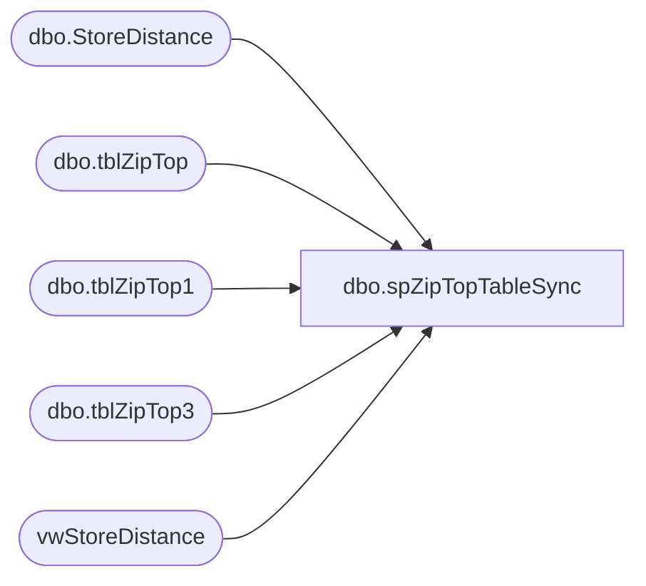

# dbo.spZipTopTableSync

**Database:** dw  
**Server:** papamart  

## Architecture Diagram



## Table Dependencies

| Referenced Table |
|---|
| dbo.StoreDistance |
| dbo.tblZipTop |
| dbo.tblZipTop1 |
| dbo.tblZipTop3 |
| vwStoreDistance |

## Stored Procedure Code

```sql
CREATE PROC spZipTopTableSync
AS
-- =============================================================================================================
-- Name: spZipTopTableSync
--
-- Description:	Syncs remote ZipTop tables from the data warehouse. This also repopulates StoreDistance.
--
-- Output: none.
-- 
-- Available actions:
--				
-- Dependencies: 
--	redpanda.PRIZM.dbo.tblZipTop
--  redpanda.PRIZM.dbo.tblZipTop1
--	redpanda.PRIZM.dbo.tblZipTop3
--	DBAUtility.dbo.tblDBA_FileSize
--	KODIAK.BearHouse.dbo.tblZipTop
--	KODIAK.PRIZM.dbo.tblZipTop3
--
-- Revision History
--		Name:			Date:			Comments:
--		Mike Pelikan	05/30/2013		Creation. This replaces a DTS package

DECLARE @Revision DATETIME
SET @Revision = '05/30/2013'
	
/*


*/
-- =============================================================================================================

----------------------------------------------------------------------------------------------------
--// Set options                                                                                //--
----------------------------------------------------------------------------------------------------
SET NOCOUNT ON
----------------------------------------------------------------------------------------------------
--// This is where the magic happens                                                            //--
----------------------------------------------------------------------------------------------------

--REDPANDA
EXEC ('TRUNCATE TABLE PRIZM.dbo.tblZipTop') AT redpanda;
EXEC ('TRUNCATE TABLE PRIZM.dbo.tblZipTop1') AT redpanda;
EXEC ('TRUNCATE TABLE PRIZM.dbo.tblZipTop3') AT redpanda;

INSERT INTO redpanda.PRIZM.dbo.tblZipTop
SELECT * FROM dw.dbo.tblZipTop (nolock) --1:33
INSERT INTO redpanda.PRIZM.dbo.tblZipTop1
SELECT * FROM dw.dbo.tblZipTop1 (nolock) --:30
INSERT INTO redpanda.PRIZM.dbo.tblZipTop3
SELECT * FROM dw.dbo.tblZipTop3 (nolock) --1:28

--BEARWEBDB
EXEC ('TRUNCATE TABLE PRIZM.dbo.tblZipTop3') AT bearwebdb;
INSERT INTO bearwebdb.PRIZM.dbo.tblZipTop3
SELECT * FROM dw.dbo.tblZipTop3 (nolock)

--kodiak
EXEC ('TRUNCATE TABLE BearHouse.dbo.tblZipTop') AT KODIAK;
EXEC ('TRUNCATE TABLE PRIZM.dbo.tblZipTop3') AT KODIAK;


INSERT INTO KODIAK.BearHouse.dbo.tblZipTop
SELECT * FROM dw.dbo.tblZipTop (nolock) --1:33

INSERT INTO KODIAK.PRIZM.dbo.tblZipTop3
SELECT * FROM dw.dbo.tblZipTop3 (nolock)

--Repopulate StoreDistance table
ALTER INDEX idxN_U_StoreDistance_zip ON StoreDistance DISABLE
 
TRUNCATE TABLE dbo.StoreDistance

INSERT INTO dbo.StoreDistance
SELECT * FROM vwStoreDistance

ALTER INDEX idxN_U_StoreDistance_zip ON StoreDistance REBUILD
```

