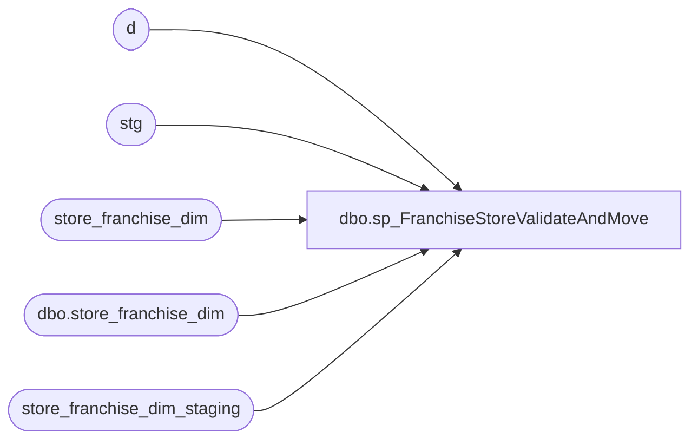

# dbo.sp_FranchiseStoreValidateAndMove

**Database:** dw  
**Server:** papamart  

## Architecture Diagram



## Table Dependencies

| Referenced Table |
|---|
| d |
| stg |
| store_franchise_dim |
| dbo.store_franchise_dim |
| store_franchise_dim_staging |

## Stored Procedure Code

```sql
-- =============================================
-- Author:		Scott Morrison (CTP)
-- Create date: 2007.01.07
-- Description:	Used in Franchise Store ETL SSIS
-- =============================================
CREATE PROCEDURE [dbo].[sp_FranchiseStoreValidateAndMove]

AS
BEGIN
	SET NOCOUNT ON

	update [store_franchise_dim_staging] set [new_store_key] = checksum(cast([store_id] as varchar(50)))

	update [store_franchise_dim_staging] set Errors = null

	update stg set Errors = isnull(Errors + '|','') + 'Duplicate store_id.'
		-- select * 
		from [store_franchise_dim_staging] stg
		where EXISTS (select * from [store_franchise_dim_staging] sub
						where sub.[store_id] = stg.[store_id]
						group by [store_id]
						having count(*) > 1)

	update stg set Errors = isnull(Errors + '|','') + 'Invalid store_name.'
		-- select *
		from [store_franchise_dim_staging] stg
		where isnull(ltrim(rtrim(store_name)),'') = ''

	update stg set Errors = isnull(Errors + '|','') + 'Invalid bearritory.'
		-- select *
		from [store_franchise_dim_staging] stg
		where isnull(ltrim(rtrim(bearritory)),'') = ''

	update stg set Errors = isnull(Errors + '|','') + 'Invalid region.'
		-- select *
		from [store_franchise_dim_staging] stg
		where isnull(ltrim(rtrim(region)),'') = ''

	update stg set Errors = isnull(Errors + '|','') + 'Invalid country.'
		-- select *
		from [store_franchise_dim_staging] stg
		where isnull(ltrim(rtrim(country)),'') = ''

	update stg set Errors = isnull(Errors + '|','') + 'Invalid BearRange.'
		-- select *
		from [store_franchise_dim_staging] stg
		where isnull(ltrim(rtrim(BearRange)),'') = ''

	update stg set Errors = isnull(Errors + '|','') + 'Invalid opening_date.'
		-- select *
		from [store_franchise_dim_staging] stg
		where isdate(opening_date) = 0

	update stg set Errors = isnull(Errors + '|','') + 'Invalid comp_date.'
		-- select *
		from [store_franchise_dim_staging] stg
		where isdate(comp_date) = 0

    delete d 
	--select *
	from store_franchise_dim d
	where not exists (select * from [store_franchise_dim_staging] stg
							where d.Store_Key = [new_store_key])

	delete d 
		--select * 
		from store_franchise_dim d
		where exists (select * from [store_franchise_dim_staging] stg
							where d.Store_Key = [new_store_key]
								and stg.Errors is null)

	INSERT [dw].[dbo].[store_franchise_dim]
           ([store_key]
           ,[store_id]
           ,[bearea]
           ,[store_name]
           ,[bearritory]
           ,[address1]
           ,[region]
           ,[zone]
           ,[address2]
           ,[state_province_name]
           ,[business_type]
           ,[city]
           ,[division]
           ,[state_province]
           ,[county]
           ,[business_unit]
           ,[country]
           ,[country_name]
           ,[postal_code]
           ,[phone]
           ,[fax]
           ,[email]
           ,[opening_date]
           ,[active]
           ,[latitude]
           ,[longitude]
           ,[volume_group]
           ,[store_mgr]
           ,[bearea_mgr]
           ,[bearitory_mgr]
           ,[region_mgr]
           ,[store_type]
           ,[closing_date]
           ,[comp_date]
           ,[store_group_id]
           ,[address3]
           ,[address4]
           ,[square_feet]
           ,[num_of_pos]
           ,[num_of_kiosks]
           ,[postal_plus4]
           ,[Abbreviation]
           ,[Legal_Description]
           ,[comp_week_id]
           ,[bearea_id]
           ,[bearitory_id]
           ,[region_id]
           ,[division_code]
           ,[language]
           ,[demographics_bg_key]
           ,[BearRange])
     
           (
			select checksum(cast([store_id] as varchar(50))) as [store_key]
				, case when isnull(ltrim(rtrim([store_id])),'') = '' then null else [store_id] end
				, case when isnull(ltrim(rtrim([bearea])),'') = '' then null else [bearea] end as [bearea]
				, case when isnull(ltrim(rtrim([store_name])),'') = '' then null else [store_name] end as [store_name]
				, case when isnull(ltrim(rtrim([bearritory])),'') = '' then null else [bearritory] end as [bearritory]
				, case when isnull(ltrim(rtrim([address1])),'') = '' then null else [address1] end as [address1]
				, case when isnull(ltrim(rtrim([region])),'') = '' then null else [region] end as [region]
				, case when isnull(ltrim(rtrim([zone])),'') = '' then null else [zone] end as [zone]
				, case when isnull(ltrim(rtrim([address2])),'') = '' then null else [address2] end as [address2]
				, case when isnull(ltrim(rtrim([state_province_name])),'') = '' then null else [state_province_name] end as [state_province_name]
				, case when isnull(ltrim(rtrim([business_type])),'') = '' then null else [business_type] end as [business_type]
				, case when isnull(ltrim(rtrim([city])),'') = '' then null else [city] end as [city]
				, case when isnull(ltrim(rtrim([division])),'') = '' then null else [division] end as [division]
				, case when isnull(ltrim(rtrim([state_province])),'') = '' then null else [state_province] end as [state_province]
				, case when isnull(ltrim(rtrim([county])),'') = '' then null else [county] end as [county]
				, case when isnull(ltrim(rtrim([business_unit])),'') = '' then null else [business_unit] end as [business_unit]
				, case when isnull(ltrim(rtrim([country])),'') = '' then null else [country] end as [country]
				, case when isnull(ltrim(rtrim([country_name])),'') = '' then null else [country_name] end as [country_name]
				, case when isnull(ltrim(rtrim([postal_code])),'') = '' then null else [postal_code] end as [postal_code]
				, case when isnull(ltrim(rtrim([phone])),'') = '' then null else [phone] end as [phone]
				, case when isnull(ltrim(rtrim([fax])),'') = '' then null else [fax] end as [fax]
				, case when isnull(ltrim(rtrim([email])),'') = '' then null else [email] end as [email]
				, case when isnull(ltrim(rtrim([opening_date])),'') = '' then null else [opening_date] end as [opening_date]
				, case when isnull(ltrim(rtrim([active])),'') = '' then null else [active] end as [active]
				, case when isnull(ltrim(rtrim([latitude])),'') = '' then null else [latitude] end as [latitude]
				, case when isnull(ltrim(rtrim([longitude])),'') = '' then null else [longitude] end as [longitude]
				, case when isnull(ltrim(rtrim([volume_group])),'') = '' then null else [volume_group] end as [volume_group]
				, case when isnull(ltrim(rtrim([store_mgr])),'') = '' then null else [store_mgr] end as [store_mgr]
				, case when isnull(ltrim(rtrim([bearea_mgr])),'') = '' then null else [bearea_mgr] end as [bearea_mgr]
				, case when isnull(ltrim(rtrim([bearitory_mgr])),'') = '' then null else [bearitory_mgr] end as [bearitory_mgr]
				, case when isnull(ltrim(rtrim([region_mgr])),'') = '' then null else [region_mgr] end as [region_mgr]
				, case when isnull(ltrim(rtrim([store_type])),'') = '' then null else [store_type] end as [store_type]
				, case when isnull(ltrim(rtrim([closing_date])),'') = '' then null else [closing_date] end as [closing_date]
				, case when isnull(ltrim(rtrim([comp_date])),'') = '' then null else [comp_date] end as [comp_date]
				, case when isnull(ltrim(rtrim([store_group_id])),'') = '' then null else [store_group_id] end as [store_group_id]
				, case when isnull(ltrim(rtrim([address3])),'') = '' then null else [address3] end as [address3]
				, case when isnull(ltrim(rtrim([address4])),'') = '' then null else [address4] end as [address4]
				, case when isnull(ltrim(rtrim([square_feet])),'') = '' then null else [square_feet] end as [square_feet]
				, case when isnull(ltrim(rtrim([num_of_pos])),'') = '' then null else [num_of_pos] end as [num_of_pos]
				, case when isnull(ltrim(rtrim([num_of_kiosks])),'') = '' then null else [num_of_kiosks] end as [num_of_kiosks]
				, case when isnull(ltrim(rtrim([postal_plus4])),'') = '' then null else [postal_plus4] end as [postal_plus4]
				, case when isnull(ltrim(rtrim([Abbreviation])),'') = '' then null else [Abbreviation] end as [Abbreviation]
				, case when isnull(ltrim(rtrim([Legal_Description])),'') = '' then null else [Legal_Description] end as [Legal_Description]
				, case when isnull(ltrim(rtrim([comp_week_id])),'') = '' then null else [comp_week_id] end as [comp_week_id]
				, case when isnull(ltrim(rtrim([bearea_id])),'') = '' then null else [bearea_id] end as [bearea_id]
				, case when isnull(ltrim(rtrim([bearitory_id])),'') = '' then null else [bearitory_id] end as [bearitory_id]
				, case when isnull(ltrim(rtrim([region_id])),'') = '' then null else [region_id] end as [region_id]
				, case when isnull(ltrim(rtrim([division_code])),'') = '' then null else [division_code] end as [division_code]
				, case when isnull(ltrim(rtrim([language])),'') = '' then null else [language] end as [language]
				, case when isnull(ltrim(rtrim([demographics_bg_key])),'') = '' then null else [demographics_bg_key] end as [demographics_bg_key]
				, case when isnull(ltrim(rtrim([BearRange])),'') = '' then null else [BearRange] end as [BearRange]
				from [store_franchise_dim_staging]
				where Errors is null
			)
END
```

