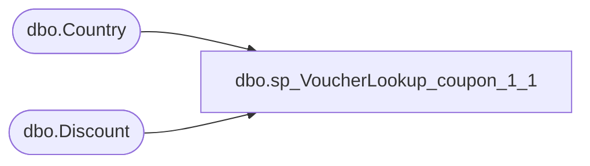

# dbo.sp_VoucherLookup_coupon_1_1

**Database:** dw  
**Server:** papamart  

## Architecture Diagram



## Table Dependencies

| Referenced Table |
|---|
| dbo.Country |
| dbo.Discount |

## Stored Procedure Code

```sql
-- =============================================
-- Author:		<Author,,Name>
-- Create date: <Create Date,,>
-- Description:	<Description,,>
-- =============================================
CREATE PROCEDURE [dbo].[sp_VoucherLookup_coupon_1_1]
	-- Add the parameters for the stored procedure here
	@coupon_number varchar(20) = 'NoData',
	@refType int
AS
BEGIN

	SET NOCOUNT ON;

IF @coupon_number != 'NoData'
BEGIN
	SELECT couponNumber 'CouponNumber'
	  ,c.Abbrv 'Country'	  
	  ,Title 'Offer'
	  ,rptDescription 'Description'
      ,CONVERT(SMALLDATETIME, startDate) 'StartDate'
      ,DATEADD(SECOND, -1, (DATEADD(DAY, 1, CONVERT(DATETIME, endingDate)))) 'EndingDate'
      ,CASE
		WHEN startDate > GETDATE() THEN 'Pending'
		WHEN GETDATE() >= endingDate THEN 'Expired'
		ELSE 'Active'
	  END 'Status'
  FROM kodiak.DiscountMstrData.dbo.Discount d
  LEFT JOIN kodiak.DiscountMstrData.dbo.Country c ON d.countryID = c.countryID
  WHERE couponNumber = @coupon_Number
END

END
```

