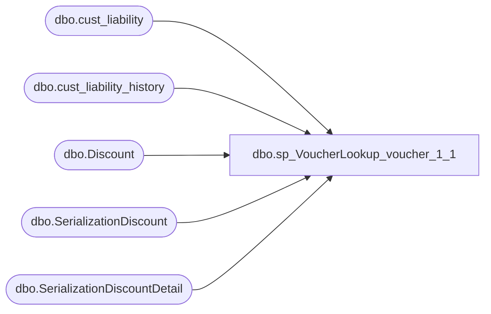

# dbo.sp_VoucherLookup_voucher_1_1

**Database:** dw  
**Server:** papamart  

## Architecture Diagram



## Table Dependencies

| Referenced Table |
|---|
| dbo.cust_liability |
| dbo.cust_liability_history |
| dbo.Discount |
| dbo.SerializationDiscount |
| dbo.SerializationDiscountDetail |

## Stored Procedure Code

```sql
-- =============================================
-- Author:		<Author,,Name>
-- Create date: <Create Date,,>
-- Description:	<Description,,>
-- =============================================
CREATE PROCEDURE [dbo].[sp_VoucherLookup_voucher_1_1]
	-- Add the parameters for the stored procedure here
	@voucher_number varchar(20) = 'NoData',
	@refType int
AS
BEGIN

	SET NOCOUNT ON;

IF @voucher_number != 'NoData'
BEGIN
SELECT DISTINCT c.reference_no AS 'VoucherNumber'
	,[RedeemedDate]
	,[RedeemedAt]
	,c.date_issued AS 'IssuedDate'
	,CASE WHEN expiry_date <= CONVERT(VARCHAR,DATEADD(DAY,-0,GETDATE()),111) 
		  THEN 'Yes' 
		  ELSE 'No' 
	END AS 'Expired'
			,DATEADD(SECOND,86399, CONVERT(DATETIME,d.endingDate   )  )  AS [ExpirationDate]
			--,DATEADD(SECOND, -1, c.expiry_date) AS [ExpirationDate]
	--,DATEADD(SECOND, -1, c.expiry_date) AS 'ExpirationDate'
	,c.pos_amount_1 AS 'Balance'
	,CASE WHEN c.liability_amount != c.amount_3 
		  THEN 'Redeemed' 
		  WHEN c.pos_amount_1 = 0
		  THEN 'Redeemed'
		  WHEN c.pos_status = '30' AND c.liability_amount = c.amount_3 AND c.amount_4 = 0 AND c.expiry_date > CONVERT(VARCHAR,DATEADD(DAY,-0,GETDATE()),111) 
		  THEN 'Valid' 
		  WHEN c.pos_status = '0' 
		  THEN 'Cancelled' 
		  WHEN c.pos_status = '50' 
		  THEN 'Forfeited' 
		  WHEN c.expiry_date <= CONVERT(VARCHAR,DATEADD(DAY,-0,GETDATE()),111) 
		  THEN 'Expired' 
				END AS 'Status'
	,c.customer_no AS 'CustomerNumber'
	,c.last_name AS 'LastName'
	,c.first_name AS 'FirstName'
	,c.email_address AS 'EmailAddress'  
	,NULL AS 'Tier'
	--,'Test' AS 'Tier'
	,d.Title AS [Title]
	,d.rptDescription AS [Description]
	,qry.transaction_no AS [POSTransactionNumber]

FROM bedrockdb01.auditworks.dbo.cust_liability c (NOLOCK) 
		LEFt OUTer join [kodiak].[DiscountMstrData].[dbo].[SerializationDiscountDetail] sdd (NOLOCK) 
		 ON sdd.serializedNum = c.reference_no
		LEFT JOIN [kodiak].[DiscountMstrData].[dbo].[SerializationDiscount] sd  (NOLOCK) 
		ON sdd.serializationID = sd.serializationID
		LEFT JOIN [kodiak].[DiscountMstrData].[dbo].[Discount] d  (NOLOCK) 
		ON  d.discountID = sd.discountID
LEFT OUTER JOIN bedrockdb01.auditworks.dbo.cust_liability_history h (NOLOCK) ON c.reference_no = h.reference_no
--LEFT OUTER JOIN [stl-crmdb-p-01].crm.dbo.customer cc (NOLOCK) ON c.customer_no = cc.customer_no
--INNER JOIN [stl-crmdb-p-01].crm.dbo.customer_attribute ca (NOLOCK) ON cc.customer_id = ca.customer_id
LEFT JOIN 
       (
              SELECT MIN(h2.transaction_date) [RedeemedDate], MIN(h2.store_no) [RedeemedAt], reference_no, MIN(h2.transaction_no) [transaction_no] 
              FROM bedrockdb01.auditworks.dbo.cust_liability_history h2 (NOLOCK)
              WHERE h2.store_no <> 990
              GROUP BY reference_no
       ) qry ON c.reference_no = qry.reference_no 

WHERE h.store_no = 990 AND (c.reference_type = @refType OR c.reference_type = 35) AND c.reference_no LIKE @voucher_number AND CONVERT(VARCHAR,DATEADD(DAY,-0,GETDATE()),111)  > c.date_issued 
ORDER BY c.date_issued
END
END

dbo,sp_TruncateStoreFranchiseDimStaging,-- =============================================
-- Author:		Scott Morrison (CTP)
-- Create date: 2007.01.07
-- Description:	Used in Franchise Store ETL SSIS
-- =============================================
CREATE PROCEDURE [dbo].[sp_TruncateStoreFranchiseDimStaging]

AS
BEGIN
	SET NOCOUNT ON

    truncate table [store_franchise_dim_staging]
END
```

