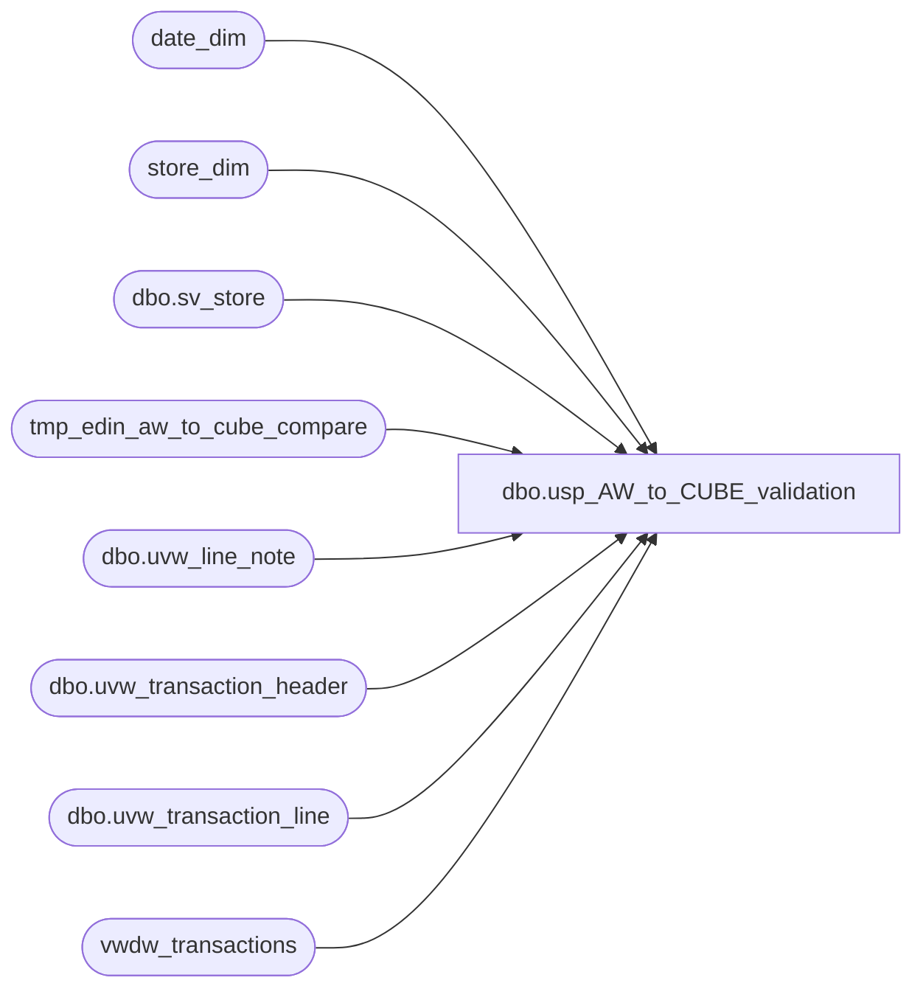

# dbo.usp_AW_to_CUBE_validation

**Database:** dw  
**Server:** papamart  

## Architecture Diagram



## Table Dependencies

| Referenced Table |
|---|
| date_dim |
| store_dim |
| dbo.sv_store |
| tmp_edin_aw_to_cube_compare |
| dbo.uvw_line_note |
| dbo.uvw_transaction_header |
| dbo.uvw_transaction_line |
| vwdw_transactions |

## Stored Procedure Code

```sql
CREATE proc [dbo].[usp_AW_to_CUBE_validation] 
-- =============================================================================================================
-- Name: usp_AW_to_CUBE_validation
--
-- Description:	EXEC usp_aw_to_cube_validation 174, 2008, 6, 24, 2, 0

--
-- Input:		@store_no = 6,
--				@fiscal_year = 2007,
--				@fiscal_period = 6,
--				@fiscal_week = 27, -- no need to specify if year and period are specified
--				@detail_level = 2,
--				@save_data = 0
--
--
-- Output: 
--
-- Dependencies: 
--
-- Revision History
--		Name:			Date:			Comments:
--		Edin P							created
--		Keith Missey	4/3/2008		updated to account for vat for Merch 4.2 upgrade
--		Keith Missey	4/17/2008		updated line object for VAT calc to mirror line object in GAAP calc
--		Keith Missey	4/29/2008		added line object 296 for customer service
--		Keith Missey	7/10/2008		added store filter to VAT calculation where clause
--		Keith Missey	5/18/2009		added line object 102, 103 for virtual world items
--		GaryD			8/18/2010		Record current prod version
--		GaryD			8/19/2010		Update server name for SA 5.0.
-- =============================================================================================================
	@store_no		smallint = 1,
	@fiscal_year	smallint = 0,
	@fiscal_period	smallint = 0,
	@fiscal_week	smallint = 0,
	@detail_level	tinyint = 1,
	@save_data		bit = 1
as
declare @start_transaction_date datetime
declare @end_transaction_date datetime
--declare @store_no	smallint
declare @store_key	smallint

if @fiscal_year = 0
begin
	select @fiscal_year = datepart(yyyy,getdate())
end

if @fiscal_period = 0
begin
	select @fiscal_period = datepart(mm,getdate()-25)
end

if @save_data = 1
begin
	if (Object_ID('tmp_edin_aw_to_cube_compare') IS NULL)
		create table tmp_edin_aw_to_cube_compare
		(
		store_no smallint not null,
		GAAP_AW_Total varchar(20),
		GAAP_CUBE_Total varchar(20),
		GAAP_Diff varchar(20),
		AW_tran_count int,
		CUBE_tran_count int,
		Tran_Diff int
		)
end

--select @fiscal_period = 2		--change if needed
--select @store_no = 5			--change if needed

--select @start_transaction_date = '2007-1-21'
--select @end_transaction_date = '2007-1-27'

if @fiscal_week	= 0
begin
	select @start_transaction_date = min(actual_date) from date_dim
	where fiscal_year = @fiscal_year
		and fiscal_period = @fiscal_period

	select @end_transaction_date = max(actual_date) from date_dim
	where fiscal_year = @fiscal_year
		and fiscal_period = @fiscal_period
end
else
begin
	select @start_transaction_date = min(actual_date) from date_dim
	where fiscal_year = @fiscal_year
		and fiscal_week = @fiscal_week

	select @end_transaction_date = max(actual_date) from date_dim
	where fiscal_year = @fiscal_year
		and fiscal_week = @fiscal_week
end

--select @start_transaction_date
--select @end_transaction_date


select @store_key = store_key from store_dim where store_id = @store_no

-- AW data
IF (Object_ID('tempdb..#tmp_edin_aw_data') IS NOT NULL) DROP TABLE #tmp_edin_aw_data
select h.store_no, 
 h.transaction_id as transaction_id_AW, 
 (SUM( ((l.gross_line_amount - l.pos_discount_amount) )* l.db_cr_none * l.voiding_reversal_flag))*-1 as GAAPSales_AW
--into tmp_FlashGAAP
into #tmp_edin_aw_data
from bedrockdb01.auditworks.dbo.uvw_transaction_header h
 join bedrockdb01.auditworks.dbo.uvw_transaction_line l on h.transaction_id = l.transaction_id
    join bedrockdb01.auditworks.dbo.sv_store c on h.store_no=c.store_no
where	1=1
		and (h.transaction_date between @start_transaction_date and @end_transaction_date
		and h.transaction_void_flag = 0
		and h.transaction_category in (1,2))
		and l.line_object IN (100,102,103,200,202,203,204,206,210,250,290,291,293,295,296,623,640,690,691,1630, 1631) 
		and l.line_void_flag=0
		and c.store_no = @store_no
GROUP BY h.store_no, h.transaction_id
--ORDER BY h.store_no, h.av_transaction_id

--CALCULATE TOTAL VAT FOR STORES' SALES
select 	h.store_no as 'StoreNo', l.transaction_id,
	SUM((CAST([line_note] AS NUMERIC(9,2)) * 
	CASE [line_action]
		WHEN 1 THEN -1
		WHEN 2 THEN 1
		WHEN 11 THEN -1
		WHEN 12 THEN 1
	END)) AS VAT
into dbo.#tmp_vat
from bedrockdb01.auditworks.dbo.uvw_transaction_header h
 INNER join bedrockdb01.auditworks.dbo.uvw_transaction_line l on h.transaction_id = l.transaction_id
 INNER JOIN bedrockdb01.auditworks.dbo.uvw_line_note ln ON l.transaction_id = ln.transaction_id AND l.line_id = ln.line_id
where (h.transaction_date between @start_transaction_date and @end_transaction_date 
		and h.transaction_void_flag = 0
		and h.transaction_category in (1,2))
		and l.line_object IN (100,102,103,200,202,203,204,206,210,250,290,291,293,295,296,623,640,690,691,1630, 1631) 
		and l.line_void_flag=0 AND ln.[note_type] = 35 and h.store_no = @store_no
GROUP BY h.[store_no], l.transaction_id
ORDER BY h.[store_no], l.transaction_id

UPDATE #tmp_edin_aw_data SET gaapsales_aw = gaapsales_aw + vat
FROM #tmp_edin_aw_data f
		INNER JOIN #tmp_vat v ON v.storeno = f.store_no AND v.transaction_id = f.transaction_id_aw

-- CUBE view data
IF (Object_ID('tempdb..#tmp_edin_cube_view_data') IS NOT NULL) DROP TABLE #tmp_edin_cube_view_data
select sd.store_id, transaction_id as transaction_id_CUBE, GaapSales as GAAPSales_CUBE, GAAPTransactionFlag
into #tmp_edin_cube_view_data
--from vwdw_transactions_edin e
from vwdw_transactions e
join store_dim sd on sd.store_key = e.store_key
where 1=1
	--and transaction_id in (69523014)
	and e.store_key = @store_key
	and date_key between (select date_key from date_dim where actual_date = @start_transaction_date) and (select date_key from date_dim where actual_date = @end_transaction_date)
	--and GAAPTransactionFlag = 1


-- VIEW RESULTS
-- show totals

if @save_data = 1
begin
	insert tmp_edin_aw_to_cube_compare
	select	store_no,
			sum(GAAPSales_AW) as GAAP_AW_Total,
			cb.GAAP_CUBE_Total,
			sum(GAAPSales_AW) - cb.GAAP_CUBE_Total as GAAP_Diff,
			count(transaction_id_AW) as AW_tran_count,
			cb.CUBE_tran_count,
			count(transaction_id_AW) - cb.CUBE_tran_count as Tran_Diff
	from #tmp_edin_aw_data aw
	join (	select	store_id,
					sum(GAAPSales_CUBE) as GAAP_CUBE_Total,
					--count(transaction_id_CUBE) as CUBE_tran_count
					sum(GAAPTransactionFlag) as CUBE_tran_count
			from #tmp_edin_cube_view_data
			group by store_id) cb
	on aw.store_no = cb.store_id
	group by store_no, cb.GAAP_CUBE_Total, cb.CUBE_tran_count
end
else
begin
	select	store_no,
			sum(GAAPSales_AW) as GAAP_AW_Total,
			cb.GAAP_CUBE_Total,
			sum(GAAPSales_AW) - cb.GAAP_CUBE_Total as GAAP_Diff,
			count(transaction_id_AW) as AW_tran_count,
			cb.CUBE_tran_count,
			count(transaction_id_AW) - cb.CUBE_tran_count as Tran_Diff
	from #tmp_edin_aw_data aw
	join (	select	store_id,
					sum(GAAPSales_CUBE) as GAAP_CUBE_Total,
					--count(transaction_id_CUBE) as CUBE_tran_count
					sum(GAAPTransactionFlag) as CUBE_tran_count
			from #tmp_edin_cube_view_data
			group by store_id) cb
	on aw.store_no = cb.store_id
	group by store_no, cb.GAAP_CUBE_Total, cb.CUBE_tran_count
end

--show transaction count
--select 'Auditworks' as Source, count(transaction_id_AW) as tran_count from #tmp_edin_aw_data
--union
--select 'CUBE view' as Source, count (transaction_id_CUBE) as tran_count from #tmp_edin_cube_view_data


if @detail_level = 2
begin
	--transaction_ids that are not available on both sides
	--transactions missing from cube view (possible cause is GAAPTransactionFlag <> 1 in vwdw_transactions view)
	select * from #tmp_edin_aw_data aw
	left join #tmp_edin_cube_view_data cb on aw.transaction_id_AW = cb.transaction_id_CUBE
	where store_id is null
	union
	--transactions missing from AW
	select * from #tmp_edin_aw_data aw
	right join #tmp_edin_cube_view_data cb on aw.transaction_id_AW = cb.transaction_id_CUBE
	where store_no is null
	order by 2

	--transactions that have a 'delta' in GAAP numbers
	select	aw.store_no,
			aw.transaction_id_AW,
			aw.GAAPSales_AW,
			cb.GAAPSales_CUBE,
			sum(aw.GAAPSales_AW - cb.GAAPSales_CUBE) as GAAP_Diff
	from #tmp_edin_aw_data aw
	join #tmp_edin_cube_view_data cb on aw.transaction_id_AW = cb.transaction_id_CUBE
	group by aw.store_no, aw.transaction_id_AW, aw.GAAPSales_AW, cb.GAAPSales_CUBE
	having sum(aw.GAAPSales_AW - cb.GAAPSales_CUBE) <> 0
end

/*

--lookup transactions that are missing in DW

select distinct dd.actual_date, tdf.transaction_id from transaction_detail_facts tdf
--select * from transaction_detail_facts tdf
join (select transaction_id_AW from #tmp_edin_aw_data aw
left join #tmp_edin_cube_view_data cube on aw.transaction_id_AW = cube.transaction_id_CUBE
where store_id is null) d on tdf.transaction_id = d.transaction_id_AW
join date_dim dd on tdf.date_key = dd.date_key
order by 1

select * from oursblanc.auditworks.dbo.av_transaction_line
where av_transaction_id in (71621221)


*/
```

