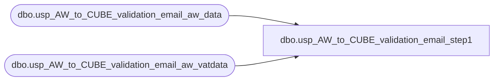

# dbo.usp_AW_to_CUBE_validation_email_step1

**Database:** dw  
**Server:** papamart  

## Architecture Diagram



## Table Dependencies

| Referenced Table |
|---|
| dbo.usp_AW_to_CUBE_validation_email_aw_data |
| dbo.usp_AW_to_CUBE_validation_email_aw_vatdata |

## Stored Procedure Code

```sql
CREATE PROC [dbo].[usp_AW_to_CUBE_validation_email_step1]
-- =============================================================================================================
-- Name: [dbo].[usp_AW_to_CUBE_validation_email_step1]
--
-- Description:	
--
-- Input:		
--
-- Output: 
--
-- Dependencies: 
--
-- Revision History
--		Name:			Date:			Comments:
--		Dave Rice						created
--		Keith Missey	4/4/2008		updated to account for vat for Merch 4.2 upgrade
--		Keith Missey	4/17/2008		updated line object for VAT calc to mirror line object in GAAP calc
--		Keith Missey	4/29/2008		added line object 296 for customer service
--		Keith Missey	11/26/2008		updated GAAP line objects
--		Keith Missey	5/18/2009		added line object 102,103 for virtual world
-- =============================================================================================================
AS 
    DECLARE @start_transaction_date DATETIME
    DECLARE @end_transaction_date DATETIME

    SELECT  @start_transaction_date = CAST(CONVERT(VARCHAR, DATEADD(mm, -2, GETDATE()), 101) AS DATETIME)
    SELECT  @end_transaction_date = CAST(CONVERT(VARCHAR, GETDATE(), 101) AS DATETIME)

    DECLARE @sql NVARCHAR(4000)
    DECLARE @vatsql NVARCHAR(4000)
    
    IF ( OBJECT_ID('usp_AW_to_CUBE_validation_email_aw_data') IS NOT NULL ) 
        DROP TABLE dbo.usp_AW_to_CUBE_validation_email_aw_data
    
    IF ( OBJECT_ID('usp_AW_to_CUBE_validation_email_aw_vatdata') IS NOT NULL ) 
        DROP TABLE dbo.usp_AW_to_CUBE_validation_email_aw_vatdata
 
    SET @sql = '
SELECT * 
into dbo.usp_AW_to_CUBE_validation_email_aw_data
FROM OPENROWSET(''SQLOLEDB'', ''POSDBSSA''; ''pm_repo'' ; ''pm_r3p0'',
''
select 
	h.store_no,
	h.transaction_date, 
	h.transaction_id as transaction_id_AW, 
	sum(case when line_object = 1130 then gross_line_amount else 0 end) voucher_adjustment,
	(SUM( ((l.gross_line_amount - l.pos_discount_amount) )* l.db_cr_none * l.voiding_reversal_flag))*-1 -
		sum(case when line_object = 1130 then gross_line_amount else 0 end) as GAAPSales_AW -- knock off the voucher_adjustment

	
from 
	auditworks.dbo.uvw_transaction_header h
	join auditworks.dbo.uvw_transaction_line l on h.transaction_id = l.transaction_id
where	1=1
		and (h.transaction_date between '''''
        + CAST(@start_transaction_date AS VARCHAR) + ''''' and '''''
        + +CAST(@end_transaction_date AS VARCHAR)
        + '''''
		and h.transaction_void_flag = 0
		and l.line_void_flag = 0
		and h.transaction_category in (1,2))
 		and l.line_object IN ( 100, 102,103,200, 202, 203, 204, 206, 210, 250, 290,
                                   291, 293, 295, 296, 623, 640, 690, 691, 1630, 1631 ) -- bring in the voucher adjustment - this is the remainder of a not fully redeemed voucher
GROUP BY h.store_no, h.transaction_date, h.transaction_id

''
)'

    SET @vatsql = '
SELECT * 
into dbo.usp_AW_to_CUBE_validation_email_aw_vatdata
FROM OPENROWSET(''SQLOLEDB'', ''POSDBSSA''; ''pm_repo'' ; ''pm_r3p0'',
''
select 	h.store_no, l.transaction_id,
	SUM((CAST([line_note] AS NUMERIC(9,2)) * 
	CASE [line_action]
		WHEN 1 THEN -1
		WHEN 2 THEN 1
		WHEN 11 THEN -1
		WHEN 12 THEN 1
	END)) AS VAT
from auditworks.dbo.uvw_transaction_header h
 INNER join auditworks.dbo.uvw_transaction_line l on h.transaction_id = l.transaction_id
 INNER JOIN auditworks.dbo.uvw_line_note ln ON l.transaction_id = ln.transaction_id AND l.line_id = ln.line_id
where (h.transaction_date between '''''
        + CAST(@start_transaction_date AS VARCHAR) + ''''' and '''''
        + +CAST(@end_transaction_date AS VARCHAR)
        + '''''
		and h.transaction_void_flag = 0
		and h.transaction_category in (1,2))
		and l.line_object IN ( 100, 102,103,200, 202, 203, 204, 206, 210, 250, 290,
                                   291, 293, 295, 296, 623, 640, 690, 691, 1630, 1631 )
		and l.line_void_flag=0 AND ln.[note_type] = 35 
GROUP BY h.[store_no], l.transaction_id
ORDER BY h.[store_no], l.transaction_id
''
)'	

    PRINT @sql
   EXEC sp_executesql @sql
    PRINT @vatsql
   EXEC sp_executesql @vatsql
    
    UPDATE  dbo.usp_AW_to_CUBE_validation_email_aw_data
    SET     [GAAPSales_AW] = gaapsales_aw + vat
    FROM    dbo.usp_AW_to_CUBE_validation_email_aw_data f
            INNER JOIN dbo.usp_AW_to_CUBE_validation_email_aw_vatdata v ON v.store_no = f.store_no
                                                                       AND v.transaction_id = f.transaction_id_aw
```

