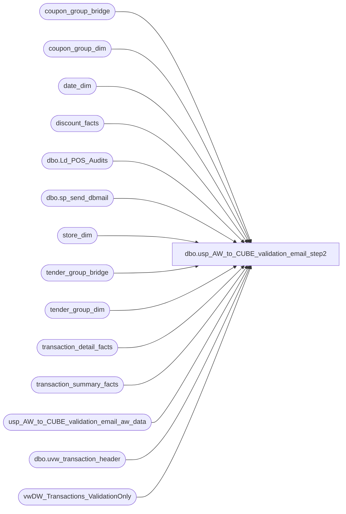

# dbo.usp_AW_to_CUBE_validation_email_step2

**Database:** dw  
**Server:** papamart  

## Architecture Diagram



## Table Dependencies

| Referenced Table |
|---|
| coupon_group_bridge |
| coupon_group_dim |
| date_dim |
| discount_facts |
| dbo.Ld_POS_Audits |
| dbo.sp_send_dbmail |
| store_dim |
| tender_group_bridge |
| tender_group_dim |
| transaction_detail_facts |
| transaction_summary_facts |
| usp_AW_to_CUBE_validation_email_aw_data |
| dbo.uvw_transaction_header |
| vwDW_Transactions_ValidationOnly |

## Stored Procedure Code

```sql
CREATE PROCEDURE [dbo].[usp_AW_to_CUBE_validation_email_step2] AS

-- =============================================================================================================
-- Name: usp_AW_to_CUBE_validation_email_step2
--
-- Description:	
/*

we have a core problem where the validation pull from auditworks doesn't match what is used to pull the transactions
in the etl.  so deleted and missing transactions are being misrepresented.

extra code has to be written to solve this and it can give false positives.


*/

--
-- Input:		
--				
--
--
-- Output: 
--
-- Dependencies: 
--
-- Revision History
--		Name:			Date:			Comments:
--		Dave			11/23/2009		used new stripped down view and sped things up even further
--										2 months of data is actually set in the new view, not here
--		Garyd			20090914		Update recipients
--		dave			20100201		sped up and added delete code for deleted transactions
--		Garyd			20100914		Update linked server name for SA5.0
--		mikep			20140724		replaced email procedure with sp_send_dbmail
-- =============================================================================================================

SET NOCOUNT ON
-- SET QUOTED_IDENTIFIER ON 
-- GO
-- SET ANSI_NULLS ON 
-- GO
 
-- exec usp_AW_to_CUBE_validation_email_step2
-- select * from usp_AW_to_CUBE_validation_email_aw_data


/*
exec usp_AW_to_CUBE_validation				@store_no = 6,
											@fiscal_year = 2007,
											@fiscal_period = 6,
											--@fiscal_week = 27, -- no need to specify if year and period are specified
											@detail_level = 2,
											@save_data = 0
exec master..xp_sendmail @recipients ='danm@buildabear.com', @subject='Validation finished'

select distinct fiscal_week from date_dim where fiscal_year =2007 and fiscal_period = 7
27,28,29,30
*/


-- *********************************************************************************************************
-- *********************************************************************************************************
-- *********************************************************************************************************

IF (Object_ID('tempdb..##tmp_edin_cube_view_data_12') IS NOT NULL) DROP TABLE ##tmp_edin_cube_view_data_12
select e.store_key, date_key, transaction_id as transaction_id_CUBE, GaapSales as GAAPSales_CUBE, netsales
into ##tmp_edin_cube_view_data_12
-- using this view because i stripped out all the fluff from the vwdw_transactions - much faster
-- the danger is that if the main view changes, this needs to change
from vwDW_Transactions_ValidationOnly e	
--from vwdw_transactions e
where 1=1

-- *********************************************************************************************************
-- *********************************************************************************************************
-- *********************************************************************************************************

-- find missing cube transactions
IF (Object_ID('tempdb..##missing_trans') IS NOT NULL) DROP TABLE ##missing_trans
select store_no, transaction_id_aw transaction_id, aw.gaapsales_aw gaap
into ##missing_trans
from usp_AW_to_CUBE_validation_email_aw_data aw
	left join ##tmp_edin_cube_view_data_12 c
	on c.transaction_id_cube = aw.transaction_id_aw
where c.transaction_id_cube is null

delete from ##missing_trans where gaap is null
delete from ##missing_trans where transaction_id > (select max(transaction_id) from transaction_detail_facts with (nolock))

IF (Object_ID('tempdb..##Ld_POS_Audits') IS NOT NULL) DROP TABLE ##Ld_POS_Audits
select transaction_id
into ##Ld_POS_Audits
from bedrockdb01.auditworks.dbo.Ld_POS_Audits

-- problem here is that the source query that builds usp_AW_to_CUBE_validation_email_aw_data
IF (Object_ID('tempdb..##deleted_trans') IS NOT NULL) DROP TABLE ##deleted_trans
select c.store_key, c.date_key, sum(GAAPSales_CUBE) GAAPSales_CUBE
into ##deleted_trans
from ##tmp_edin_cube_view_data_12 c
	left join usp_AW_to_CUBE_validation_email_aw_data aw
	on aw.transaction_id_aw = c.transaction_id_cube
where aw.transaction_id_aw is null
group by c.store_key, c.date_key
having sum(GAAPSales_CUBE) > 10

-- ****************************
-- ****************************
-- ****************************
declare @store_key	int
declare @date_key	int

-- loop through the stores and their associated days so that we can sift through the transactions
declare curStoreDate cursor
for
select store_key, date_key
from ##deleted_trans
order by store_key, date_key
open curStoreDate

fetch next from curStoreDate into @store_key, @date_key
while (@@fetch_STATUS <> -1)
begin
	-- pull all the data warehouse transactions for that store and day so we can sift through them to find the 
	-- possible missing ones
	IF (Object_ID('tempdb..#dw_transactions') IS NOT NULL) DROP TABLE #dw_transactions
	select distinct transaction_id, tender_group_key, coupon_group_key, c.gaapsales_cube, 0 found
	into #dw_transactions
	from ##tmp_edin_cube_view_data_12 c
		left join usp_AW_to_CUBE_validation_email_aw_data aw
		on aw.transaction_id_aw = c.transaction_id_cube
		join transaction_detail_facts tdf
		on tdf.transaction_id = c.transaction_id_CUBE
	where aw.transaction_id_aw is null
		and c.store_key = @store_key
		and c.date_key = @date_key

	-- go look on auditworks to see if these transactions exist, if so, mark 'em
	-- this is safe since we are only going back two months
	declare @transaction_id int

	declare curTransactionID cursor
	for
	select transaction_id
	from #dw_transactions
	open curTransactionID

	fetch next from curTransactionID into @transaction_id
	while (@@fetch_STATUS <> -1)
	begin
		update #dw_transactions
		set found = 1
		where transaction_id in (		
			select transaction_id
			from bedrockdb01.auditworks.dbo.uvw_transaction_header
			where transaction_id = @transaction_id
				and transaction_void_flag = 0
		)

		fetch next from curTransactionID into @transaction_id
	end
	close curTransactionID
	deallocate curTransactionID

	-- remove the ones we found in auditworks
	delete from #dw_transactions
	where found = 1

	-- delete any transactions that we do see on auditworks, any remaining shouldn't exist on papamart
	-- delete those id'd transactions
	delete tender_group_dim 
	where tender_group_key in (select tender_group_key from #dw_transactions)

	delete tender_group_dim 
	where tender_group_key in (select tender_group_key from #dw_transactions)

	delete tender_group_bridge 
	where tender_group_key in (select tender_group_key from #dw_transactions)

	delete coupon_group_dim 
	where coupon_group_key in (select coupon_group_key from #dw_transactions)

	delete coupon_group_bridge 
	where coupon_group_key in (select coupon_group_key from #dw_transactions)

	delete discount_facts
	where transaction_id in (select transaction_id from #dw_transactions)

	delete transaction_summary_facts
	where transaction_id in (select transaction_id from #dw_transactions)

	delete transaction_detail_facts
	where transaction_id in (select transaction_id from #dw_transactions)

	fetch next from curStoreDate into @store_key, @date_key
end
close curStoreDate
deallocate curStoreDate

-- pull storeid and actual date
IF (Object_ID('tempdb..##deleted_trans_rpt') IS NOT NULL) DROP TABLE ##deleted_trans_rpt
select sd.store_id, d.actual_date, dt.GAAPSales_CUBE
into ##deleted_trans_rpt
from ##deleted_trans dt
	join store_dim sd 
	on sd.store_key = dt.store_key
	join date_dim d
	on d.date_key = dt.date_key

IF (Object_ID('tempdb..##gaap_problems') IS NOT NULL) DROP TABLE ##gaap_problems
select 
	fiscal_period period, 
	store_no store, 
	count(*) tran_cnt, 
--	sum(aw.gaapsales_aw - gaapsales_cube) gaap_diff
	cast(STUFF(sum(aw.gaapsales_aw - gaapsales_cube), 1, 0, REPLICATE(' ', 12 - LEN(sum(aw.gaapsales_aw - gaapsales_cube)))) as varchar(12)) gaap_diff

into ##gaap_problems
from usp_AW_to_CUBE_validation_email_aw_data aw
	join ##tmp_edin_cube_view_data_12 c
	on c.transaction_id_cube = aw.transaction_id_aw
	join date_dim d
	on d.actual_date = aw.transaction_date
where aw.gaapsales_aw - gaapsales_cube != 0
	and aw.transaction_date != cast(convert(varchar, getdate(), 101) as datetime)
group by fiscal_period, store_no
-- only pay attention to problems where there are 3+ transactions out of whack, or the difference is $100+
having count(*) > 2 and sum(abs(aw.gaapsales_aw - gaapsales_cube)) > 100
order by fiscal_period, store_no

IF (Object_ID('tempdb..##missing_rpt') IS NOT NULL) DROP TABLE ##missing_rpt
select 
	store_no,
	cast(STUFF(audited, 1, 0, REPLICATE(' ', 12 - LEN(audited))) as varchar(12)) audited,
	cast(STUFF(non_audited, 1, 0, REPLICATE(' ', 12 - LEN(non_audited))) as varchar(12)) non_audited
into ##missing_rpt
from (
	select 
		store_no, 
		cast(sum(case when a.transaction_id is not null then gaap else 0 end) as money) audited, 
		cast(sum(case when a.transaction_id is null then gaap else 0 end)  as money) non_audited
	from ##missing_trans mt
		left join ##Ld_POS_Audits a
		on a.transaction_id = mt.transaction_id
	group by store_no
	)d  

declare @query varchar(8000)
if (select count(*) from ##gaap_problems) > 0 or (select count(*) from ##deleted_trans) > 0
begin
-- 	@recipients = 'davidr@buildabear.com',
-- 	@recipients = 'develobears@buildabear.com; databears@buildabear.com',
	exec msdb.dbo.sp_send_dbmail 
 	@recipients = 'develobears@buildabear.com; databears@buildabear.com',
	@subject='GAAP Issues between AW and DW', 
	@query_result_width = 250,
	@query= '
	select ''Too many GAAP differences for a store in a fiscal month''
	select * from ##gaap_problems order by abs(gaap_diff) desc
	select ''''
	select ''''
	select ''Deleted Transactions that are still in the warehouse''
	select * from ##deleted_trans_rpt order by actual_date, store_id
	select ''''
	select ''Missing Transactions that are NOT in the warehouse''
	select * from ##missing_rpt
	order by store_no
	select ''''
	select ''''
	select ''look at q:\auditworks_missing_and_dup_transactions.sql for more information''
	select ''''
	select ''this was run from papamart.dw.dbo.usp_AW_to_CUBE_validation_email_step2''
	'
end
```

