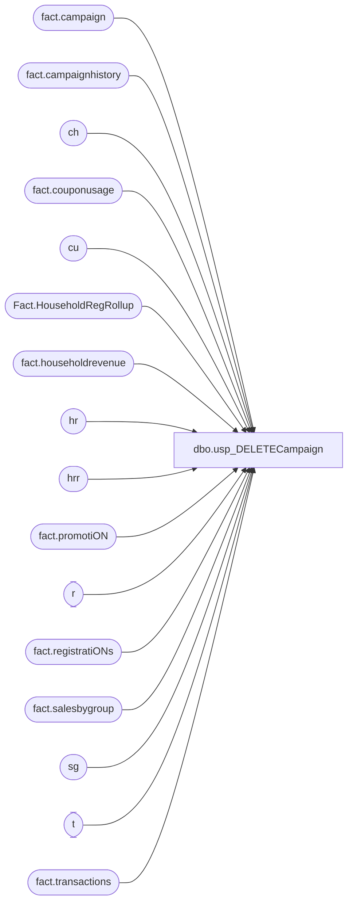

# dbo.usp_DELETECampaign

**Database:** dw  
**Server:** papamart  

## Architecture Diagram



## Table Dependencies

| Referenced Table |
|---|
| fact.campaign |
| fact.campaignhistory |
| ch |
| fact.couponusage |
| cu |
| Fact.HouseholdRegRollup |
| fact.householdrevenue |
| hr |
| hrr |
| fact.promotiON |
| r |
| fact.registratiONs |
| fact.salesbygroup |
| sg |
| t |
| fact.transactions |

## Stored Procedure Code

```sql
CREATE PROCEDURE [dbo].[usp_DELETECampaign](@CampaignID int)
AS
BEGIN

if @CampaignID > 3 

  BEGIN

		DELETE hrr FROM Fact.HouseholdRegRollup hrr
		inner join fact.promotiON p
		ON hrr.campaign_id = p.campaign_id and hrr.primarypromotiONid = p.promotiON_id
		WHERE p.campaign_id = @CampaignID

		DELETE hr FROM fact.householdrevenue hr
		inner join fact.promotiON p
		ON hr.promotion_id = p.promotion_id
        inner join fact.campaign c 
        ON c.campaign_id = p.campaign_id
		WHERE p.campaign_id = @CampaignID

		DELETE cu from fact.couponusage cu
		inner join fact.promotion p
		on cu.promotion_id = p.promotion_id
		where p.campaign_id = @CampaignID

		DELETE r FROM fact.registratiONs r
		inner join fact.promotiON p
		ON p.promotiON_id = r.promotiON_id and r.campaign_id = p.campaign_id
		WHERE p.campaign_id = @CampaignID

		DELETE sg FROM fact.salesbygroup sg
		inner join fact.promotiON p
		ON sg.campaign_id = p.campaign_id and sg.promotiON_id = p.promotiON_id
		WHERE p.campaign_id = @CampaignID

		DELETE t FROM [fact].[transactions] t
		inner join fact.promotiON p
		ON t.campaign_id = p.campaign_id and t.creditedpromotiON_id = p.promotiON_id
		WHERE p.campaign_id = @CampaignID

		DELETE ch FROM fact.campaignhistory ch
		inner join fact.promotiON p
		ON ch.promotiON_id = p.promotiON_id 
		WHERE p.campaign_id = @CampaignID

		DELETE from fact.promotion where campaign_id = @CampaignID

    END
END


--
--select * from Fact.HouseholdRegRollup
--
--select * from fact.householdrevenue
--
--select * from fact.couponusage
--
--select * from fact.salesbygroup
--
--select * from fact.registratiONs
--
--select * from [fact].[transactions]
--
--select * from fact.campaignhistory
--
--select * from fact.promotion
```

