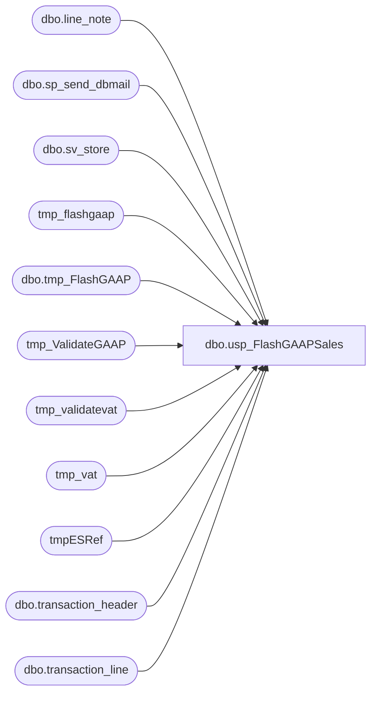

# dbo.usp_FlashGAAPSales

**Database:** dw  
**Server:** papamart  

## Architecture Diagram



## Table Dependencies

| Referenced Table |
|---|
| dbo.line_note |
| dbo.sp_send_dbmail |
| dbo.sv_store |
| tmp_flashgaap |
| dbo.tmp_FlashGAAP |
| tmp_ValidateGAAP |
| tmp_validatevat |
| tmp_vat |
| tmpESRef |
| dbo.transaction_header |
| dbo.transaction_line |

## Stored Procedure Code

```sql
CREATE PROC [dbo].[usp_FlashGAAPSales] 
-- =============================================================================================================
-- Name: usp_FlashGAAPSales
--
-- Description:	
--
-- Input:		@transaction_date		datetime		reporting date
--
--
-- Output: 
--
-- Dependencies: 
--
-- Revision History
--		Name:			Date:			Comments:
--		Brad Atkinson	12/3/2007		modified
--		Keith Missey	1/6/2008		added Kim West
--		Keith Missey	3/26/2008		Merch 4.2 Upgrades
--		Keith Missey	4/1/2008		updated stores with zero sales to account for updated store_dim	
--		Keith Missey	4/19/2008		updated line object for VAT calc to mirror line object in GAAP calc	
--		Keith Missey	4/29/2008		added line object 296 for customer service
--		Keith Missey	9/8/2008		updated stores with zero sales e-mail
--		Keith Missey	9/29/2008		updated for addition of France and Ireland stores
--		Keith Missey	10/16/2008		Updated to use dbmail following SQL 2005 upgrade
--		Keith Missey	10/31/2008		updated GAAP line objects
--		Keith Missey	5/18/2009		added line object 102,103 for virtual world
--		Garyd			08/19/2010		Update server name for SA 5.0.
--		Dave Rice		10/11/2010		commented out zero sales email, this has been suplanted by a report from Paul
--		Dave Rice		02/21/2011		added line object 104
--		Keith Missey	12/12/2011		updated to remove store 13, register 3; temporary code update
--		Gary Murrish	11/28/2012		Removed block for store 13, register 3.
--		Mike Pelikan	01/14/2014		Modified email address comments to reduce false positives when looking for
--										exipired users
--		Mike Pelikan	03/24/2014      added AND ISNUMERIC([line_note]) = 0 to tmp_ValidateVat WHERE Clause
--		Gary Murrish	4/29/2014		Changed isNumeric to be = 1 so that the vat would work.
--		Mike Pelikan	08/06/2014		Added WITH EXECUTE AS OWNER to allow non-sysadmin users to execute proc
--		Dan Tweedie		06/03/2016		I expanded the store number range to include China locations in the European email, since this is presently managed by European operations.
--										Changed references to databears to BI Admin.
--		Dan Tweedie		06/08/2016		Added line_object 106, including only line_actions 90,142,99, resulting in ES Fulfillments / ES Returns being included as Gaap
--		Dan Tweedie		08/12/2016		Corrected queries to be aligned with our new definitions of gaap, ensuring ES Fulfillments are reported as from the original Order location
-- =============================================================================================================
    
	@transaction_date DATETIME = NULL
	
	WITH EXECUTE AS OWNER
AS 


--IF OBJECT_ID('dw..tmpESRef') IS NOT NULL
--BEGIN
--	DROP TABLE dw..tmpESRef
--END

----this table is to enable us to post Enterprise Selling Fulfillments to original order location
--select acl.reference_no, acl.issuing_store_no, acl.store_key, tdf.transaction_id
--into tmpESRef
--from dwstaging.dbo.aw_cust_liability acl
--join dw.dbo.transaction_detail_facts tdf with (nolock) on acl.reference_no = tdf.reference_no 
--join dw.dbo.line_object_dim lod with (nolock) on tdf.line_object_key = lod.line_object_key
--join dw.dbo.line_action_dim lad with (nolock) on tdf.line_action_key = lad.line_action_key
--join dwstaging.dbo.aw_transaction_header ath on tdf.transaction_id = ath.transaction_id
--where lod.line_object = 106 --enterprise selling
--and lad.line_action in (90, 142, 8) --fulfillment or cancel
--group by acl.reference_no, acl.issuing_store_no, acl.store_key, tdf.transaction_id


    DECLARE @salesdate DATETIME
    DECLARE @str_salesdate CHAR(8)
    DECLARE @total DECIMAL(12, 4)
    DECLARE @str_message VARCHAR(1000)
    DECLARE @recipients VARCHAR(500)
    DECLARE @recipients_uk VARCHAR(500)
    DECLARE @copy_recipients VARCHAR(500)
    DECLARE @recipients_polling VARCHAR(500)
    DECLARE @subject VARCHAR(100)
    DECLARE @query VARCHAR(8000)
    DECLARE @resultseparator CHAR(1)

    SET @recipients = 'northamericanflashreport@buildabear.com'--; retailsystems@buildabear.com'
    SET @recipients_uk = @recipients + ';ukflashreport@buildabear.com'
    SET @copy_recipients = 'biadmin@buildabear.com'
    SET @recipients_polling = 'poll@buildabear.com'

    SET @resultseparator = CHAR(9)

    IF @transaction_date IS NULL 
        BEGIN
            SET @transaction_date = CAST(CONVERT(CHAR(10), GETDATE() - 1, 101) AS DATETIME)
        END

    SET @salesdate = @transaction_date
    SET @str_salesdate = ( SELECT   CONVERT(CHAR(8), @salesdate, 1)
                         )

    IF EXISTS ( SELECT  *
                FROM    sysobjects
                WHERE   id = OBJECT_ID('dbo.tmp_FlashGAAP')
                        AND sysstat & 0xf = 3 ) 
        DROP TABLE dbo.tmp_FlashGAAP
    IF EXISTS ( SELECT  *
                FROM    sysobjects
                WHERE   id = OBJECT_ID('dbo.tmp_VAT')
                        AND sysstat & 0xf = 3 ) 
        DROP TABLE dbo.tmp_VAT
    IF EXISTS ( SELECT  *
                FROM    sysobjects
                WHERE   id = OBJECT_ID('dbo.tmp_ValidateGAAP')
                        AND sysstat & 0xf = 3 ) 
        DROP TABLE dbo.tmp_ValidateGAAP
    IF EXISTS ( SELECT  *
                FROM    sysobjects
                WHERE   id = OBJECT_ID('dbo.tmp_ValidateVat')
                        AND sysstat & 0xf = 3 ) 
        DROP TABLE dbo.tmp_ValidateVat

    SELECT  isnull(es.issuing_store_no, h.store_no) AS 'StoreNo',
            c.store_name AS 'Store Name',
            ( SUM(( (l.gross_line_amount - l.pos_discount_amount) )
                  * l.db_cr_none * l.voiding_reversal_flag) ) * -1 AS 'GAAPSales'
    INTO    dbo.tmp_FlashGAAP
    FROM    bedrockdb01.auditworks.dbo.transaction_header h
            JOIN bedrockdb01.auditworks.dbo.transaction_line l ON h.transaction_id = l.transaction_id
            left join tmpESRef es on l.reference_no COLLATE Latin1_General_CI_AS = es.reference_no COLLATE Latin1_General_CI_AS
			JOIN bedrockdb01.auditworks.dbo.sv_store c ON isnull(es.issuing_store_no, h.store_no) = c.store_no
    WHERE   ( h.transaction_date = @salesdate
              AND h.transaction_void_flag = 0
              AND l.line_void_flag = 0 )
		AND 
				(
					(h.transaction_category IN (1, 2) AND l.line_object_type <> 12 and h.transaction_series <> 'C' and l.line_action <> 95) --exc
						OR 
					(h.transaction_category IN (10) AND (l.line_object_type = 7 OR l.line_object BETWEEN 700 AND 799) and h.transaction_series <> 'C')
						OR
					(h.transaction_category = 242 and 
							(
								(l.line_object = 106 and l.line_action in (90,99,142)) --es fulfillments
									or
								(l.line_object in (200, 203) and line_action = 97) --es shipping on fulfillment
							
							)
							 and h.transaction_series = 'C')  --es fulfillments, returns (technically this is customer liability, which is how es fulfillments post
				)
				
			AND NOT (h.store_no = 13 AND h.register_no = 3 AND transaction_date <= '1/31/2012')
			AND 
				(
					l.Line_Object IN (100, 102, 103, 104, 200, 202, 203, 204, 206, 210, 250, 290, 291, 293, 295, 296, 623, 640, 690, 691, 1630, 1631, 1199, 115, 215, 1660) 
				 OR 
					(l.line_object = 106 and line_action in (90,142,99) )
				)
    GROUP BY isnull(es.issuing_store_no, h.store_no),
            c.store_name
    ORDER BY isnull(es.issuing_store_no, h.store_no)

    SELECT  isnull(es.issuing_store_no, h.store_no) AS 'StoreNo',
            h.transaction_id,
            ( SUM(( (l.gross_line_amount - l.pos_discount_amount) )
                  * l.db_cr_none * l.voiding_reversal_flag) ) * -1 AS 'GAAPSales'
    INTO    dbo.tmp_ValidateGAAP
    FROM    bedrockdb01.auditworks.dbo.transaction_header h
            JOIN bedrockdb01.auditworks.dbo.transaction_line l ON h.transaction_id = l.transaction_id
            left join tmpESRef es on l.reference_no COLLATE Latin1_General_CI_AS = es.reference_no COLLATE Latin1_General_CI_AS
			JOIN bedrockdb01.auditworks.dbo.sv_store c ON isnull(es.issuing_store_no, h.store_no) = c.store_no
    WHERE   ( h.transaction_date = @salesdate
              AND h.transaction_void_flag = 0
              AND l.line_void_flag = 0 )
		AND 
				(
					(h.transaction_category IN (1, 2) AND l.line_object_type <> 12 and h.transaction_series <> 'C' and l.line_action <> 95) --exc
						OR 
					(h.transaction_category IN (10) AND (l.line_object_type = 7 OR l.line_object BETWEEN 700 AND 799) and h.transaction_series <> 'C')
						OR
					(h.transaction_category = 242 and 
							(
								(l.line_object = 106 and l.line_action in (90,99,142)) --es fulfillments
									or
								(l.line_object in (200, 203) and line_action = 97) --es shipping on fulfillment
							
							)
							 and h.transaction_series = 'C')  --es fulfillments, returns (technically this is customer liability, which is how es fulfillments post
				)
				
			AND NOT (h.store_no = 13 AND h.register_no = 3 AND transaction_date <= '1/31/2012')
			AND 
				(
					l.Line_Object IN (100, 102, 103, 104, 200, 202, 203, 204, 206, 210, 250, 290, 291, 293, 295, 296, 623, 640, 690, 691, 1630, 1631, 1199, 115, 215, 1660) 
				 OR 
					(l.line_object = 106 and line_action in (90,142,99) )
				)
    GROUP BY isnull(es.issuing_store_no, h.store_no),
            c.store_name,
            h.transaction_id

--CALCULATE TOTAL VAT FOR STORES' SALES
    SELECT  isnull(es.issuing_store_no, h.store_no) AS 'StoreNo',
            SUM(( l.gross_line_amount * CASE [line_action]
                                          WHEN 13 THEN -1
                                          WHEN 21 THEN 1
                                        END )) AS 'VAT'
    INTO    dbo.tmp_VAT
    FROM    bedrockdb01.auditworks.dbo.transaction_header h
            JOIN bedrockdb01.auditworks.dbo.transaction_line l ON h.transaction_id = l.transaction_id
			left join tmpESRef es on l.reference_no COLLATE Latin1_General_CI_AS = es.reference_no COLLATE Latin1_General_CI_AS
    WHERE   ( h.transaction_date = @salesdate
              AND h.transaction_void_flag = 0
              AND h.transaction_category IN ( 1, 2 )
            )
            AND l.line_object IN ( 1150 )
            AND l.line_void_flag = 0
    GROUP BY isnull(es.issuing_store_no, h.store_no)
    ORDER BY isnull(es.issuing_store_no, h.store_no)

    SELECT  isnull(es.issuing_store_no, h.store_no) AS 'StoreNo',
            l.transaction_id,
            SUM(( CAST([line_note] AS NUMERIC(9, 2)) * CASE [line_action]
                                                         WHEN 1 THEN -1
                                                         WHEN 2 THEN 1
                                                         WHEN 11 THEN -1
                                                         WHEN 12 THEN 1
                                                       END )) AS VAT
    INTO    dbo.tmp_ValidateVat
    FROM    bedrockdb01.auditworks.dbo.transaction_header h
            INNER JOIN bedrockdb01.auditworks.dbo.transaction_line l ON h.transaction_id = l.transaction_id
            INNER JOIN bedrockdb01.auditworks.dbo.line_note ln ON l.transaction_id = ln.transaction_id
                                                                AND l.line_id = ln.line_id
			left join tmpESRef es on l.reference_no COLLATE Latin1_General_CI_AS = es.reference_no COLLATE Latin1_General_CI_AS
    WHERE   ( h.transaction_date = @salesdate
              AND h.transaction_void_flag = 0
              AND l.line_void_flag = 0 )
		AND 
				(
					(h.transaction_category IN (1, 2) AND l.line_object_type <> 12 and h.transaction_series <> 'C' and l.line_action <> 95) --exc
						OR 
					(h.transaction_category IN (10) AND (l.line_object_type = 7 OR l.line_object BETWEEN 700 AND 799) and h.transaction_series <> 'C')
						OR
					(h.transaction_category = 242 and 
							(
								(l.line_object = 106 and l.line_action in (90,99,142)) --es fulfillments
									or
								(l.line_object in (200, 203) and line_action = 97) --es shipping on fulfillment
							
							)
							 and h.transaction_series = 'C')  --es fulfillments, returns (technically this is customer liability, which is how es fulfillments post
				)
				
			AND NOT (h.store_no = 13 AND h.register_no = 3 AND transaction_date <= '1/31/2012')
			AND 
				(
					l.Line_Object IN (100, 102, 103, 104, 200, 202, 203, 204, 206, 210, 250, 290, 291, 293, 295, 296, 623, 640, 690, 691, 1630, 1631, 1199, 115, 215, 1660) 
				 OR 
					(l.line_object = 106 and line_action in (90,142,99) )
				)
            AND ln.[note_type] = 35
			AND ISNUMERIC([line_note]) = 1
    GROUP BY isnull(es.issuing_store_no, h.store_no),
            l.transaction_id
    ORDER BY isnull(es.issuing_store_no, h.store_no),
            l.transaction_id

--UPDATE GAAP SALES BY STRIPPING OUT VAT
    UPDATE  tmp_flashgaap
    SET     gaapsales = gaapsales + vat
    FROM    tmp_flashgaap f
            INNER JOIN tmp_vat v ON v.storeno = f.storeno
	
    UPDATE  tmp_ValidateGAAP
    SET     gaapsales = gaapsales + vat
    FROM    tmp_ValidateGAAP f
            INNER JOIN tmp_validatevat v ON v.storeno = f.storeno
                                            AND v.transaction_id = f.transaction_id

--N.America--

    SET @total = ( SELECT   SUM(GAAPSales)
                   FROM     dw.dbo.tmp_FlashGAAP
                   WHERE    StoreNo < 1500
                 )

    SET @str_message = ( SELECT 'Attached is the Flash GAAP Sales report at the store level.  

Here is the Flash GAAP Summary info:

Date Range:  ' + @str_salesdate + ' - ' + @str_salesdate + '
GAAP Sales:  ' + CAST(@total AS VARCHAR(20))
                                + '


Please provide BI Admin (biadmin@buildabear.com) with any feedback you have with the Report.  (do not reply to SQL Services;  it will not get delivered)
Generated from papamart.dw.usp_FlashGAAPSales'
                       )

    SET @query = 'SET ANSI_WARNINGS OFF 
SET NOCOUNT ON

DECLARE 
@startdt datetime,
@enddt datetime

SET @startdt =  CAST(CONVERT(char(10),' + '''' + @str_salesdate + ''''
        + ',101) as datetime)
SET @enddt =  CAST(CONVERT(char(10),' + '''' + @str_salesdate + ''''
        + ',101) as datetime)

select case when sd.store_id = 473 then 13 else sd.store_id end as store_id
, @startdt as date_beg
, @enddt as date_end
, f.GAAPSales
, case 	when sd.store_id in (13,473) then 9500 
		when sd.store_id =136 then 9400 
		when sd.bearea = ''Canada Stores'' then 8000
		when sd.store_id between 470 and 2900 and sd.store_id not in (480,482,485) then 9999
	else 0 end as ''sortorder''
into ##tmp_FlashGAAP
from dw.dbo.store_dim sd
	left join dw.dbo.tmp_FlashGAAP f on sd.store_id = f.storeno
where sd.store_id between 0 and 1499
order by case when sd.store_id =13 then 9999 else 0 end, store_id 


select store_id, date_beg, date_end, GAAPSales, sortorder
into ##tmpFlashGAAP2
from ##tmp_FlashGAAP
union all 
select  8 , @startdt, @enddt, 0, 0
union all 
select 17 , @startdt, @enddt, 0, 0
union all
select 155, @startdt, @enddt, 0, 0

select CAST(store_id as numeric(4,0)) as Stores_US 
	, CONVERT(char(8),date_beg,1) as ''Begin''
	, CONVERT(char(8),date_end,1) as ''End''
	, CAST(SUM(COALESCE(GAAPSales,0)) as numeric(10,2)) as ''GAAPSales''
from ##tmpFlashGAAP2
where sortorder =0
group by store_id, 	date_beg, date_end, sortorder
order by sortorder

select CAST(store_id as numeric(4,0)) as Stores_CA
	, CONVERT(char(8),date_beg,1) as ''Begin''
	, CONVERT(char(8),date_end,1) as ''End''
	, CAST(SUM(COALESCE(GAAPSales,0)) as numeric(10,2)) as ''GAAPSales''		
from ##tmpFlashGAAP2
where sortorder =8000
group by store_id, 	date_beg, date_end, sortorder
order by sortorder

select CAST(store_id as numeric(4,0)) as Stores_Web
	, CONVERT(char(8),date_beg,1) as ''Begin''
	, CONVERT(char(8),date_end,1) as ''End''
	, CAST(SUM(COALESCE(GAAPSales,0)) as numeric(10,2)) as ''GAAPSales''	
from ##tmpFlashGAAP2
where sortorder in (9400,9500)
group by store_id, 	date_beg, date_end, sortorder
order by sortorder


select CAST(store_id as numeric(4,0)) as Stores_Other
	, CONVERT(char(8),date_beg,1) as ''Begin''
	, CONVERT(char(8),date_end,1) as ''End''
	, CAST(SUM(COALESCE(GAAPSales,0)) as numeric(10,2)) as ''GAAPSales''	
from ##tmpFlashGAAP2
where sortorder =9999 or sortorder not in (0,8000,9400,9500)
group by store_id, 	date_beg, date_end, sortorder
order by sortorder
'


    EXEC msdb.dbo.sp_send_dbmail @recipients = @recipients,
        @copy_recipients = @copy_recipients,
        @subject = 'Flash GAAP Sales from AW',
        @attach_query_result_as_file = 'TRUE',
        @query_result_separator = @resultseparator,
        @query_attachment_filename = 'FlashGAAPSales.csv',
        @query_result_header = 'TRUE', @query_result_width = 80,
        @body = @str_message, @query = @query

--UK--

    SET @total = ( SELECT   SUM(GAAPSales)
                   FROM     dw.dbo.tmp_FlashGAAP
                   WHERE    storeNo >= 2000
                 )

    SET @str_message = ( SELECT 'Attached is the Flash Europe GAAP Sales report at the store level.  

Here is the Flash GAAP Summary info:

Date Range:  ' + @str_salesdate + ' - ' + @str_salesdate + '
GAAP Sales:  ' + CAST(@total AS VARCHAR(20))
                                + '


Please provide BI Admin (biadmin@buildabear.com) with any feedback you have with the Report.  (do not reply to SQL Services;  it will not get delivered)
Generated from papamart.dw.usp_FlashGAAPSales'
                       )

    SET @query = 'SET ANSI_WARNINGS OFF 
SET NOCOUNT ON

DECLARE 
@startdt datetime,
@enddt datetime

SET @startdt =  CAST(CONVERT(char(10),' + '''' + @str_salesdate + ''''
        + ',101) as datetime)
SET @enddt =  CAST(CONVERT(char(10),' + '''' + @str_salesdate + ''''
        + ',101) as datetime)

select sd.store_id as store_id
, @startdt as date_beg
, @enddt as date_end
, f.GAAPSales
, case when sd.store_id =2013 then 9999 else 0 end as ''sortorder''
into ##tmp_FlashGAAP_UK
from dw.dbo.store_dim sd
	left join dw.dbo.tmp_FlashGAAP f on sd.store_id = f.storeno
where sd.store_id between 2000 and 3999
order by case when sd.store_id =2013 then 9999 else 0 end, store_id 


select store_id, date_beg, date_end, GAAPSales, sortorder
into ##tmpFlashGAAP2_UK
from ##tmp_FlashGAAP_UK


select CAST(store_id as numeric(4,0)) as Stores_Europe 
	, CONVERT(char(8),date_beg,1) as ''Begin''
	, CONVERT(char(8),date_end,1) as ''End''
	, CAST(SUM(COALESCE(GAAPSales,0)) as numeric(10,2)) as ''GAAPSales''
from ##tmpFlashGAAP2_UK
where sortorder in (0, 9999)
group by store_id,  date_beg, date_end, sortorder
order by sortorder
'


    EXEC msdb.dbo.sp_send_dbmail @recipients = @recipients_uk,
        @copy_recipients = @copy_recipients,
        @subject = 'Flash Europe GAAP Sales from AW',
        @attach_query_result_as_file = 'TRUE',
        @query_result_separator = @resultseparator,
        @query_attachment_filename = 'FlashEuropeGAAPSales.csv',
        @query_result_header = 'TRUE'     
        , @body = @str_message, @query = @query


-- create file with sales info

    IF ( OBJECT_ID('tmp_edin_GAAPSales') IS NOT NULL ) 
        DROP TABLE tmp_edin_GAAPSales
    SELECT  StoreNo,
            SalesDate,
            SUM(GAAPSales) AS GAAPSales
    INTO    tmp_edin_GAAPSales
    FROM    ( SELECT    CASE WHEN StoreNo IN ( 13, 473 ) THEN 13
                             ELSE StoreNo
                        END AS StoreNo,
                        CONVERT(CHAR(10), @salesdate, 101) AS SalesDate,
                        GAAPSales
              FROM      tmp_FlashGAAP
            ) d
    GROUP BY StoreNo,
            SalesDate
    ORDER BY StoreNo

    EXEC master..xp_cmdshell 'osql -S PAPAMART -d dw -U link_readonly -P l1nkr -s "," -o "\\sharebear1\groups\it\retail systems\polling\flash_gaap\FlashGAAPSales.csv" -Q "select * from tmp_edin_GAAPSales"',
        no_output
```

