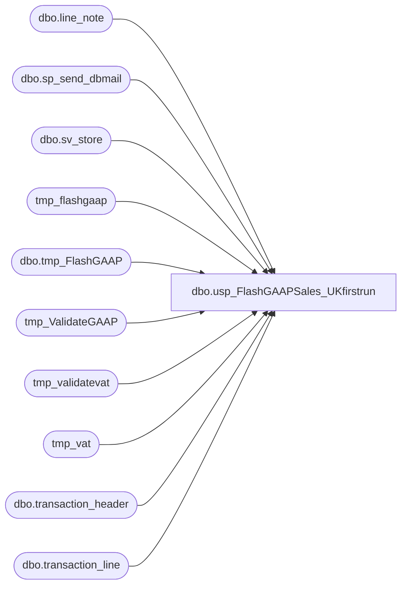

# dbo.usp_FlashGAAPSales_UKfirstrun

**Database:** dw  
**Server:** papamart  

## Architecture Diagram



## Table Dependencies

| Referenced Table |
|---|
| dbo.line_note |
| dbo.sp_send_dbmail |
| dbo.sv_store |
| tmp_flashgaap |
| dbo.tmp_FlashGAAP |
| tmp_ValidateGAAP |
| tmp_validatevat |
| tmp_vat |
| dbo.transaction_header |
| dbo.transaction_line |

## Stored Procedure Code

```sql
CREATE PROC [dbo].[usp_FlashGAAPSales_UKfirstrun]  
-- =============================================================================================================
-- Name: [dbo].[usp_FlashGAAPSales_UKfirstrun]  
--
-- Description:	

--
-- Input:		@transaction_date		datetime		reporting date
--
--
-- Output: 
--
-- Dependencies: 
--
-- Revision History
--		Name:			Date:			Comments:
--		Keith Missey	3/26/2008		Merch 4.2 Upgrades
--		Keith Missey	4/29/2008		added line object 296 for customer service
--		Keith Missey	9/29/2008		updated for addition of France and Ireland stores
--		Gary Derikito	10/16/2008		Updated to use dbmail following SQL 2005 upgrade
--		Keith Missey	10/31/2008		updated gaap line objects
--		Keith Missey	5/18/2009		added line object 102,103 for virtual world
--		Garyd			08/19/2010		Update server name for SA 5.0.
--		Mike Pelikan	01/14/2014		Modified email address comments to reduce false positives when looking for
--										exipired users
--		Kevin Shyr		09/02/2014		Put Cast into subquery to deal with Varchar conversion error

-- =============================================================================================================
    @transaction_date DATETIME = NULL
AS 
    DECLARE @salesdate DATETIME  
    DECLARE @str_salesdate CHAR(8)  
    DECLARE @total DECIMAL(12, 4)  
    DECLARE @str_message VARCHAR(1000)  
    DECLARE @recipients VARCHAR(500)  
    DECLARE @copy_recipients VARCHAR(500)  
    DECLARE @resultseparator CHAR(1)
    DECLARE @query VARCHAR(8000)
  
    SET @recipients = 'ukflashreport@buildabear.com'  
    SET @copy_recipients = 'databears@buildabear.com'  
    SET @resultseparator = CHAR(9)
  

    IF @transaction_date IS NULL 
        BEGIN
            SET @transaction_date = CAST(CONVERT(CHAR(10), GETDATE() - 1, 101) AS DATETIME)
        END

    SET @salesdate = @transaction_date
    SET @str_salesdate = ( SELECT   CONVERT(CHAR(8), @salesdate, 1)
                         )  
  
    IF EXISTS ( SELECT  *
                FROM    sysobjects
                WHERE   id = OBJECT_ID('dbo.tmp_FlashGAAP')
                        AND sysstat & 0xf = 3 ) 
        DROP TABLE dbo.tmp_FlashGAAP  
    IF EXISTS ( SELECT  *
                FROM    sysobjects
                WHERE   id = OBJECT_ID('dbo.tmp_VAT')
                        AND sysstat & 0xf = 3 ) 
        DROP TABLE dbo.tmp_VAT
    IF EXISTS ( SELECT  *
                FROM    sysobjects
                WHERE   id = OBJECT_ID('dbo.tmp_ValidateGAAP')
                        AND sysstat & 0xf = 3 ) 
        DROP TABLE dbo.tmp_ValidateGAAP  
    IF EXISTS ( SELECT  *
                FROM    sysobjects
                WHERE   id = OBJECT_ID('dbo.tmp_ValidateVat')
                        AND sysstat & 0xf = 3 ) 
        DROP TABLE dbo.tmp_ValidateVat
  
    SELECT  h.store_no AS 'StoreNo',
            c.store_name AS 'Store Name',
            ( SUM(( (l.gross_line_amount - l.pos_discount_amount) )
                  * l.db_cr_none * l.voiding_reversal_flag) ) * -1 AS 'GAAPSales'
    INTO    tmp_FlashGAAP
    FROM    bedrockdb01.auditworks.dbo.transaction_header h
            JOIN bedrockdb01.auditworks.dbo.transaction_line l ON h.transaction_id = l.transaction_id
            JOIN bedrockdb01.auditworks.dbo.sv_store c ON h.store_no = c.store_no
    WHERE   ( h.transaction_date = @salesdate
              AND h.transaction_void_flag = 0
              AND h.transaction_category IN ( 1, 2 )
            )
                        AND l.line_object IN ( 100, 102, 103, 200, 202, 203, 204, 206, 210, 250, 290,
                                   291, 293, 295, 296, 623, 640, 690, 691, 1630, 1631 )
--            AND l.[line_object] IN ( 200, 200, 202, 203, 204, 210, 250, 290, 296,
--                                     291, 640, 690, 1606, 1607, 1610, 1611,
--                                     1612, 1613, 1614, 1616, 1617, 1618, 1621,
--                                     1622, 1623, 1625, 1626, 1627, 1629, 1630,
--                                     1631, 1800, 1801, 1802, 1803, 1804, 1805,
--                                     1806, 1807, 1808, 1809, 1810, 1811, 1900 )


            AND l.line_void_flag = 0
    GROUP BY h.store_no,
            c.store_name
    ORDER BY h.store_no,
            c.store_name  
  
    SELECT  h.store_no AS 'StoreNo',
            h.transaction_id,
            ( SUM(( (l.gross_line_amount - l.pos_discount_amount) )
                  * l.db_cr_none * l.voiding_reversal_flag) ) * -1 AS 'GAAPSales'
    INTO    tmp_ValidateGAAP
    FROM    bedrockdb01.auditworks.dbo.transaction_header h
            JOIN bedrockdb01.auditworks.dbo.transaction_line l ON h.transaction_id = l.transaction_id
            JOIN bedrockdb01.auditworks.dbo.sv_store c ON h.store_no = c.store_no
    WHERE   ( h.transaction_date = @salesdate
              AND h.transaction_void_flag = 0
              AND h.transaction_category IN ( 1, 2 )
            )
            AND l.line_object IN ( 100, 102, 103, 200, 202, 203, 204, 206, 210, 250, 290,
                                   291, 293, 295, 296, 623, 640, 690, 691, 1630, 1631 )
--            AND l.[line_object] IN ( 200, 200, 202, 203, 204, 210, 250, 290, 296,
--                                     291, 640, 690, 1606, 1607, 1610, 1611,
--                                     1612, 1613, 1614, 1616, 1617, 1618, 1621,
--                                     1622, 1623, 1625, 1626, 1627, 1629, 1630,
--                                     1631, 1800, 1801, 1802, 1803, 1804, 1805,
--                                     1806, 1807, 1808, 1809, 1810, 1811, 1900 )
            AND l.line_void_flag = 0
    GROUP BY h.store_no,
            c.store_name,
            h.transaction_id  

--CALCULATE TOTAL VAT FOR STORES' SALES
    SELECT  h.store_no AS 'StoreNo',
            SUM(( l.gross_line_amount * CASE [line_action]
                                          WHEN 13 THEN -1
                                          WHEN 21 THEN 1
                                        END )) AS 'VAT'
    INTO    tmp_VAT
    FROM    bedrockdb01.auditworks.dbo.transaction_header h
            JOIN bedrockdb01.auditworks.dbo.transaction_line l ON h.transaction_id = l.transaction_id
    WHERE   ( h.transaction_date = @salesdate
              AND h.transaction_void_flag = 0
              AND h.transaction_category IN ( 1, 2 )
            )
            AND l.line_object IN ( 1150 )
            AND l.line_void_flag = 0
    GROUP BY h.store_no
    ORDER BY h.store_no

/************************ changed 2014-09-02 *************************/
--    SELECT  h.store_no AS 'StoreNo',
--            l.transaction_id,
--            SUM(( CAST([line_note] AS NUMERIC(9, 2)) * CASE [line_action]
--                                                         WHEN 1 THEN -1
--                                                         WHEN 2 THEN 1
--                                                         WHEN 11 THEN -1
--                                                         WHEN 12 THEN 1
--                                                       END )) AS VAT
--    INTO    dbo.tmp_ValidateVat
--    FROM    bedrockdb01.auditworks.dbo.transaction_header h
--            INNER JOIN bedrockdb01.auditworks.dbo.transaction_line l ON h.transaction_id = l.transaction_id
--            INNER JOIN bedrockdb01.auditworks.dbo.line_note ln ON l.transaction_id = ln.transaction_id
--                                                                AND l.line_id = ln.line_id
--    WHERE   ( h.transaction_date = @salesdate
--              AND h.transaction_void_flag = 0
--              AND h.transaction_category IN ( 1, 2 )
--            )
--            AND l.line_object IN ( 100,102,103, 200, 202, 203, 204, 206, 210, 250, 290,
--                                   291, 293, 295, 296, 623, 640, 690, 691, 1630, 1631 )
----            AND l.[line_object] IN ( 200, 200, 202, 203, 204, 210, 250, 290, 296,
----                                     291, 640, 690, 1606, 1607, 1610, 1611,
----                                     1612, 1613, 1614, 1616, 1617, 1618, 1621,
----                                     1622, 1623, 1625, 1626, 1627, 1629, 1630,
----                                     1631, 1800, 1801, 1802, 1803, 1804, 1805,
----                                     1806, 1807, 1808, 1809, 1810, 1811, 1900 )
--            AND l.line_void_flag = 0
--            AND ln.[note_type] = 35
--    GROUP BY h.[store_no],
--            l.transaction_id
--    ORDER BY h.[store_no],
--            l.transaction_id
SELECT    StoreNo, transaction_id, 
SUM(( CAST([line_note] AS NUMERIC(9, 2)) * CASE [line_action]
                                                        WHEN 1 THEN -1
                                                        WHEN 2 THEN 1
                                                        WHEN 11 THEN -1
                                                        WHEN 12 THEN 1
                                                    END )) AS VAT
  
INTO    dbo.tmp_ValidateVat
FROM (
    SELECT  h.store_no AS 'StoreNo',
            l.transaction_id,
            [line_note] , line_action
            
    FROM    bedrockdb01.auditworks.dbo.transaction_header h
            INNER JOIN bedrockdb01.auditworks.dbo.transaction_line l ON h.transaction_id = l.transaction_id
            INNER JOIN bedrockdb01.auditworks.dbo.line_note ln ON l.transaction_id = ln.transaction_id
                                                                AND l.line_id = ln.line_id
    WHERE   ( h.transaction_date = @salesdate
              AND h.transaction_void_flag = 0
              AND h.transaction_category IN ( 1, 2 )
            )
            AND l.line_object IN ( 100,102,103, 200, 202, 203, 204, 206, 210, 250, 290,
                                   291, 293, 295, 296, 623, 640, 690, 691, 1630, 1631 )
            AND l.[line_object] IN ( 200, 200, 202, 203, 204, 210, 250, 290, 296,
                                     291, 640, 690, 1606, 1607, 1610, 1611,
                                     1612, 1613, 1614, 1616, 1617, 1618, 1621,
                                     1622, 1623, 1625, 1626, 1627, 1629, 1630,
                                     1631, 1800, 1801, 1802, 1803, 1804, 1805,
                                     1806, 1807, 1808, 1809, 1810, 1811, 1900 )
            AND l.line_void_flag = 0
            AND ln.[note_type] = 35
)
qry
    GROUP BY qry.StoreNo, qry.transaction_id
    ORDER BY qry.StoreNo, qry.transaction_id


--UPDATE GAAP SALES BY STRIPPING OUT VAT
    UPDATE  tmp_flashgaap
    SET     gaapsales = gaapsales + vat
    FROM    tmp_flashgaap f
            INNER JOIN tmp_vat v ON v.storeno = f.storeno

    UPDATE  tmp_ValidateGAAP
    SET     gaapsales = gaapsales + vat
    FROM    tmp_ValidateGAAP f
            INNER JOIN tmp_validatevat v ON v.storeno = f.storeno
                                            AND v.transaction_id = f.transaction_id
  
--UK--  
  
    SET @total = ( SELECT   SUM(GAAPSales)
                   FROM     dw.dbo.tmp_FlashGAAP
                   WHERE    storeNo >= 2000
                 )  
  
    SET @str_message = ( SELECT 'Attached is the Flash Europe GAAP Sales report (first-run) at the store level.    
  
Here is the Flash GAAP Summary info:  
  
Date Range:  ' + @str_salesdate + ' - ' + @str_salesdate + '  
GAAP Sales:  ' + CAST(@total AS VARCHAR(20))
                                + '  
  
  
Please provide Databear Service (it-data@buildabear.com) with any feedback you have with the Report.  (do not reply to SQL Services;  it will not get delivered)'
                       )  

    SET @query = 'SET ANSI_WARNINGS OFF   
  
DECLARE   
@startdt datetime,  
@enddt datetime  
  
SET @startdt =  CAST(CONVERT(char(10),' + '''' + @str_salesdate + ''''
        + ',101) as datetime)
SET @enddt =  CAST(CONVERT(char(10),' + '''' + @str_salesdate + ''''
        + ',101) as datetime)
  
select sd.store_id as store_id  
, @startdt as date_beg  
, @enddt as date_end  
, f.GAAPSales  
, 0 as ''sortorder''  
into ##tmp_FlashGAAP_UK  
from dw.dbo.store_dim sd  
 left join dw.dbo.tmp_FlashGAAP f on sd.store_id = f.storeno  
where sd.store_id between 2000 and 3000  
order by case when sd.store_id =13 then 9999 else 0 end, store_id   
  
  
select store_id, date_beg, date_end, GAAPSales, sortorder  
into ##tmpFlashGAAP2_UK  
from ##tmp_FlashGAAP_UK  
  
  
select CAST(store_id as numeric(4,0)) as Stores_Europe   
 , CONVERT(char(8),date_beg,1) as ''Begin''  
 , CONVERT(char(8),date_end,1) as ''End''  
 , CAST(SUM(COALESCE(GAAPSales,0)) as numeric(10,2)) as ''GAAPSales''  
from ##tmpFlashGAAP2_UK  
where sortorder =0  
group by store_id,  date_beg, date_end, sortorder  
order by sortorder  
'
  
--exec master..xp_sendmail @recipients=@recipients  
--,@copy_recipients=@copy_recipients  
--,@subject = 'Flash Europe GAAP Sales from AW (first-run)'  
--,@attach_results = 'TRUE'  
--,@separator = ','  
--,@attachments =  'FlashEuropeGAAPSales.csv'  
--,@ansi_attachment='TRUE'  
--,@no_header ='FALSE'  
--,@width =80   
--,@message = @str_message  
--,@query = @query

    EXEC msdb.dbo.sp_send_dbmail @recipients = @recipients,
        @copy_recipients = @copy_recipients,
        @subject = 'Flash Europe GAAP Sales from AW (first-run)',
        @attach_query_result_as_file = 'TRUE',
        @query_result_separator = @resultseparator,
        @query_attachment_filename = 'FlashEuropeGAAPSales.csv'  
--,@ansi_attachment='TRUE'  
        , @query_result_header = 'FALSE', @query_result_width = 80,
        @body = @str_message, @query = @query
```

