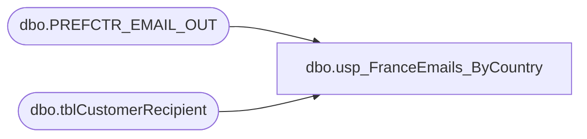

# dbo.usp_FranceEmails_ByCountry

**Database:** dw  
**Server:** papamart  

## Architecture Diagram



## Table Dependencies

| Referenced Table |
|---|
| dbo.PREFCTR_EMAIL_OUT |
| dbo.tblCustomerRecipient |

## Stored Procedure Code

```sql
CREATE procedure [dbo].[usp_FranceEmails_ByCountry]
-- =============================================================================================================
-- Name: [dbo].[usp_FranceEmails_ByCountry]
--
-- Description:	returns list of opted-in France e-mail addresses by country
--
-- Input:	
--
-- Output: 
--
-- Dependencies: 
--
-- Revision History
--		Name:			Date:			Comments:
--		Keith Missey	8/8/2008		Created
-- =============================================================================================================
as 

	SELECT DISTINCT
            ssemail
    FROM    mamamart.babw.dbo.tblCustomerRecipient
    WHERE   --pull_storeid IN (2201, 2202, 2203) AND 
			CHARINDEX('@', [ssemail]) > 0
            AND CHARINDEX('.', ssemail) > 0 AND [sSEMail] <> 'bad@email.adr'
            AND sssendemail = 'yes' AND (LEFT(sscountry,2) =  'FR')
            AND ssemail NOT IN (
            SELECT DISTINCT
                    email_addr
            FROM    dw.dbo.PREFCTR_EMAIL_OUT WITH ( NOLOCK )
            WHERE   date_optbackin IS NULL)
    ORDER BY ssemail
```

