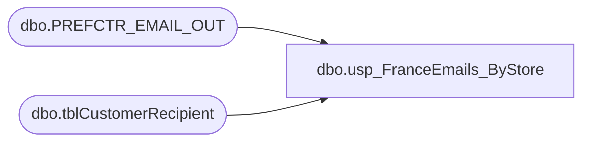

# dbo.usp_FranceEmails_ByStore

**Database:** dw  
**Server:** papamart  

## Architecture Diagram



## Table Dependencies

| Referenced Table |
|---|
| dbo.PREFCTR_EMAIL_OUT |
| dbo.tblCustomerRecipient |

## Stored Procedure Code

```sql
CREATE procedure [dbo].[usp_FranceEmails_ByStore]
-- =============================================================================================================
-- Name: [dbo].[usp_FranceEmails_ByStore]
--
-- Description:	returns list of opted-in France e-mail addresses by store
--
-- Input:	@storenumber	int		number of france store; if none supplied then all
--
-- Output: 
--
-- Dependencies: 
--
-- Revision History
--		Name:			Date:			Comments:
--		Keith Missey	4/14/2008		Created
--		Keith Missey	8/8/2008		added country filter
-- =============================================================================================================
@storenumber INT=0
as 

IF @storenumber <> 0
	SELECT DISTINCT
            ssemail
    FROM    mamamart.babw.dbo.tblCustomerRecipient
    WHERE   pull_storeid = @storenumber 
            AND CHARINDEX('@', [ssemail]) > 0
            AND CHARINDEX('.', ssemail) > 0 AND [sSEMail] <> 'bad@email.adr'
            AND sssendemail = 'yes' AND (sscountry LIKE 'FR%' OR LEN(sscountry) = 0)
            AND ssemail NOT IN (
            SELECT DISTINCT
                    email_addr
            FROM    dw.dbo.PREFCTR_EMAIL_OUT WITH ( NOLOCK )
            WHERE   date_optbackin IS NULL
                    AND final_optout IS NULL )
    ORDER BY ssemail
ELSE
	SELECT DISTINCT
            ssemail
    FROM    mamamart.babw.dbo.tblCustomerRecipient
    WHERE   pull_storeid IN (2201, 2202, 2203)
           AND CHARINDEX('@', [ssemail]) > 0
            AND CHARINDEX('.', ssemail) > 0 AND [sSEMail] <> 'bad@email.adr'
            AND sssendemail = 'yes' AND (sscountry LIKE 'FR%' OR LEN(sscountry) = 0)
            AND ssemail NOT IN (
            SELECT DISTINCT
                    email_addr
            FROM    dw.dbo.PREFCTR_EMAIL_OUT WITH ( NOLOCK )
            WHERE   date_optbackin IS NULL
                    AND final_optout IS NULL )
    ORDER BY ssemail
```

