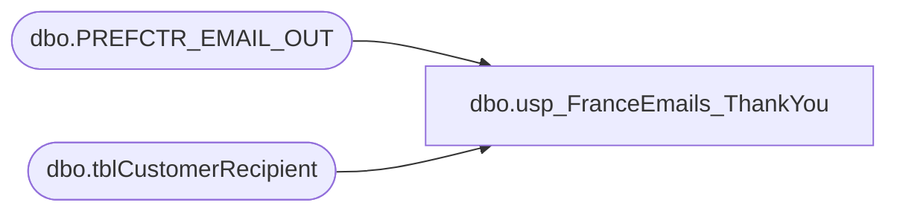

# dbo.usp_FranceEmails_ThankYou

**Database:** dw  
**Server:** papamart  

## Architecture Diagram



## Table Dependencies

| Referenced Table |
|---|
| dbo.PREFCTR_EMAIL_OUT |
| dbo.tblCustomerRecipient |

## Stored Procedure Code

```sql
CREATE PROCEDURE [dbo].[usp_FranceEmails_ThankYou]
-- =============================================================================================================
-- Name: [dbo].usp_FranceEmails_ThankYou]
--
-- Description:	returns list of opted-in e-mail addresses in order to send thank you e-mails
--
-- Input:	@startdate	datetime
--			@enddate	datetime
--
-- Output: 
--
-- Dependencies: 
--
-- Revision History
--		Name:			Date:			Comments:
--		Keith Missey	8/8/2008		Created
-- =============================================================================================================
    @StartDate DATETIME,
    @EndDate DATETIME
AS 
    SELECT  sSEmail,
            MIN(drstarttime) AS regdate
    INTO    #tmp_kmiss_franceemails
    FROM    mamamart.babw.dbo.tblCustomerRecipient with (nolock)
    WHERE   pull_storeid IN (2201, 2202, 2203)
            AND CHARINDEX('@', [ssemail]) > 0
            AND CHARINDEX('.', ssemail) > 0 AND [sSEMail] <> 'bad@email.adr'
            AND sssendemail = 'yes' 
    GROUP BY [ssemail]
    
    SELECT DISTINCT
            LOWER(sSEmail), regdate
	FROM #tmp_kmiss_franceemails
	WHERE regdate >= @startdate AND regdate < @enddate AND ssemail NOT IN (
            SELECT DISTINCT
                    email_addr
            FROM    dw.dbo.PREFCTR_EMAIL_OUT WITH ( NOLOCK )
            WHERE   date_optbackin IS NULL
                    AND final_optout IS NULL )
```

