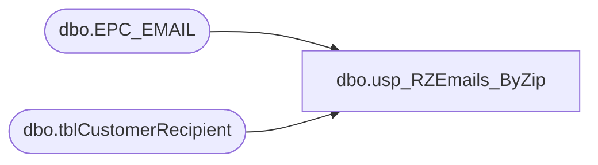

# dbo.usp_RZEmails_ByZip

**Database:** dw  
**Server:** papamart  

## Architecture Diagram



## Table Dependencies

| Referenced Table |
|---|
| dbo.EPC_EMAIL |
| dbo.tblCustomerRecipient |

## Stored Procedure Code

```sql
CREATE procedure [dbo].[usp_RZEmails_ByZip]
-- =============================================================================================================
-- Name: [dbo].[usp_RZEmails_ByZip]
--
-- Description:	returns list of opted-in RZ e-mail addresses by zip code
--
-- Input:	@zipcodes	varchar(4000)	comma-delimited list of zip codes
--
-- Output: 
--
-- Dependencies: 
--
-- Revision History
--		Name:			Date:			Comments:
--		Keith Missey	4/14/2008		created
-- =============================================================================================================
@zipcodes VARCHAR(4000)
AS

DECLARE @commapos int,
	@stringlen int,
	@oldcommapos INT,
	@singlezipcode VARCHAR(15)
	
CREATE TABLE #tmpzip
(
	zipcode VARCHAR(15)
)

--IF LAST ZIP CODE DIDN'T HAVE CRLF AFTER IT, ADD COMMA NOW SO FILE WILL PROCESS CORRECTLY
IF SUBSTRING(@zipcodes, LEN(@zipcodes)-1, 1) <> ','
BEGIN
	SET @zipcodes = @zipcodes + ','
END

SET @commapos = CHARINDEX(',', @zipcodes, 0)
SET @oldcommapos = 0

	WHILE @commapos > 0
	BEGIN
		
		SET @singlezipcode = LTRIM(RTRIM(SUBSTRING(@zipcodes,@oldcommapos,@commapos - @oldcommapos)))
		
		IF @singlezipcode IS NOT NULL AND @singlezipcode <> ''
		BEGIN
			INSERT #tmpzip
			SELECT @singlezipcode
		END
		
			SET @oldcommapos = @commapos + 1
			SET @commapos = CHARINDEX(',', @zipcodes, @commapos + 1)
		
	END

--SELECT * FROM [#tmpzip]

 SELECT DISTINCT
            LOWER(sSEmail) AS email_address, [sSPostCode] AS postalcode
    INTO    #tmp_kmiss_rz_email_list
    FROM    mamamart.babw.dbo.tblCustomerRecipient
		INNER JOIN #tmpzip ON [sSPostCode] = [zipcode]
    WHERE   Pull_StoreID BETWEEN 1501 AND 1599
            AND sSSendEmail = 'yes'
            AND CHARINDEX('@', [ssemail]) > 0
            AND CHARINDEX('.', ssemail) > 0 AND [sSEMail] <> 'bad@email.adr'

           
--delete any emails that are opted out on the web email pref center
    DELETE  #tmp_kmiss_rz_email_list
    WHERE   email_address IN ( 
                               SELECT DISTINCT
                                        email_addr
                               FROM     bearwebdb.emailcenter_rz.dbo.EPC_EMAIL
                               WHERE    global_out_Y_N = 'Y' )

--output data
    SELECT  DISTINCT email_address, postalcode
        FROM    #tmp_kmiss_rz_email_list
        ORDER BY [postalcode]
```

