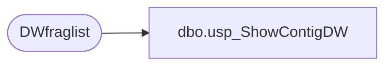

# dbo.usp_ShowContigDW

**Database:** dw  
**Server:** papamart  

## Architecture Diagram



## Table Dependencies

| Referenced Table |
|---|
| DWfraglist |

## Stored Procedure Code

```sql
CREATE procedure  usp_ShowContigDW as

-- Declare variables
SET NOCOUNT ON
DECLARE @tablename VARCHAR (128)

-- Clear the table

TRUNCATE TABLE DBAUtility..DWfraglist 
-- Declare cursor
DECLARE tables CURSOR FOR
   SELECT TABLE_NAME
   FROM INFORMATION_SCHEMA.TABLES
   WHERE TABLE_TYPE = 'BASE TABLE' order by table_name

-- Open the cursor
OPEN tables

-- Loop through all the tables in the database
FETCH NEXT
   FROM tables
   INTO @tablename

WHILE @@FETCH_STATUS = 0
BEGIN
-- Do the showcontig of all indexes of the table
   INSERT INTO DBAUtility..DWfraglist 
   EXEC ('DBCC SHOWCONTIG (''' + @tablename + ''') 
      WITH  TABLERESULTS, NO_INFOMSGS')
   FETCH NEXT
      FROM tables
      INTO @tablename
END

-- Close and deallocate the cursor
CLOSE tables
DEALLOCATE tables
dbo,spAuditAWTranslate_ByDay,--exec spAuditAWTranslate_ByDay
CREATE procedure spAuditAWTranslate_ByDay
(@iDaysBack int = 0)
as

declare @today as smalldatetime
set @today = Cast(Convert(varchar(50), getdate(), 1) as smalldatetime)

SELECT convert( varchar(50),b.dTimeStamp, 101) DateOfExport
	, sum(t.mAmount) as amount_Total
	, sum(t.mCcAmount) as amount_CC
	, sum(t.mGcTenderAmount) as amount_GiftCard
	, sum(t.mVoucherAmount) as amount_SFS
	, count(*) as TransCount
FROM BearwebDB.WebCart_Commerce.dbo.NSBTranslate_batch b 
	join BearwebDB.WebCart_Commerce.dbo.NSBTranslate_LogTrans t 
	on b.sbatchid=t.sbatchid
where bSentToAW=1 
	and b.dtimestamp > DATEADD(day, - @iDaysBack, @today)
group by  convert(varchar(50),b.dTimeStamp, 101)
ORDER BY convert(varchar(50),b.dTimeStamp, 101) DESC
```

