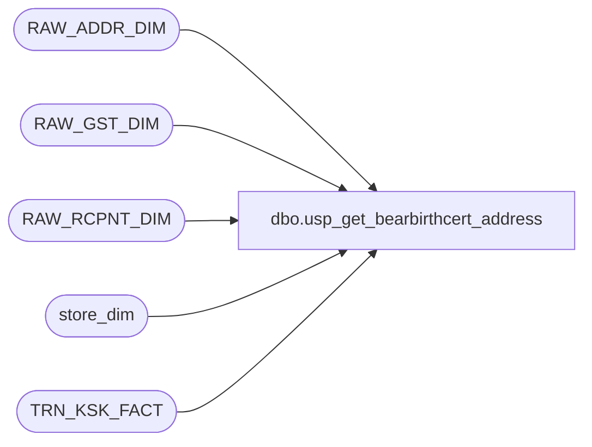

# dbo.usp_get_bearbirthcert_address

**Database:** dw  
**Server:** papamart  

## Architecture Diagram



## Table Dependencies

| Referenced Table |
|---|
| RAW_ADDR_DIM |
| RAW_GST_DIM |
| RAW_RCPNT_DIM |
| store_dim |
| TRN_KSK_FACT |

## Stored Procedure Code

```sql
CREATE PROC [dbo].[usp_get_bearbirthcert_address]
-- =============================================================================================================
-- Name: usp_get_bearbirthcert_address
--
-- Description:	retrieves bear birth certificate address information
--
-- Input:	@registrationid		int
--
-- Output: resultset containing address columns
--
-- Dependencies: 
--
-- Revision History
--		Name:			Date:			Comments:
--		Keith Missey	10/24/2007		Created
--		Keith Missey	7/29/2008		updated query to use
-- =============================================================================================================
    @registrationid INT
AS 
    --SELECT  StoreID,
    --        firstname AS [Recipient First Name],
    --        lastname AS [Recipient Last Name],
    --        address AS [Recipient Address],
    --        city AS [Recipient City],
    --        state AS [Recipient State],
    --        zipcode AS [Recipient Zip Code],
    --        email AS [Recipient Email],
    --        senderfirstname AS [Sender First Name],
    --        senderlastname AS [Sender Last Name],
    --        SenderAddress AS [Sender Address],
    --        SenderCity AS [Sender City],
    --        SenderState AS [Sender State],
    --        SenderZipCode AS [Sender Zip Code],
    --        SenderEmail AS [Sender Email],
    --        id
    --FROM    babw.dbo.tblimportkioskdata WITH ( NOLOCK ) 
    --WHERE   id = @registrationid
    --UNION
    --SELECT  pull_storeid AS StoreID,
    --        srfirstname AS [Recipient First Name],
    --        srlastname AS [Recipient Last Name],
    --        CASE WHEN sraddress2 <> '' THEN sraddress1 + ' ,' + sraddress2
    --             ELSE ssaddress1
    --        END AS [Recipient Address],
    --        srcity AS [Recipient City],
    --        srstate AS [Recipient State],
    --        srpostcode AS [Recipient Zip Code],
    --        sremail AS [Recipient Email],
    --        ssfirstname AS [Sender First Name],
    --        sslastname AS [Sender Last Name],
    --        CASE WHEN ssaddress2 <> '' THEN ssaddress1 + ' ,' + ssaddress2
    --             ELSE ssaddress1
    --        END AS [Sender Address],
    --        sscity AS [Sender City],
    --        ssstate AS [Sender State],
    --        sspostcode AS [Sender Zip Code],
    --        ssemail AS [Sender Email],
    --        id
    --FROM    babw.dbo.tblcustomerrecipient WITH ( NOLOCK ) 
    --WHERE   id = @registrationid
SELECT   s.store_id AS [StoreID],
			NULLIF (rr.FRST_NM, 'Rcpnt_Frst_Nm') AS [Recipient First Name],
			NULLIF (rr.LAST_NM, 'Rcpnt_Last_Nm') AS [Recipient Last Name],
			CASE WHEN rr.ADDR_LN_2_TXT <> '' THEN
				rr.ADDR_LN_1_TXT + ',' + rr.ADDR_LN_2_TXT
				ELSE rr.ADDR_LN_1_TXT
			END AS [Recipient Address], 
            rr.CTY_NM AS [Recipient City],
            rr.ST_PRVNC_TXT AS [Recipient State], 
            rr.PSTL_CD AS [Recipient Zip Code], 
            rr.EMAIL_ADDR_TXT AS [Recipient Email], 
            rg.FRST_NM AS [Sender First Name], 
            rg.LAST_NM AS [Sender Last Name], 
            CASE WHEN ra.ADDR_LN_2_TXT <> '' THEN
				ra.ADDR_LN_1_TXT + ',' + ra.ADDR_LN_2_TXT
				ELSE ra.ADDR_LN_1_TXT
			END AS [Sender Address], 
			ra.CTY_NM AS [Sender City],
			ra.ST_PRVNC_TXT AS [Sender State], 
			ra.PSTL_CD AS [Sender Zip Code], 
			rg.EMAIL_ADDR_TXT AS [Sender Email],
			tkf.TKF_ID AS ID
FROM        TRN_KSK_FACT tkf WITH (NOLOCK)
			LEFT JOIN RAW_GST_DIM rg WITH (NOLOCK) ON tkf.RAW_GST_ID = rg.RAW_GST_ID 
			LEFT JOIN RAW_RCPNT_DIM rr WITH (NOLOCK) ON tkf.RAW_RCPNT_ID = rr.RAW_RCPNT_ID 
			LEFT JOIN RAW_ADDR_DIM ra WITH (NOLOCK) ON rg.RAW_ADDR_ID = ra.RAW_ADDR_ID 
			LEFT JOIN store_dim s WITH (NOLOCK) ON tkf.STR_ID = s.store_key
WHERE		tkf.TKF_ID = @registrationid
```

