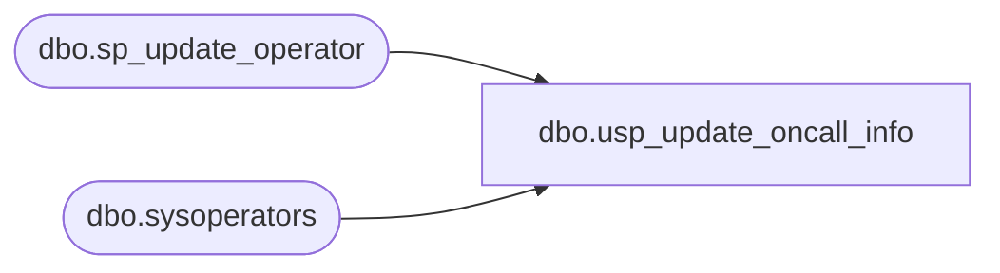

# dbo.usp_update_oncall_info

**Database:** dw  
**Server:** papamart  

## Architecture Diagram



## Table Dependencies

| Referenced Table |
|---|
| dbo.sp_update_operator |
| dbo.sysoperators |

## Stored Procedure Code

```sql
CREATE proc [dbo].[usp_update_oncall_info] 
	@text_no varchar(30) = '3146516348@txt.att.net' --Use Kevin's cell as default value
as
begin
--exec dw.dbo.usp_update_oncall_info @text_no = '3144796549@txt.att.net'
set nocount on;

declare @email1 varchar(200)
declare @email2 varchar(200)
declare @email3 varchar(200)
declare @emailKermode varchar(200)
--declare @text_no varchar(30)
--select @text_no = '3146516348@txt.att.net'

--grab current Papamart Databears and text emails
select @email1 = substring(email_address, charindex(';',email_address), len(email_address)) from msdb.dbo.sysoperators
where name = 'Databears and Text'

select @email1 = @text_no + @email1

--grab current BABWSCORE01 Databears and text emails
select @email2 = substring(email_address, charindex(';',email_address), len(email_address)) from babwscore01.msdb.dbo.sysoperators
where name = 'Databears and Text'

select @email2 = @text_no + @email2

--grab current BABWSCORE01 Databears and text emails
select @email3 = substring(email_address, charindex(';',email_address), len(email_address)) from babwscore01.msdb.dbo.sysoperators
where name = 'ExperianOperators'

select @email3 = @text_no + @email3


--grab current Kermode Databears and text emails
select @emailKermode = substring(email_address, charindex(';',email_address), len(email_address)) from kermode.msdb.dbo.sysoperators
where name = 'Databears and Text'

select @emailKermode = @text_no + @emailKermode

--select @email2 = @text_no + ';KevinSh@buildabear.com;SamaraR@buildabear.com'

--select @email1

	--ON PAPAMART
	EXEC msdb.dbo.sp_update_operator 
		@name = 'Databears and Text',
		@email_address = @email1;

	--on BABWSCORE01
	EXEC babwscore01.msdb.dbo.sp_update_operator 
		@name = 'Databears and Text',
		@email_address = @email2;

	EXEC babwscore01.msdb.dbo.sp_update_operator
		@name = 'ExperianOperators',
		@email_address = @email3;

	--on Kermode
	EXEC Kermode.msdb.dbo.sp_update_operator 
		@name = 'Databears and Text',
		@email_address = @emailKermode;
end
```

