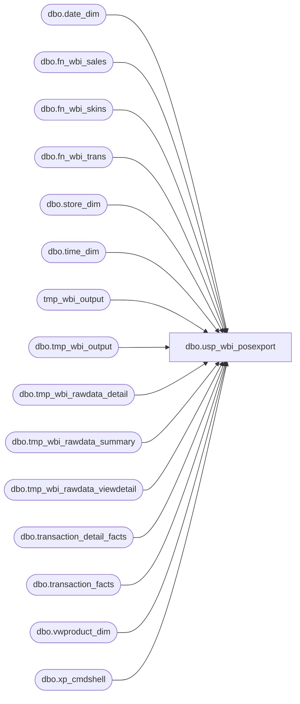

# dbo.usp_wbi_posexport

**Database:** dw  
**Server:** papamart  

## Architecture Diagram



## Table Dependencies

| Referenced Table |
|---|
| dbo.date_dim |
| dbo.fn_wbi_sales |
| dbo.fn_wbi_skins |
| dbo.fn_wbi_trans |
| dbo.store_dim |
| dbo.time_dim |
| tmp_wbi_output |
| dbo.tmp_wbi_output |
| dbo.tmp_wbi_rawdata_detail |
| dbo.tmp_wbi_rawdata_summary |
| dbo.tmp_wbi_rawdata_viewdetail |
| dbo.transaction_detail_facts |
| dbo.transaction_facts |
| dbo.vwproduct_dim |
| dbo.xp_cmdshell |

## Stored Procedure Code

```sql
CREATE PROC [dbo].[usp_wbi_posexport]
-- =============================================================================================================
-- Name: usp_wbi_posexport
--
-- Description:	nightly load process for Workbrain
--
-- Input:		@ac_filename		filename for output
--				@ad_date			date to start obtaining records
--
-- Output: returns records in textfile through bcp command
--
-- Dependencies: requires 4 fn_wbi_xx udfs
--
-- Revision History
--		Name:			Date:			Comments:
--		Keith Missey	9/7/2007		Created
--		Keith Missey	10/2/2007		removed party skins per meeting 10/2/2007
--		Keith Missey	10/12/2007		padded store id to 5 characters
--		Keith Missey	1/29/2008		added code to automate procedure
--		Keith Missey	2/29/2008		redid code to use vwdw_transactions to take advantage of existing biz rules
--		Keith Missey	5/19/2008		changed query to include all stores except corporate and ridemakerz
--		Keith Missey	6/18/2008		removed canadian stores
--		Keith Missey	5/22/2009		added process to send all half hour increments regardless of sales or not
--		Keith Missey	6/16/2009		removed dolls and dino buckets
--		Gary D			10/20/2009		Add execute as to allow users without sysadmin to run
--		Keith Missey	12/02/2011		removed primary key and added index
--		Keith Missey	04/12/2013		updated to pull from transaction_facts and fixed store list
--		Kevin Shyr		2/20/2015		Change store filter to remove all "not equal" country filter, put in US only instead
--		Brian Byas		08/25/2016		Changed GAAP_Sales_Amount to use Store_Sales_amount for Enterprise Selling
-- =============================================================================================================
@ac_filename varchar(100),
@ad_startdate DATETIME,
@ad_enddate DATETIME

WITH EXECUTE AS OWNER

AS

--DECLARE @ad_startdate varchar(20),
--		@ac_filename varchar(100),
--		@ad_enddate varchar(20)

--SET @ad_startdate = CONVERT(varchar,DATEADD(d, -1, getdate()),101)
--SET @ad_enddate = CONVERT(varchar,getdate(),101)
--SET @ac_filename = '\\laborbat01\pos\workbrain_pos_' + REPLACE(@ad_startdate, '/','-') 

--DROP TABLES IF EXIST IN DATABASE
IF  EXISTS (SELECT * FROM dbo.sysobjects WHERE id = OBJECT_ID(N'[dbo].[tmp_wbi_rawdata_viewdetail]')) 
DROP TABLE dbo.tmp_wbi_rawdata_viewdetail

IF  EXISTS (SELECT * FROM dbo.sysobjects WHERE id = OBJECT_ID(N'[dbo].[tmp_wbi_rawdata_detail]')) 
DROP TABLE dbo.tmp_wbi_rawdata_detail

IF  EXISTS (SELECT * FROM dbo.sysobjects WHERE id = OBJECT_ID(N'[dbo].[tmp_wbi_rawdata_summary]')) 
DROP TABLE dbo.tmp_wbi_rawdata_summary

IF  EXISTS (SELECT * FROM dbo.sysobjects WHERE id = OBJECT_ID(N'[dbo].[tmp_wbi_output]')) 
DROP TABLE dbo.tmp_wbi_output

CREATE TABLE dbo.tmp_wbi_output 
(
	SKDGRP_NAME varchar(40),
	INVTYP_ID smallint,
	RESDET_DATE char(10),
	RESDET_TIME char(8),
	RESDET_VOLUME money,
	INPUT_INVTYP_ID smallint,
	OLD_SKDGRP_NAME varchar(40),
	VOLTYPE_NAME varchar(200)
)

CREATE TABLE [dbo].[tmp_wbi_rawdata_viewdetail](
	[transaction_id] [decimal](12, 0) NOT NULL,-- PRIMARY KEY,
	[store_id] [varchar](8000) NULL,
	[actual_date] [datetime] NULL,
	[gaapsales] [decimal](38, 2) NULL,
	[merchandiseunits] [int] NULL,
	[animalunits] [int] NULL,
	[partyflag] [int] NOT NULL
) 

CREATE TABLE [dbo].[tmp_wbi_rawdata_detail](
	[transaction_id] [decimal](12, 0) NOT NULL,
	[division] [varchar](20) NULL,
	[hour] [int] NULL,
	[half_hour_id] [int] NULL
) 

CREATE TABLE [dbo].[tmp_wbi_rawdata_summary](
	[transaction_id] [decimal](12, 0) NOT NULL,
	[store_id] [varchar](8000) NULL,
	[actual_date] [datetime] NULL,
	[gaapsales] [decimal](38, 2) NULL,
	[merchandiseunits] [int] NULL,
	[animalunits] [int] NULL,
	[partyflag] [int] NOT NULL,
	[division] [varchar](20) NULL,
	[hour] [int] NULL,
	[half_hour_id] [int] NULL
) 

DECLARE @outputsql varchar(500),
		@bcpsql varchar(1000)		

--COLLECT RAW DATA FROM TRANSACTION DETAIL FACTS VIEW
INSERT dbo.tmp_wbi_rawdata_viewdetail
SELECT vtdf.transaction_id, REPLICATE('0', 5 - LEN(sd.store_id)) + CAST(sd.store_id AS char) AS store_id, 
	dd.actual_date, --td.hour, td.half_hour_id, pd.division,
	vtdf.Store_Sales_Amount, vtdf.merchandise_units, vtdf.animal_units, vtdf.party_flag
FROM dbo.transaction_facts vtdf with (NOLOCK)
        INNER JOIN dbo.store_dim sd with (NOLOCK) ON vtdf.store_key = sd.store_key
		INNER JOIN dbo.date_dim dd with (NOLOCK) ON vtdf.date_key = dd.date_key
WHERE --sd.store_id IN (14) AND 
	sd.bearritory NOT LIKE '%corporate%' 
	AND sd.region NOT LIKE '%corporate%'  
	AND sd.region NOT IN ('ridemakerz') 
	--AND country <> 'UK' AND country <> 'CA' AND country <> 'IE' -- removed 2/20/2015
	AND country = 'US'
	AND dd.actual_date >= @ad_startdate AND dd.actual_date < @ad_enddate --AND hour = 10 and half_hour_id = 2 

INSERT dbo.tmp_wbi_rawdata_detail
SELECT vtdf.transaction_id, MAX(pd.division), td.[hour], td.half_hour_id
		FROM dbo.tmp_wbi_rawdata_viewdetail vtdf
		INNER JOIN dbo.transaction_detail_facts tdf with (NOLOCK) ON vtdf.transaction_id = tdf.transaction_id
		INNER JOIN dbo.time_dim td with (NOLOCK) ON tdf.time_key = td.time_key
		INNER JOIN dbo.vwproduct_dim pd with (NOLOCK) ON tdf.product_key = pd.product_key
GROUP BY vtdf.[transaction_id], td.[hour], td.[half_hour_id]

CREATE INDEX ix_rawdata_transid
ON dw.dbo.tmp_wbi_rawdata_viewdetail (transaction_id)


INSERT dbo.tmp_wbi_rawdata_summary
SELECT DISTINCT vd.transaction_id, store_id, actual_date, gaapsales, merchandiseunits, animalunits, partyflag, division, 
		hour, half_hour_id 
FROM dw.dbo.tmp_wbi_rawdata_viewdetail vd
	INNER JOIN dw.dbo.tmp_wbi_rawdata_detail d ON vd.transaction_id = d.transaction_id

--Transactions excluding gift card sales and transactions flagged as party
INSERT tmp_wbi_output
SELECT * FROM dbo.fn_wbi_trans()
--UNION
--SELECT * FROM dbo.fn_wbi_trans('DOLLS')
--UNION
--SELECT * FROM dbo.fn_wbi_trans('DINO')
--UNION
--SELECT * FROM dbo.fn_wbi_trans('RIDEMAKERZ')

/*
--Units excluding gift card sales and transactions flagged as party
INSERT tmp_wbi_output
SELECT * FROM dbo.fn_wbi_units('US')
UNION
SELECT * FROM dbo.fn_wbi_units('DOLLS')
UNION
SELECT * FROM dbo.fn_wbi_units('DINO')
UNION
SELECT * FROM dbo.fn_wbi_units('RIDEMAKERZ')
*/
--Skins excluding gift card sales and transactions flagged as party
INSERT dbo.tmp_wbi_output
SELECT * FROM dbo.fn_wbi_skins(0)
--UNION
--SELECT * FROM dbo.fn_wbi_skins('DOLLS',0)
--UNION
--SELECT * FROM dbo.fn_wbi_skins('DINO',0)
--UNION
--SELECT * FROM dbo.fn_wbi_skins('RIDEMAKERZ',0)

--Sales excluding gift card sales and transactions flagged as party
INSERT dbo.tmp_wbi_output
SELECT * FROM dbo.fn_wbi_sales(0)
--UNION
--SELECT * FROM dbo.fn_wbi_sales('DOLLS', 0)
--UNION
--SELECT * FROM dbo.fn_wbi_sales('DINO', 0)
--UNION
--SELECT * FROM dbo.fn_wbi_sales('RIDEMAKERZ', 0)

--PARTY SALES
INSERT dbo.tmp_wbi_output
SELECT * FROM dbo.fn_wbi_sales(1)
--UNION
--SELECT * FROM dbo.fn_wbi_sales('DOLLS', 1)
--UNION
--SELECT * FROM dbo.fn_wbi_sales('DINO', 1)
--UNION
--SELECT * FROM dbo.fn_wbi_sales('RIDEMAKERZ', 1)

--HAVE TO ENSURE ALL HALF HOUR INCREMENTS FOR ALL STORES ARE POPULATED FOR PURPOSES OF AUDIT PROCESS
CREATE TABLE #tmphalfhour
(
	tmpid INT IDENTITY(1,1),
	skdgrp_name VARCHAR(40),
	actualdate varchar(10),
	halfhour VARCHAR(10)
)

INSERT [#tmphalfhour] 
SELECT DISTINCT skdgrp_name, CONVERT(varchar, actual_date,101), CONVERT(varchar(2),hour) + ':' +
				CASE
					WHEN half_hour_id = 1 THEN '00:00'
					WHEN half_hour_id = 2 THEN '30:00'
				END
FROM dw.dbo.time_dim
	CROSS JOIN dw.dbo.[tmp_wbi_output]
	CROSS JOIN dw.dbo.date_dim
WHERE [skdgrp_name] LIKE '%sales' AND [skdgrp_name] NOT LIKE '%party%' AND hour IS NOT NULL 
	AND actual_date >= @ad_startdate AND actual_date < @ad_enddate

INSERT dw.dbo.tmp_wbi_output
SELECT DISTINCT t.skdgrp_name, 3, actualdate, halfhour, 0, NULL, NULL, NULL  FROM #tmphalfhour t
WHERE [skdgrp_name] + ' ' + actualdate + ' ' + halfhour NOT IN
	(SELECT DISTINCT [SKDGRP_NAME] + ' ' + RESDET_DATE + ' ' + [RESDET_TIME] FROM dw.dbo.[tmp_wbi_output] 
		WHERE [skdgrp_name] LIKE '%sales' AND [skdgrp_name] NOT LIKE '%party%')

--SELECT * FROM #tmphalfhour ORDER BY skdgrp_name, actualdate, halfhour

--SELECT SKDGRP_NAME, INVTYP_ID, RESDET_DATE, RESDET_TIME,
--	RESDET_VOLUME, INPUT_INVTYP_ID, OLD_SKDGRP_NAME, VOLTYPE_NAME 
--FROM tmp_wbi_output
--ORDER BY SKDGRP_NAME, RESDET_DATE, RESDET_TIME
--SELECT * FROM tmp_wbi_output ORDER BY SKDGRP_NAME, RESDET_DATE, RESDET_TIME

--FORMAT REQUESTED BY WORKBRAIN DEVELOPMENT TEAM
SET @outputsql = 'SELECT char(34) + SKDGRP_NAME + char(34), char(34) + LTRIM(RTRIM(CAST(INVTYP_ID AS char))) + char(34), char(34) + RESDET_DATE + char(34), char(34) + RESDET_TIME + char(34), ' +
	'char(34) + LTRIM(RTRIM(CAST(RESDET_VOLUME AS char))) + char(34), char(34) + LTRIM(RTRIM(CAST(INPUT_INVTYP_ID AS char))) + char(34), char(34) + OLD_SKDGRP_NAME + char(34), char(34) + VOLTYPE_NAME + char(34)' +
	'FROM dw.dbo.tmp_wbi_output ORDER BY RESDET_DATE, RESDET_TIME, SKDGRP_NAME'

SET @bcpsql = 'bcp "' + @outputsql + '" queryout "' + @ac_filename + '" -t "," -T -c'

EXEC master.dbo.xp_cmdshell @bcpsql
```

