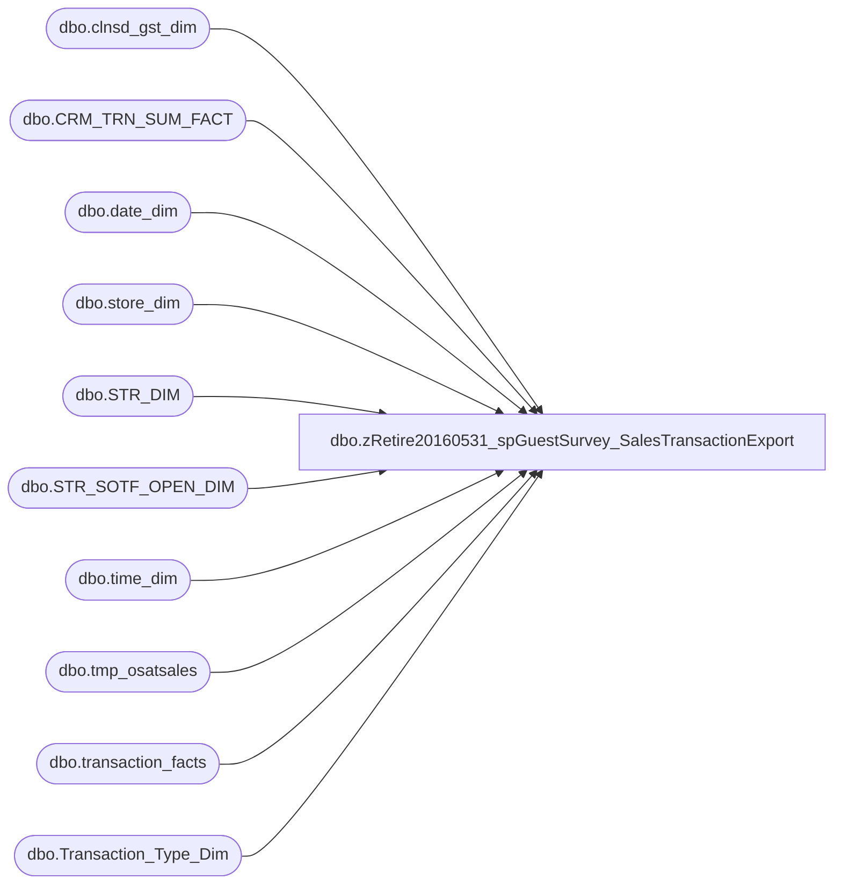

# dbo.zRetire20160531_spGuestSurvey_SalesTransactionExport

**Database:** dw  
**Server:** papamart  

## Architecture Diagram



## Table Dependencies

| Referenced Table |
|---|
| dbo.clnsd_gst_dim |
| dbo.CRM_TRN_SUM_FACT |
| dbo.date_dim |
| dbo.store_dim |
| dbo.STR_DIM |
| dbo.STR_SOTF_OPEN_DIM |
| dbo.time_dim |
| dbo.tmp_osatsales |
| dbo.transaction_facts |
| dbo.Transaction_Type_Dim |

## Stored Procedure Code

```sql
CREATE PROC [dbo].[spGuestSurvey_SalesTransactionExport]
-- =============================================================================================================
-- Name: spGuestSurvey_SalesTransactionExport
--
-- Description:	daily upload process for sales data for guest survey provider
--
-- Input:		@ac_path			filepath for output
--				@ad_startdate		start date
--				@ad_enddate			end date
--
-- Output: returns records in textfile and uploads to FTP site through bcp command
--
-- Dependencies: 
--
-- Revision History
--		Name:			Date:			Comments:
--		Keith Missey	6/7/2013		Created
--		Mike Pelikan	04/29/2014		Changed BABWMSTRDATA linked server reference
--		Mike Pelikan	10/23/2014		Changed name of procedure, added EXECUTE AS

-- =============================================================================================================
    @ac_path VARCHAR(100),
    @ad_startdate DATETIME,
	@ad_enddate DATETIME
--WITH EXECUTE AS 'bab\SQLServices'
AS 
SET NOCOUNT ON

--DROP TABLES IF EXIST IN DATABASE
    IF EXISTS ( SELECT  *
                FROM    dbo.sysobjects
                WHERE   id = OBJECT_ID(N'[dbo].[tmp_osatsales]') ) 
        DROP TABLE dw.dbo.tmp_osatsales

CREATE TABLE dw.dbo.[tmp_osatsales](
	receiptid varchar(30) NULL,
	[transaction_id] [int] NOT NULL,
	[store_id] char(4) NOT NULL,
	[actual_date] [datetime] NOT NULL,
	[hour] [int] NOT NULL,
	[minute] [int] NOT NULL,
	[transaction_no] [int] NOT NULL,
	[register_no] [int] NOT NULL,
	SOTF char(2) NULL,
	[gaap_sales_amount] [decimal](9, 2) NOT NULL,
	[animal_units] [varchar](10) NOT NULL,
	[footwear_units] [varchar](10) NOT NULL,
	[accessories_units] [varchar](10) NOT NULL,
	[sounds_units] [varchar](10) NOT NULL,
	[clothing_units] [varchar](10) NOT NULL,
	[transaction_type] [varchar](20) NULL,
	[NewVsRepeat] [varchar](10) NOT NULL,
	[SFSFlag] [varchar](10) NOT NULL,
	[giftcards_sold] [decimal](9, 2) NOT NULL,
	[couponsredeemed] [decimal](9, 2) NOT NULL,
	[sfscertredeemed] [decimal](9, 2) NOT NULL,
	[merchandise_units] [varchar](10) NOT NULL,
	hpgsegment varchar(25) NOT NULL
) 

INSERT dw.dbo.tmp_osatsales
SELECT 	NULL AS receiptid, transaction_id, 
	replicate('0', 4 - len(store_id)) + CAST(store_id AS VARCHAR) AS store_id,
	actual_date, hour, minute, 
	transaction_no,
	register_no,
	NULL AS sotf, 
	gaap_sales_amount, 		
	CASE 		
		WHEN animal_units >= 6 THEN '6+'	
			ELSE CAST(ISNULL(animal_units,0) AS VARCHAR) END AS animal_units,
	CASE 		
		WHEN footwear_units >= 6 THEN '6+'	
			ELSE CAST(ISNULL(footwear_units,0) AS VARCHAR) END AS footwear_units,
	CASE 		
		WHEN accessories_units >= 6 THEN '6+'	
			ELSE CAST(ISNULL(accessories_units,0) AS VARCHAR) END AS accessories_units,
	CASE 		
		WHEN sounds_units >= 6 THEN '6+'	
			ELSE CAST(ISNULL(sounds_units,0) AS VARCHAR) END AS sounds_units,
	CASE 		
		WHEN clothing_units >= 6 THEN '6+'	
			ELSE CAST(ISNULL(clothing_units,0) AS VARCHAR) END AS clothing_units,
	transaction_type, 		
	CASE WHEN actual_date = CRM_MBRSHP_DT THEN 'NEW' 		
		WHEN CRM_MBRSHP_DT IS NOT NULL THEN 'REPEAT'	
		ELSE 'N/A' END AS NewVsRepeat,	
	CASE WHEN g.LYLTY_GST_NBR IS NULL THEN 'NONSFS' ELSE 'SFS' END AS SFSFlag,		
	ISNULL(giftcard_units,0) AS giftcards_sold,		
	ISNULL(coupon_discount_units,0) AS couponsredeemed,		
	ISNULL(reward_certificate_amount/10,0) AS sfscertredeemed,		
	CASE WHEN merchandise_units >= 10 THEN '10+'		
		ELSE CAST(ISNULL(merchandise_units,0) AS VARCHAR) END AS merchandise_units,
	CASE
		WHEN gaap_sales_amount < 10 THEN 'UNDER 10'
		WHEN gaap_sales_amount >= 10 AND gaap_sales_amount < 20 THEN '10.00 - 19.99'
		WHEN gaap_sales_amount >= 20 AND gaap_sales_amount < 30 THEN '20.00 - 29.99'
		WHEN gaap_sales_amount >= 30 AND gaap_sales_amount < 40 THEN '30.00 - 39.99'
		WHEN gaap_sales_amount >= 40 AND gaap_sales_amount < 50 THEN '40.00 - 49.99'
		WHEN gaap_sales_amount >= 50 THEN '50+'
		END AS hpgsegment		
FROM dw.dbo.transaction_facts tf WITH (NOLOCK)			
	INNER JOIN dw.dbo.store_dim s ON tf.store_key = s.store_key		
	INNER JOIN dw.dbo.date_dim d ON tf.date_key = d.date_key		
	INNER JOIN dw.dbo.Transaction_Type_Dim td ON tf.transaction_type_key = td.transaction_key		
	INNER JOIN dw.dbo.time_dim t ON tf.time_key = t.time_key		
	LEFT JOIN dw.dbo.CRM_TRN_SUM_FACT c WITH (NOLOCK) ON c.tdf_trn_id = tf.transaction_id		
	LEFT JOIN dw.dbo.clnsd_gst_dim g WITH (NOLOCK) ON c.clnsd_gst_id = g.clnsd_gst_id	
WHERE actual_date >= @ad_startdate AND actual_date < @ad_enddate AND store_id NOT IN (13,2013)
print '1'
--SET SOTF FLAG
UPDATE dw.dbo.tmp_osatsales SET sotf = '02'
WHERE store_id IN (SELECT str_num FROM KODIAK.BABWMstrData.dbo.STR_DIM sd INNER JOIN KODIAK.BABWMstrData.dbo.STR_SOTF_OPEN_DIM sotf ON sd.STR_ID = sotf.STR_KEY)
print '2'
UPDATE dw.dbo.tmp_osatsales SET sotf = '01'
WHERE sotf IS NULL


--SET RECEIPT CODE
UPDATE dw.dbo.tmp_osatsales
SET receiptid = 
		replicate('0', 2 - len(datepart (m, actual_date))) + cast(datepart (m, actual_date) AS VARCHAR)  
		+ replicate('0', 2 - len(datepart (D, actual_date))) + cast(datepart (D, actual_date) AS VARCHAR) 
		+ cast(datepart (YYYY, actual_date) AS VARCHAR)
		+ store_id --store id
		+ replicate('0', 6 - len(transaction_no)) + CAST(transaction_no AS VARCHAR) --transaction_no
		--+ replicate('0', 2 - len(datepart (s, GETDATE()))) + cast(datepart (s, GETDATE()) AS VARCHAR) --seconds from current time
		+ sotf --SOTF Flag
		+ replicate('0', 2 - len(datepart (D, actual_date))) + cast(datepart (D, actual_date) AS VARCHAR) --day from transaction date
		+ replicate('0', 2 - len(register_no)) + cast(register_no AS VARCHAR) --register_no
		+ replicate('0', 2 - len(datepart (m, actual_date))) + cast(datepart (m, actual_date) AS VARCHAR) --month from transaction date


    DECLARE @cmd varchar(1000),
        @filename varchar(100),
		@filename_header varchar(100),
        @filedate varchar(20),
        @selectstmnt varchar(5000),
        @bcpsql varchar(500),
		@columnheaders varchar(4000), 
		@tablename varchar(128)

--CREATE TABLE CONTAINING COLUMN HEADERS FOR FILE EXPORT
SET @columnheaders = ''
SET @tablename='tmp_osatsales'

SELECT @columnheaders = @columnheaders + c.name + ','
 FROM syscolumns c INNER JOIN sysobjects o ON o.id = c.id
 WHERE o.name = @tablename
 ORDER BY colid

SELECT @columnheaders = Substring(@columnheaders, 1, Datalength(@columnheaders) - 1)

if (Object_ID('dw.dbo.tmp_osatsales_header') IS NOT NULL) 
DROP TABLE dw.dbo.tmp_osatsales_header

SELECT @columnheaders AS columnheader
INTO dw.dbo.tmp_osatsales_header
    
	SELECT @filename = 'buildabear_transdata_' 
		+ replicate('0', 2 - len(datepart (m, getdate()))) + cast(datepart (m, getdate()) AS VARCHAR)
		+ replicate('0', 2 - len(datepart (d, getdate()))) + cast(datepart (d, getdate()) AS VARCHAR)
		+ cast(datepart(yyyy,getdate()) AS varchar) + '.csv'
	SET @filename_header = 'tmp_ostsales_header.csv'

--CREATE FILE CONTAINING EMAILS USING BCP COMMAND
    SET @selectstmnt = 'SELECT * FROM dw.dbo.tmp_osatsales'
    SET @bcpsql = 'bcp "' + @selectstmnt + '" queryout "' + @ac_path + @filename
        + '.data" -t "," -T -c'
    EXEC master..xp_cmdshell @bcpsql--, no_output

    SET @selectstmnt = 'SELECT * FROM dw.dbo.tmp_osatsales_header'
    SET @bcpsql = 'bcp "' + @selectstmnt + '" queryout "' + @ac_path + @filename_header
        + '" -t "," -T -c'
    EXEC master..xp_cmdshell @bcpsql--, no_output

    SET @cmd = 'copy ' + @ac_path + @filename_header + '+' + @ac_path + @filename
            + '.data ' + @ac_path + @filename 
    EXEC master..xp_cmdshell @cmd, no_output

--COMPRESS FILE
    SELECT  @cmd = '"C:\Program Files\7-zip\7z.exe" a -tzip '
            + @ac_path + REPLACE(@filename, '.csv', '') + '.zip ' + @ac_path
            + @filename 
    EXEC master..xp_cmdshell @cmd--, no_output

--DELETE TEXT FILE
    SELECT  @cmd = 'del ' + @ac_path + '*.csv /Q /F'
    EXEC master..xp_cmdshell @cmd, no_output

	SELECT  @cmd = 'del ' + @ac_path + '*.data /Q /F'
    EXEC master..xp_cmdshell @cmd, no_output

endHere:
```

