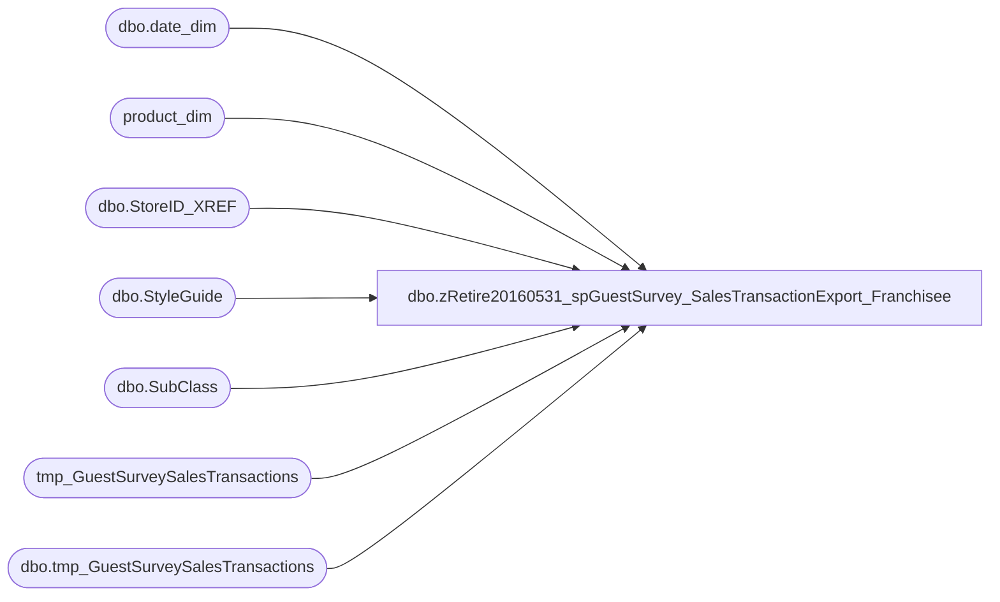

# dbo.zRetire20160531_spGuestSurvey_SalesTransactionExport_Franchisee

**Database:** dw  
**Server:** papamart  

## Architecture Diagram



## Table Dependencies

| Referenced Table |
|---|
| dbo.date_dim |
| product_dim |
| dbo.StoreID_XREF |
| dbo.StyleGuide |
| dbo.SubClass |
| tmp_GuestSurveySalesTransactions |
| dbo.tmp_GuestSurveySalesTransactions |

## Stored Procedure Code

```sql
CREATE PROC [dbo].[spGuestSurvey_SalesTransactionExport_Franchisee]
AS
-- =============================================================================================================
-- Name: spGuestSurvey_SalesTransactionExport_Franchisee
--
-- Description:	daily upload process for sales data for guest survey provider for franchisees
--
-- Output: returns records in textfile for uploads to FTP site through bcp command
--
-- Dependencies: 
--
-- Revision History
--		Name:			Date:			Comments:
--		Mike Pelikan	20150206		Created for Turkey only
--		Mike Pelikan	20150325		tested and changed directory path
-- =============================================================================================================

SET NOCOUNT ON
DECLARE @FileName VARCHAR(100), @Path VARCHAR(100), @wrkPath VARCHAR(100),
 @PathFileName VARCHAR(200), @FormatFilePath VARCHAR(100), @FormatPathFileName VARCHAR(200), 
@cmdStmt VARCHAR(500), @Filter VARCHAR(10)
DECLARE @files TABLE (fileID  INT IDENTITY(1,1), results varchar(1000))
DECLARE @TransactionMapping TABLE (DirectoryName varchar(10) NOT NULL, MappingFileName varchar(20) NOT NULL)


DECLARE @ac_path VARCHAR(500)
SET @ac_path = '\\kermode\FileRepository\FranchiseeFiles\Transactions\'

DECLARE @wrkingDate VARCHAR(10)

DECLARE @cmd varchar(1000),
	@filename_header varchar(100),
    @filedate varchar(20),
    @selectstmnt varchar(5000),
    @bcpsql varchar(500),
	@columnheaders varchar(4000), 
	@tablename varchar(128)

DECLARE @RecKey CHAR(20), @rectype CHAR(1), @recdata CHAR(79), @SRCount INT

DECLARE @DirectoryName VARCHAR(10), @MappingFileName VARCHAR(20)
SET @Path = '\\kermode\FileRepository\FranchiseeFiles\Transactions\'
SET @FormatFilePath = '\\kermode\d$\ETL Executables\FranchiseeFiles\GuestSurveys\Transactions\'

--DROP TABLE ##stg_Files
IF OBJECT_ID('tempdb..##stg_Files') IS NULL
CREATE TABLE ##stg_Files(	
[RecType] char(1) NOT NULL,
[RecData] nvarchar(79) NOT NULL,
RecKey CHAR(20),
SRKey INT) 

TRUNCATE TABLE ##stg_files

IF OBJECT_ID(N'[dbo].[tmp_GuestSurveySalesTransactions]') IS NULL  
CREATE TABLE dw.dbo.[tmp_GuestSurveySalesTransactions](
	receiptid varchar(30) NULL,
	[transaction_id] [int] NOT NULL,
	[store_id] char(4) NOT NULL,
	[actual_date] [datetime] NOT NULL,
	[hour] [int] NOT NULL,
	[minute] [int] NOT NULL,
	[transaction_no] [int] NOT NULL,
	[register_no] [int] NOT NULL,
	SOTF char(2) NULL,
	[gaap_sales_amount] [decimal](9, 2) NOT NULL,
	[animal_units] [varchar](10) NOT NULL,
	[footwear_units] [varchar](10) NOT NULL,
	[accessories_units] [varchar](10) NOT NULL,
	[sounds_units] [varchar](10) NOT NULL,
	[clothing_units] [varchar](10) NOT NULL,
	[transaction_type] [varchar](20) NULL,
	[NewVsRepeat] [varchar](10) NOT NULL,
	[SFSFlag] [varchar](10) NOT NULL,
	[giftcards_sold] [decimal](9, 2) NOT NULL,
	[couponsredeemed] [decimal](9, 2) NOT NULL,
	[sfscertredeemed] [decimal](9, 2) NOT NULL,
	[merchandise_units] [varchar](10) NOT NULL,
	hpgsegment varchar(25) NOT NULL,
	isProcessed BIT,
	DataFileName VARCHAR(100)
) 

IF OBJECT_ID(N'tempdb..##tmp_GuestSurveySalesTransactions') IS NULL  
CREATE TABLE ##tmp_GuestSurveySalesTransactions(
	receiptid varchar(30) NULL,
	[transaction_id] [int] NOT NULL,
	[store_id] char(4) NOT NULL,
	[actual_date] [datetime] NOT NULL,
	[hour] [int] NOT NULL,
	[minute] [int] NOT NULL,
	[transaction_no] [int] NOT NULL,
	[register_no] [int] NOT NULL,
	SOTF char(2) NULL,
	[gaap_sales_amount] [decimal](9, 2) NOT NULL,
	[animal_units] [varchar](10) NOT NULL,
	[footwear_units] [varchar](10) NOT NULL,
	[accessories_units] [varchar](10) NOT NULL,
	[sounds_units] [varchar](10) NOT NULL,
	[clothing_units] [varchar](10) NOT NULL,
	[transaction_type] [varchar](20) NULL,
	[NewVsRepeat] [varchar](10) NOT NULL,
	[SFSFlag] [varchar](10) NOT NULL,
	[giftcards_sold] [decimal](9, 2) NOT NULL,
	[couponsredeemed] [decimal](9, 2) NOT NULL,
	[sfscertredeemed] [decimal](9, 2) NOT NULL,
	[merchandise_units] [varchar](10) NOT NULL,
	hpgsegment varchar(25) NOT NULL
) 

TRUNCATE TABLE ##tmp_GuestSurveySalesTransactions


IF OBJECT_ID(N'tempdb..#StyleGuide') IS NOT NULL DROP TABLE #StyleGuide
SELECT * INTO #StyleGuide FROM KODIAK.[FranchMstrData].[dbo].[StyleGuide]

IF OBJECT_ID(N'tempdb..#StoreXref') IS NOT NULL DROP TABLE #StoreXref
SELECT * INTO #StoreXref FROM KODIAK.[FranchMstrData].[dbo].[StoreID_XREF]

IF OBJECT_ID(N'tempdb..#SubClass') IS NOT NULL DROP TABLE #SubClass
SELECT * INTO #SubClass FROM KODIAK.[FranchMstrData].[dbo].[SubClass]

DECLARE @Count INT, @recCount INT, @retInfo VARCHAR(50)


DECLARE @TRHeader1 TABLE (RecType CHAR(1), StoreNo CHAR(5), TermNo CHAR(3), TransNo CHAR(6), OperNo CHAR(8), 
TransType INT, RepNo CHAR(1), TranDate CHAR(6), TranTime CHAR(6), NumLines INT, Total Numeric(13,2), Flags CHAR(8), 
TransCancellation BIT, TwoDecimalCurrency BIT, OtherFlags CHAR(6), 
SupervisorNo INT, TranYear INT, NumTrx INT, RecKey CHAR(20))

DECLARE @PSale1 TABLE (RecType CHAR(1), ItemCode CHAR(20), VATCode CHAR(2), VATRate CHAR(4), MainGrp CHAR(4), 
Sector CHAR(4), Reyon CHAR(4), XPrice CHAR(13), Reason CHAR(3), Flags CHAR(8), 
ProductCancellation BIT, CancelledProduct BIT, WeightedProduct BIT, Refund BIT, ExcludeFromDisc BIT, ScannedProd BIT, PriceChange BIT, DCS BIT,
SupervisorNo CHAR(8), LenBar CHAR(2), RecKey CHAR(20), SRKey INT)

DECLARE @PSale2 TABLE (RecType CHAR(1), SalePrice Numeric(13,2), Unit CHAR(1), Quantity INT, Seller CHAR(8), 
Dentry CHAR(20), Stock CHAR(20), RecKey CHAR(20), SRKey INT)

DECLARE @Discount TABLE (RecType CHAR(1), DiscPerc Numeric(4,3), DiscAmt Numeric(13,2), Before CHAR(13), Code CHAR(2), 
DiscType CHAR(24), DiscountCancel BIT, CancelledDiscount BIT, TotalDisc BIT, OtherFlags CHAR(5), SupervisorNo CHAR(8), PromoCode CHAR(6), RecKey CHAR(20), SRKey INT)


	--CREATE TABLE CONTAINING COLUMN HEADERS FOR FILE EXPORT
	SET @columnheaders = ''
	SET @tablename='tmp_GuestSurveySalesTransactions'

	SELECT @columnheaders = @columnheaders + c.name + ','
	 FROM syscolumns c INNER JOIN sysobjects o ON o.id = c.id
	 WHERE o.name = @tablename and c.name <> 'isProcessed'
	 ORDER BY colid

	SELECT @columnheaders = Substring(@columnheaders, 1, Datalength(@columnheaders) - 1)

	if (Object_ID('dw.dbo.tmp_osatsales_header') IS NOT NULL) 
	DROP TABLE dw.dbo.tmp_osatsales_header

	SELECT @columnheaders AS columnheader
	INTO dw.dbo.tmp_osatsales_header

-------------------------------------------------------------------------------------------
--\ File Load																	/--
-------------------------------------------------------------------------------------------
SET @DirectoryName = 'TR'
SET @MappingFileName = 'TMapping.fmt'
SET @wrkPath = @Path + @DirectoryName + '\'

SET @FormatPathFileName = @FormatFilePath + @DirectoryName + '\' + @MappingFileName
	
SET @cmdStmt = 'dir "' + @wrkPath + '*" /b /A:-D '

INSERT INTO @files EXEC xp_cmdshell @cmdStmt 

DELETE FROM @files WHERE results IS NULL
DELETE FROM @files WHERE results = 'File Not Found'
	

TRUNCATE TABLE tmp_GuestSurveySalesTransactions
	
WHILE (SELECT COUNT(*) FROM @files) > 0
BEGIN
	TRUNCATE TABLE ##stg_Files
	SELECT TOP 1 @FileName = results FROM @files ORDER BY FileID
	SELECT @PathFileName = @wrkPath + @Filename
	
	PRINT 	@PathFileName 
	PRINT @FormatPathFileName
	EXEC ('BULK INSERT ##stg_Files 
	FROM ''' + @PathFileName + '''
	WITH
	(
	
	FIELDTERMINATOR = ''\t'',
	ROWTERMINATOR = ''\n'',
	FORMATFILE = ''' + @FormatPathFileName + '''
	)
	')

	-----------------------------------------------
	--Add key to each record
	-----------------------------------------------
	SELECT @recCount = COUNT(*) FROM ##stg_Files
	SET @Count = 0
	DECLARE key_cursor CURSOR
	FOR SELECT RecType, RecData FROM ##stg_Files

	OPEN key_cursor
	FETCH NEXT FROM key_cursor 
	INTO @rectype, @recdata;

	WHILE @@FETCH_STATUS = 0
	BEGIN
		IF @rectype = 'H'
		BEGIN
			SET @recKey = SUBSTRING(@recdata, 1,14) + SUBSTRING(@recdata, 26,6) 
			SET @SRCount = 0
		END
		IF @rectype = 'S'
		BEGIN
			SET @SRCount = @SRCount + 1
		END

		UPDATE ##stg_Files
		SET RecKey = @recKey, SRKey = @SRCount
		WHERE CURRENT OF key_cursor
		SET @Count = @Count + 1

		SET @retInfo = CAST( @Count AS VARCHAR(5)) + ' of ' + CAST( @recCount AS VARCHAR(5))
		IF @count%5  = 0
			RAISERROR (@retInfo, 10, 1) WITH NOWAIT
		FETCH NEXT FROM key_cursor 
		INTO @rectype, @recdata;
	END

	CLOSE key_cursor;
	DEALLOCATE key_cursor;
		
	-----------------------------------------------			
	SET @cmdStmt = 'MOVE "' + @PathFileName + '" "' +  @Path + @DirectoryName + '\Archive\"' 
	PRINT @cmdStmt
	EXEC xp_cmdshell @cmdStmt
	DELETE FROM @files WHERE results = @FileName
	
	INSERT INTO @TRHeader1
	SELECT RecType, SUBSTRING(RecData, 1,5) StoreNo, SUBSTRING(RecData, 6,3) TermNo, SUBSTRING(RecData, 9,6) TransNo, 
	SUBSTRING(RecData, 15,8) OperNo, SUBSTRING(RecData, 23,2) TransType, SUBSTRING(RecData, 25,1) RepNo, SUBSTRING(RecData, 26,6) TranDate, 
	SUBSTRING(RecData, 32,6) TranTime, SUBSTRING(RecData, 38, 4) NumLines, CAST(SUBSTRING(RecData, 42, 13) AS Numeric(13,2))/100 Total, SUBSTRING(RecData, 55, 8) Flags,
	SUBSTRING(RecData, 55, 1) TransCancellation, SUBSTRING(RecData, 56, 1) TwoDecimalCurrency, SUBSTRING(RecData, 57, 6) OtherFlags, 
	SUBSTRING(RecData, 63, 8) SupervisorNo, SUBSTRING(RecData, 71, 4) TranYear, SUBSTRING(RecData, 75,2) NumTrx, RecKey
	FROM ##stg_Files
	WHERE RecType = 'H'
	ORDER BY TranDate

	INSERT INTO @PSale2
	SELECT RecType,  CAST(SUBSTRING(RecData, 1, 13) AS Numeric(13,2))/100 SalePrice, SUBSTRING(RecData, 14, 1) Unit, SUBSTRING(RecData, 15, 6) Quantity, 
	SUBSTRING(RecData, 21, 8) Seller, SUBSTRING(RecData, 29, 20) Dentry, SUBSTRING(RecData, 49, 20) Stock, RecKey, SRKey 
	FROM ##stg_Files
	WHERE RecType = 'E'

	INSERT INTO @PSale1
	SELECT RecType, SUBSTRING(RecData, 1,20) ItemCode, SUBSTRING(RecData, 21,2) VATCode, SUBSTRING(RecData, 23,4) VATRate, 
	SUBSTRING(RecData, 27, 4) MainGrp, SUBSTRING(RecData, 31, 4) Sector, SUBSTRING(RecData, 35, 4) Reyon, SUBSTRING(RecData, 39, 13) XPrice, 
	SUBSTRING(RecData, 52, 3) Reason, SUBSTRING(RecData, 55, 8) Flags, 
	SUBSTRING(RecData, 55, 1) ProductCancellation, SUBSTRING(RecData, 56, 1) CancelledProduct, SUBSTRING(RecData, 57, 1) WeightedProduct, 
	SUBSTRING(RecData, 58, 1) Refund, SUBSTRING(RecData, 59, 1) ExcludeFromDisc, SUBSTRING(RecData, 60, 1) ScannedProd, SUBSTRING(RecData, 61, 1) PriceChange, SUBSTRING(RecData, 62, 1) DCS,
	SUBSTRING(RecData, 63, 8) SupervisorNo, SUBSTRING(RecData, 76, 2) LenBar, RecKey, SRKey
	FROM ##stg_Files
	WHERE RecType = 'S'

	INSERT INTO @Discount
	SELECT RecType, CAST(SUBSTRING(RecData, 1, 4) AS Numeric(8,3))/1000 DiscPerc, CAST(SUBSTRING(RecData, 5, 13) AS Numeric(13,2))/100 DiscAmt, SUBSTRING(RecData, 18, 13) Before, 
	SUBSTRING(RecData, 31, 2) Code, SUBSTRING(RecData, 33, 2) DiscType, SUBSTRING(RecData, 35, 1) DiscountCancel, SUBSTRING(RecData, 36, 1) CancelledDiscount, 
	SUBSTRING(RecData, 37, 1) TotalDisc, SUBSTRING(RecData, 38, 5) OtherFlags, SUBSTRING(RecData, 43, 8) SupervisorNo, 
	SUBSTRING(RecData, 51, 6) PromoCode, RecKey, SRKey
	FROM ##stg_Files
	WHERE RecType = 'D'

	
	INSERT INTO 
	--select * from 
	[tmp_GuestSurveySalesTransactions]
	SELECT receiptid, transaction_id, store_id, actual_date, hour, minute, transaction_no, register_no, 'NO' SOTF, gaap_sales_amount, 
	CASE WHEN animal_units >= 6 THEN '6+' ELSE CAST(ISNULL(animal_units,0) AS VARCHAR) END AS animal_units,
	CASE WHEN footwear_units >= 6 THEN '6+' ELSE CAST(ISNULL(footwear_units,0) AS VARCHAR) END AS footwear_units,
	CASE WHEN accessories_units >= 6 THEN '6+' ELSE CAST(ISNULL(accessories_units,0) AS VARCHAR) END AS accessories_units,
	CASE WHEN sounds_units >= 6 THEN '6+' ELSE CAST(ISNULL(sounds_units,0) AS VARCHAR) END AS sounds_units,
	CASE WHEN clothing_units >= 6 THEN '6+' ELSE CAST(ISNULL(clothing_units,0) AS VARCHAR) END AS clothing_units,
	CASE 
		WHEN animal_units = merchandise_units THEN'Bare Bear'
		WHEN animal_units > 0 AND merchandise_units <> animal_units THEN 'Bear Plus'
		WHEN animal_units = 0 THEN 'Plus Only'
		ELSE 'Unclassified'
	END transaction_type, 'N/A' NewVsRepeat, 'NONSFS' SFSFlag, ISNULL(giftcards_sold, 0) giftcards_sold, ISNULL(couponsredeemed, 0) couponsredeemed, 
	0 sfscertredeemed,
	CASE WHEN merchandise_units >= 10 THEN '10+' ELSE CAST(ISNULL(merchandise_units,0) AS VARCHAR) END AS merchandise_units,
	CASE
		WHEN gaap_sales_amount < 10 THEN 'UNDER 10'
		WHEN gaap_sales_amount >= 10 AND gaap_sales_amount < 20 THEN '10.00 - 19.99'
		WHEN gaap_sales_amount >= 20 AND gaap_sales_amount < 30 THEN '20.00 - 29.99'
		WHEN gaap_sales_amount >= 30 AND gaap_sales_amount < 40 THEN '30.00 - 39.99'
		WHEN gaap_sales_amount >= 40 AND gaap_sales_amount < 50 THEN '40.00 - 49.99'
		WHEN gaap_sales_amount >= 50 THEN '50+'
		END AS hpgsegment, 0 isProcessed, @FileName		
	FROM (
		SELECT NULL AS receiptid, h1.reckey, h1.TransNo transaction_id, CAST(HierarchyStoreID AS VARCHAR(10)) AS store_id,
		TranDate actual_date, LEFT(TranTime, 2) hour, RIGHT(TranTime, 2) minute,  h1.TransNo transaction_no,
		TermNo register_no, h1.Total gaap_sales_amount, 0 giftcards_sold, COUNT(d.reckey) AS couponsredeemed,	
				SUM( CASE 
					WHEN -- lo.Line_Object IN (100, 102, 103, 104) AND
					SUBSTRING(MerchKey, 7, 2) NOT IN ('45', '46', '47', '49', '50', '51', '55', '60', '70', '75', '80', '85') AND
					RIGHT(MerchKey, 8) NOT IN ('48-06-01', '57-01-01') THEN ISNULL(p2.Quantity, 0)
					ELSE 0
				END) AS merchandise_units,

				SUM(CASE WHEN ScorecardCategory = 'Animal' THEN ISNULL(p2.Quantity, 0) ELSE 0 END) AS animal_units,
				SUM(CASE WHEN ScorecardCategory = 'Footwear' THEN ISNULL(p2.Quantity, 0) ELSE 0 END) AS footwear_units,
				SUM(CASE WHEN ScorecardCategory = 'Accessories' THEN ISNULL(p2.Quantity, 0) ELSE 0 END) AS accessories_units,
				SUM(CASE WHEN ScorecardCategory = 'Sounds' THEN ISNULL(p2.Quantity, 0) ELSE 0 END) AS sounds_units,
				SUM(CASE WHEN ScorecardCategory = 'Clothing' THEN ISNULL(p2.Quantity, 0) ELSE 0 END) AS clothing_units,
				SUM(CASE WHEN ScorecardCategory = 'Sports' THEN ISNULL(p2.Quantity, 0) ELSE 0 END) AS sports_units,
				SUM(CASE WHEN ScorecardCategory = 'Prestuffed' THEN ISNULL(p2.Quantity, 0) ELSE 0 END) AS prestuffed_units
			FROM @TRHeader1 h1 
			INNER JOIN @PSale1 p1 ON h1.reckey = p1.reckey --696
			INNER JOIN @PSale2 p2 ON p1.reckey = p2.reckey AND p1.SRKey = p2.SRKey
			LEFT JOIN @Discount d ON p1.reckey = d.reckey AND p1.SRKey = d.SRKey
			INNER JOIN dw.dbo.date_dim dd ON h1.trandate = dd.actual_date		
			INNER JOIN #StoreXref xr ON h1.StoreNo = xr.[FranchiseeStoreID] AND 15 = xr.[FranchID]
			LEFT JOIN product_dim pd ON p2.stock = pd.style_code
		LEFT JOIN (
			SELECT  [ItemNo], [MerchKey]
			FROM #StyleGuide sg
			INNER JOIN #SubClass sc ON sg.SubClassId = sc.SubClassId
		) qry ON  p2.stock = qry.[ItemNo]
		WHERE TransCancellation = 0 AND p1.ProductCancellation = 0 AND p1.CancelledProduct = 0 -- AND TransType IN (1, 2, 4) 
		--AND date_key IN (6504,6505,6506,6507,6508,6509,6510)
		GROUP BY h1.reckey,  h1.TransNo, h1.Total, HierarchyStoreID, TranDate, TranTime, h1.TransNo, TermNo
	) AQry

	DELETE FROM @TRHeader1
	DELETE FROM @PSale1
	DELETE FROM @PSale2
	DELETE FROM @Discount
	

END

UPDATE dw.dbo.tmp_GuestSurveySalesTransactions
SET receiptid = 
	replicate('0', 2 - len(datepart (m, actual_date))) + cast(datepart (m, actual_date) AS VARCHAR)  
	+ replicate('0', 2 - len(datepart (D, actual_date))) + cast(datepart (D, actual_date) AS VARCHAR) 
	+ cast(datepart (YYYY, actual_date) AS VARCHAR)
	+ store_id --store id
	+ replicate('0', 6 - len(transaction_no)) + CAST(transaction_no AS VARCHAR) --transaction_no
	--+ replicate('0', 2 - len(datepart (s, GETDATE()))) + cast(datepart (s, GETDATE()) AS VARCHAR) --seconds from current time
	+ '0' --SOTF Flag
	+ replicate('0', 2 - len(datepart (D, actual_date))) + cast(datepart (D, actual_date) AS VARCHAR) --day from transaction date
	+ replicate('0', 2 - len(register_no)) + cast(register_no AS VARCHAR) --register_no
	+ replicate('0', 2 - len(datepart (m, actual_date))) + cast(datepart (m, actual_date) AS VARCHAR) --month from transaction date

----------------------------------------------------------------------------------------
--CREATE THE FILES
----------------------------------------------------------------------------------------
	
WHILE (SELECT COUNT(*) FROM tmp_GuestSurveySalesTransactions  WHERE isProcessed = 0) >1
BEGIN
	SELECT @wrkingDate = CONVERT(VARCHAR(10), MIN([actual_date]), 101) FROM tmp_GuestSurveySalesTransactions WHERE isProcessed = 0
    
	SELECT @filename = 'tr_transdata_' 
		+ replicate('0', 2 - len(datepart (m, @wrkingDate))) + cast(datepart (m, @wrkingDate) AS VARCHAR)
		+ replicate('0', 2 - len(datepart (d, @wrkingDate))) + cast(datepart (d, @wrkingDate) AS VARCHAR)
		+ cast(datepart(yyyy,@wrkingDate) AS varchar) + '.csv'
	SET @filename_header = 'tmp_ostsales_header.csv'

	INSERT INTO ##tmp_GuestSurveySalesTransactions
	SELECT receiptid, transaction_id, store_id, actual_date, hour, minute, transaction_no, register_no, SOTF, 
	gaap_sales_amount, animal_units, footwear_units, accessories_units, sounds_units, clothing_units,
	transaction_type, NewVsRepeat, SFSFlag, giftcards_sold, couponsredeemed, sfscertredeemed, merchandise_units,
	hpgsegment 
	FROM dw.dbo.tmp_GuestSurveySalesTransactions WHERE actual_date = @wrkingDate 

--CREATE FILE CONTAINING EMAILS USING BCP COMMAND
	SET @selectstmnt = 'SELECT * FROM ##tmp_GuestSurveySalesTransactions'
	SET @bcpsql = 'bcp "' + @selectstmnt + '" queryout "' + @ac_path + @filename
		+ '.data" -t "," -T -c'
	EXEC master..xp_cmdshell @bcpsql--, no_output

	SET @selectstmnt = 'SELECT * FROM dw.dbo.tmp_osatsales_header'
	SET @bcpsql = 'bcp "' + @selectstmnt + '" queryout "' + @ac_path + @filename_header
		+ '" -t "," -T -c'
	EXEC master..xp_cmdshell @bcpsql--, no_output

	SET @cmd = 'copy ' + @ac_path + @filename_header + '+' + @ac_path + @filename
			+ '.data ' + @ac_path + @filename 
	EXEC master..xp_cmdshell @cmd, no_output

--COMPRESS FILE
	SELECT  @cmd = '"C:\Program Files\7-zip\7z.exe" a -tzip '
			+ @ac_path + REPLACE(@filename, '.csv', '') + '.zip ' + @ac_path
			+ @filename 
	EXEC master..xp_cmdshell @cmd--, no_output

--DELETE TEXT FILE
	SELECT  @cmd = 'del ' + @ac_path + '*.csv /Q /F'
	EXEC master..xp_cmdshell @cmd, no_output

	SELECT  @cmd = 'del ' + @ac_path + '*.data /Q /F'
	EXEC master..xp_cmdshell @cmd, no_output

	UPDATE tmp_GuestSurveySalesTransactions
	SET isProcessed = 1
	WHERE actual_date = @wrkingDate
		
	TRUNCATE TABLE ##tmp_GuestSurveySalesTransactions
	
END
endHere:
dbo,spAuditWebCart_Populate_AW_Direct_ShipTrans,--exec spAuditWebCart_Populate_AW_Direct_ShipTrans '1/1/07', '1/1/07'
CREATE          PROCEDURE [dbo].[spAuditWebCart_Populate_AW_Direct_ShipTrans](
@FirstDate datetime
,@LastDate datetime
)
as
-- =====================================================================================================
-- Name: spAuditWebCart_Populate_AW_Direct_ShipTrans
--
-- Description:	Pulls transaction data from Sales Audit
--
-- Input:	
--			@FirstDate			datetime	Sets date range
--			@LastDate			datetime	
--
-- Output: Resultset with the following columns:
--			N/A
--
-- Dependencies: None
--
-- Revision History
--		Name:			Date:			Comments:
--		GaryD			08/18/2010		Initial version in source control.
-- =====================================================================================================

-- DECLARE @FIRSTDATE DATETIME, @LASTDATE DATETIME
-- SELECT @FIRSTDATE='12/1/06', @LASTDATE='12/29/06'
-- 
-- declare @OrdersTable table(orderNumber varchar(50))
-- insert into @OrdersTable(orderNumber) values(2489386)

select @LastDate = Dateadd(day,1,@LastDate) --to include @LastDate dates in queries

-- CLEAN UP TEMP TABLES =================================================================================
IF (Object_ID('tempdb.dbo.#AW_Direct') IS NOT NULL) DROP TABLE dbo.#AW_Direct
IF (Object_ID('tempdb.dbo.#AW_transaction_header') IS NOT NULL) DROP TABLE dbo.#AW_transaction_header
IF (Object_ID('tempdb.dbo.#AW_transaction_line') IS NOT NULL) DROP TABLE dbo.#AW_transaction_line
IF (Object_ID('tempdb.dbo.#AW_line_note') IS NOT NULL) DROP TABLE dbo.#AW_line_note
IF (Object_ID('tempdb.dbo.#AW_authorization_detail') IS NOT NULL) DROP TABLE dbo.#AW_authorization_detail

create table #AW_line_note(
	transaction_id numeric(12,0)
	,AW_OrderNumber varchar(50)	--web cart order number
)
create index ix_AWLineNote_transactionID on #AW_line_note(transaction_id)


create table #AW_transaction_header(
	transaction_id numeric(12,0)
	,store_no int
	,transaction_no numeric(12,0) --AW trans ID in SJ
	,transaction_series varchar(50)
	,register_no int
	,transaction_date datetime	--actual transaction date
	,AW_transaction_void_flag smallint
)
create index ix_AWTransactionHeader_transactionID on #AW_transaction_header(transaction_id)


create table #AW_transaction_line(
	transaction_id numeric(12,0)
	,line_action tinyint
	,line_object smallint
	,gross_line_amount money
	,AW_line_void_flag tinyint
	,line_id numeric(5,0)
)
create index ix_AWTransactionLine_transactionID on #AW_transaction_line(transaction_id)


create table #AW_authorization_detail(
	transaction_id numeric(12,0)
	,line_id numeric(5,0)
	,SJ_ID_UsedForSettleRequest varchar(50)	--SJ OrderID starting March 8,2005, SJtransactionID for WebService settled orders that is GC_K as of 1/11/06
)
create index ix_AWAuthorizationDetail_transactionID on #AW_authorization_detail(transaction_id)


--##### detect if in archive #############################################################################
declare @iMax_AuditStatus int

select @iMax_AuditStatus = max(audit_status)
from bedrockdb01.auditworks.dbo.audit_status
where store_no IN (13,136,2013,1513)
 	and register_no=2 
	and sales_date between @FirstDate and @LastDate
	and audit_status in (100,200,300,400,500)

--300 or less IS NOT IN ARCHIVE
--400 or more IS IN ARCHIVE
--select * from code_description where code_type = 13

--##### ARCHIVED AW TABLE DATA #############################################################################
if(@iMax_AuditStatus=400 or @iMax_AuditStatus=500) begin
	print 'archive data needed'

	--NOTE: this willl insert dupe WC orders that were exported 2x and have 2 AW trans IDs
	INSERT #AW_line_note(
		transaction_id
		,AW_OrderNumber
	)
	SELECT av_transaction_id
		,substring(d.line_note,12,99) 	as AW_OrderNumber	--web cart order number
	--	INTO #AW_line_note
	FROM bedrockdb01.auditworks.dbo.av_line_note d
	--	FROM av_line_note d with(nolock)
	WHERE d.note_type = 28
		and substring(d.line_note,12,99) collate SQL_Latin1_General_CP1_CI_AS  IN (
			select sProductionOrderNumber 
			from queries.dbo.WCAudit_PMS_OrdersShipped 
			--WHERE sProductionOrderNumber is not null
		)
	
	INSERT #AW_transaction_header(
		transaction_id
		,store_no
		,transaction_no
		,transaction_series
		,register_no
		,transaction_date
		,AW_transaction_void_flag
	)
	SELECT  a.av_transaction_id
		,a.store_no
		,a.transaction_no 		
		,a.transaction_series
		,a.register_no
		,a.transaction_date		--actual transaction date
		,a.transaction_void_flag 	as AW_transaction_void_flag
	--	INTO #AW_transaction_header
	FROM bedrockdb01.auditworks.dbo.av_transaction_header a
	--	FROM av_transaction_header a with(nolock)
	WHERE a.av_transaction_id IN (select transaction_id from #AW_line_note)
	
	
	INSERT #AW_transaction_line(
		transaction_id

		,line_action
		,line_object
		,gross_line_amount
		,AW_line_void_flag
		,line_id
	)
	SELECT  b.av_transaction_id
		,b.line_action
		,b.line_object
		,b.gross_line_amount	
		,b.line_void_flag 		as AW_line_void_flag
		,b.line_id
	--	INTO #AW_transaction_line
	FROM bedrockdb01.auditworks.dbo.av_transaction_line b
	--	FROM av_transaction_line b with(nolock)
	WHERE b.av_transaction_id IN (select transaction_id from #AW_line_note)
		
	
	INSERT #AW_authorization_detail(
		transaction_id
		,line_id
		,SJ_ID_UsedForSettleRequest
	)
	SELECT  e.av_transaction_id
		,e.line_id
		,e.approval_message 		as SJ_ID_UsedForSettleRequest	--SJ OrderID starting March 8,2005, SJtransactionID for WebService settled orders that is GC_K as of 1/11/06
	--	INTO #AW_authorization_detail
	FROM bedrockdb01.auditworks.dbo.av_authorization_detail e
	--	FROM av_authorization_detail e with(nolock)
	WHERE e.av_transaction_id IN (select transaction_id from #AW_line_note)
end
--END ARCHIVED AW TABLE DATA #############################################################################


--##### CURRENT AW TABLE DATA #############################################################################

--NOTE: this willl insert dupe WC orders that were exported 2x and have 2 AW trans IDs
INSERT #AW_line_note(
	transaction_id
	,AW_OrderNumber
)
SELECT transaction_id
	,substring(d.line_note,12,99) 	as AW_OrderNumber	--web cart order number
--	INTO #AW_line_note
FROM bedrockdb01.auditworks.dbo.line_note d
--	FROM line_note d with(nolock)
WHERE d.note_type = 28
	and substring(d.line_note,12,99) collate SQL_Latin1_General_CP1_CI_AS IN (select sProductionOrderNumber from queries.dbo.WCAudit_PMS_OrdersShipped)

INSERT #AW_transaction_header(
	transaction_id
	,store_no
	,transaction_no
	,transaction_series
	,register_no
	,transaction_date
	,AW_transaction_void_flag
)
SELECT  a.transaction_id
	,a.store_no
	,a.transaction_no 		
	,a.transaction_series
	,a.register_no
	,a.transaction_date		--actual transaction date
	,a.transaction_void_flag 	as AW_transaction_void_flag
--	INTO #AW_transaction_header
FROM bedrockdb01.auditworks.dbo.transaction_header a
--	FROM transaction_header a with(nolock)
WHERE a.transaction_id	IN (select transaction_id from #AW_line_note)


INSERT #AW_transaction_line(
	transaction_id
	,line_action
	,line_object
	,gross_line_amount
	,AW_line_void_flag
	,line_id
)
SELECT  b.transaction_id
	,b.line_action
	,b.line_object
	,b.gross_line_amount	
	,b.line_void_flag 		as AW_line_void_flag
	,b.line_id
--	INTO #AW_transaction_line
FROM bedrockdb01.auditworks.dbo.transaction_line b
--	FROM transaction_line b with(nolock)
WHERE b.transaction_id IN (select transaction_id from #AW_line_note)
	

INSERT #AW_authorization_detail(
	transaction_id
	,line_id
	,SJ_ID_UsedForSettleRequest
)
SELECT  e.transaction_id
	,e.line_id
	,e.approval_message 		as SJ_ID_UsedForSettleRequest	--SJ OrderID starting March 8,2005, SJtransactionID for WebService settled orders that is GC_K as of 1/11/06
--	INTO #AW_authorization_detail
FROM bedrockdb01.auditworks.dbo.authorization_detail e
--	FROM authorization_detail e with(nolock)
WHERE e.transaction_id IN (select transaction_id from #AW_line_note)
--END CURRENT AW TABLE DATA #############################################################################

--{{{{{{{{{{{{{{{{{{{{{{{{{{{{{ line object = 200, lineAction = 012

--##### Combine Data ##################################################################################################################
SELECT  case 	when a.store_no=13 AND a.transaction_series='W' and a.register_no < 1000 then 'US_WEB'
		when a.store_no=13 AND a.transaction_series='D' then 'US_F2BM'
		when a.store_no=13 AND a.transaction_series='F' then 'US_DINO'
		when a.store_no=136 AND a.transaction_series='W' then 'CA_WEB'
		when a.store_no=2013 AND a.transaction_series='W' then 'UK_WEB'
		when a.store_no=1513 AND a.transaction_series='W' then 'RZ_WEB'
		--when a.store_no not in (13, 136) AND a.transaction_series='W' and a.register_no=1 then 'GC_KIOSK' --old, future?
		when a.store_no = 13 AND a.transaction_series='W' and a.register_no > 1000 then 'GC_KIOSK' --current
		else 'NOT 13, 136 or 2013!'
	end 	as AW_Site
	,d.AW_OrderNumber	--web cart order number
	,a.store_no	as store_no
	,a.transaction_no as AW_TranNo --AW trans ID in SJ
	,Cast(CONVERT(varchar(20),a.transaction_date,101) as datetime) as AW_ReqToSettleDate --actual transaction date
--	,sum(case when b.line_action = 11 AND b.line_object IN (604,605,606,608,611,614,642,699)then b.gross_line_amount	
--		when b.line_action = 27 AND b.line_object IN (604,605,606,608,611,614,642,699)then - b.gross_line_amount	
--		else 0
--	end) 	as AW_CCAmount	--$ on this CC line item
--	,sum(case when b.line_action = 25 AND b.line_object IN (624,633)then b.gross_line_amount	
--		when b.line_action = 12 AND b.line_object IN (624,633)then - b.gross_line_amount	
--		else 0
--	end) 	as AW_GCAmount	--$ on this GC line item
--	,sum(case when b.line_action = 25 AND b.line_object IN (640)then b.gross_line_amount	
--		when b.line_action = 24 AND b.line_object IN (640)then - b.gross_line_amount	
--		else 0
--	end) 	as AW_SFSAmount	--$ on this GC line item

,sum(case when b.line_action = 11 AND b.line_object IN (604,605,606,608,611,614,642,699)then b.gross_line_amount else 0	end)
 	as AW_CCAmount_SHIP	--$ on this CC line item
	,sum(case when b.line_action = 25 AND b.line_object IN (624,633)then b.gross_line_amount else 0	end)
 	as AW_GCAmount_SHIP	--$ on this GC line item
	,sum(case when b.line_action = 25 AND b.line_object IN (640)then b.gross_line_amount else 0	end)
 	as AW_SFSAmount_SHIP	--$ on this GC line item

	,sum(case when b.line_action = 27 AND b.line_object IN (604,605,606,608,611,614,642,699)then - b.gross_line_amount else 0 end)
 	as AW_CCAmount_ShipREFUND	--$ on this CC line item
	,sum(case when b.line_action = 12 AND b.line_object IN (624,633)then - b.gross_line_amount else 0 end)
 	as AW_GCAmount_ShipREFUND	--$ on this GC line item
	,sum(case when b.line_action = 24 AND b.line_object IN (640)then - b.gross_line_amount else 0 end)
 	as AW_SFSAmount_ShipREFUND	--$ on this GC line item


	,e.SJ_ID_UsedForSettleRequest	--SJ OrderID starting March 8,2005, SJtransactionID for WebService settled orders that is GC_K as of 1/11/06
	,b.AW_line_void_flag
	,a.AW_transaction_void_flag
INTO #AW_Direct
FROM 	#AW_transaction_header a
	JOIN #AW_transaction_line b ON a.transaction_id=b.transaction_id 
	JOIN #AW_line_note d ON  b.transaction_id=d.transaction_id 
	LEFT JOIN #AW_authorization_detail e on e.transaction_id=b.transaction_id and e.line_id=b.line_id --LEFT JOIN TO GET GC TENDERS (No Auth record)
WHERE 	b.line_object = 200 ---XXXXXXXXXXXXXXXXXXXXXXXXXXXXXXXXXXXXXXXXXXXXXXXXXXXXXXXXXXXX
		and 
		(
		(a.store_no IN (13,136,2013) AND a.transaction_series = 'W' and a.register_no < 1000)
		OR 
		(a.store_no = 13 AND (a.transaction_series = 'D' or a.transaction_series = 'F'))
		--OR
		--(a.store_no NOT IN (13,136) AND a.transaction_series = 'W' and a.register_no = 1) --old, future?
		OR
		(a.store_no = 13 AND a.transaction_series='W' and a.register_no > 1000) --current
	    )
group by b.AW_line_void_flag
	,a.AW_transaction_void_flag
	,a.store_no
	,case 	when a.store_no=13 AND a.transaction_series='W' and a.register_no < 1000 then 'US_WEB'
		when a.store_no=13 AND a.transaction_series='D' then 'US_F2BM'
		when a.store_no=13 AND a.transaction_series='F' then 'US_DINO'
		when a.store_no=136 AND a.transaction_series='W' then 'CA_WEB'
		when a.store_no=2013 AND a.transaction_series='W' then 'UK_WEB'
		when a.store_no=1513 AND a.transaction_series='W' then 'RZ_WEB'
		--when a.store_no not in (13, 136) AND a.transaction_series='W' and a.register_no=1 then 'GC_KIOSK' --old, future?
		when a.store_no = 13 AND a.transaction_series='W' and a.register_no > 1000 then 'GC_KIOSK' --current
		else 'NOT 13, 136 or 2013!'
	end
	,d.AW_OrderNumber
	,a.transaction_no
	,Cast(CONVERT(varchar(20),a.transaction_date,101) as datetime)
	,e.SJ_ID_UsedForSettleRequest 

--select sum(AW_CCAmount), sum(AW_GCAmount), count(*) from #AW_Direct
--END Combine Data ##################################################################################################################


--##### BUILD OUTPUT TABLES ##################################################################################################
IF (Object_ID('queries.dbo.WCAudit_AW_Direct_ShippingTrans') IS NOT NULL) DROP TABLE queries.dbo.WCAudit_AW_Direct_ShippingTrans

--EVERY AW Transaction (Unique by AW.Transaction Number which is equivelent to SJ.AWTransID)
CREATE TABLE queries.dbo.WCAudit_AW_Direct_ShippingTrans
	(AW_Site varchar(50)
	,AW_TranNo int
	,AW_OrderNumber varchar(50)
	,AW_ReqToSettleDate datetime
	,AW_CCAmount money
	,AW_GCAmount money
	,AW_SFSAmount money
	,AW_line_void_flag int
	,AW_transaction_void_flag int
--	,AW_Archive bit
	)
create index ix_AWDirectAWTShipTrans_AW_OrderNumber on queries.dbo.WCAudit_AW_Direct_ShippingTrans(AW_OrderNumber)

Insert queries.dbo.WCAudit_AW_Direct_ShippingTrans(
	AW_Site
	,AW_TranNo 
	,AW_OrderNumber 
	,AW_ReqToSettleDate 
	,AW_CCAmount_SHIP 
	,AW_GCAmount_SHIP 
	,AW_SFSAmount_SHIP
	,AW_CCAmount_REFUND 
	,AW_GCAmount_REFUND 
	,AW_SFSAmount_REFUND
	,AW_line_void_flag
	,AW_transaction_void_flag
--	,AW_Archive
	)
SELECT AW_Site
	,AW_TranNo
	,AW_OrderNumber
	,AW_ReqToSettleDate
	,SUM(AW_CCAmount_SHIP) as AW_CCAmount_SHIP
	,SUM(AW_GCAmount_SHIP) as AW_GCAmount_SHIP
	,SUM(AW_SFSAmount_SHIP) as AW_SFSAmount_SHIP
	,SUM(AW_CCAmount_REFUND) as AW_CCAmount_REFUND
	,SUM(AW_GCAmount_REFUND) as AW_GCAmount_REFUND
	,SUM(AW_SFSAmount_REFUND) as AW_SFSAmount_REFUND
	,AW_line_void_flag
	,AW_transaction_void_flag
--	,0
from  #AW_Direct
--where AW_OrderNumber IN (select OrderNumber from queries.dbo.WCAudit_OrdersShipped)
group by AW_Site, AW_TranNo, AW_OrderNumber, AW_ReqToSettleDate	,AW_line_void_flag, AW_transaction_void_flag
order by AW_line_void_flag, AW_transaction_void_flag, AW_Site, AW_TranNo, AW_OrderNumber, AW_ReqToSettleDate	


--select * from #AW_Direct
--select * from queries..WCAudit_AW_Direct_ShippingTrans


-- CLEAN UP =============================================================================================
-- IF (Object_ID('queries.dbo.WCAudit_AW_Direct_For_CC_Log') IS NOT NULL) DROP TABLE queries.dbo.WCAudit_AW_Direct_For_CC_Log
-- 
-- --EVERY CC Charge with SJ order number or SJ TransID that was used to request settlement
-- CREATE TABLE queries.dbo.WCAudit_AW_Direct_For_CC_Log
-- 	(AW_Site varchar(50)
-- 	,AW_TranNo int
-- 	,AW_OrderNumber varchar(50)
-- 	,AW_ReqToSettleDate datetime
-- 	,AW_CCAmount money
-- 	,SJ_ID_UsedForSettleRequest varchar(100)
-- --	,AW_Archive bit
-- 	)
-- create index ix_AWDirectCCLog_AW_OrderNumber on queries.dbo.WCAudit_AW_Direct_For_CC_Log(AW_OrderNumber)
-- 
-- Insert queries.dbo.WCAudit_AW_Direct_For_CC_Log
-- 	(AW_Site 
-- 	,AW_TranNo 
-- 	,AW_OrderNumber 
-- 	,AW_ReqToSettleDate 
-- 	,AW_CCAmount 
-- 	,SJ_ID_UsedForSettleRequest 
-- --	,AW_Archive
-- 	)
-- SELECT AW_Site
-- 	,AW_TranNo
-- 	,AW_OrderNumber
-- 	,AW_ReqToSettleDate
-- 	,AW_CCAmount
-- 	,SJ_ID_UsedForSettleRequest
-- --	,0
-- from  #AW_Direct
-- where AW_CCAmount <> 0 AND AW_OrderNumber IN (select OrderNumber from queries.dbo.WCAudit_OrdersShipped)
-- group by AW_Site, AW_TranNo, AW_OrderNumber, AW_ReqToSettleDate, AW_CCAmount, SJ_ID_UsedForSettleRequest,AW_line_void_flag, AW_transaction_void_flag
-- order by AW_line_void_flag, AW_transaction_void_flag, AW_Site, AW_TranNo, AW_OrderNumber, AW_ReqToSettleDate, AW_CCAmount, SJ_ID_UsedForSettleRequest

--select * from #Level1_AW_Direct_For_CC_Log
--END BUILD OUTPUT TABLES ##################################################################################################


-- CLEAN UP TEMP TABLES =================================================================================
IF (Object_ID('tempdb.dbo.#AW_Direct') IS NOT NULL) DROP TABLE dbo.#AW_Direct
IF (Object_ID('tempdb.dbo.#AW_transaction_header') IS NOT NULL) DROP TABLE dbo.#AW_transaction_header
IF (Object_ID('tempdb.dbo.#AW_transaction_line') IS NOT NULL) DROP TABLE dbo.#AW_transaction_line
IF (Object_ID('tempdb.dbo.#AW_line_note') IS NOT NULL) DROP TABLE dbo.#AW_line_note
IF (Object_ID('tempdb.dbo.#AW_authorization_detail') IS NOT NULL) DROP TABLE dbo.#AW_authorization_detail
```

