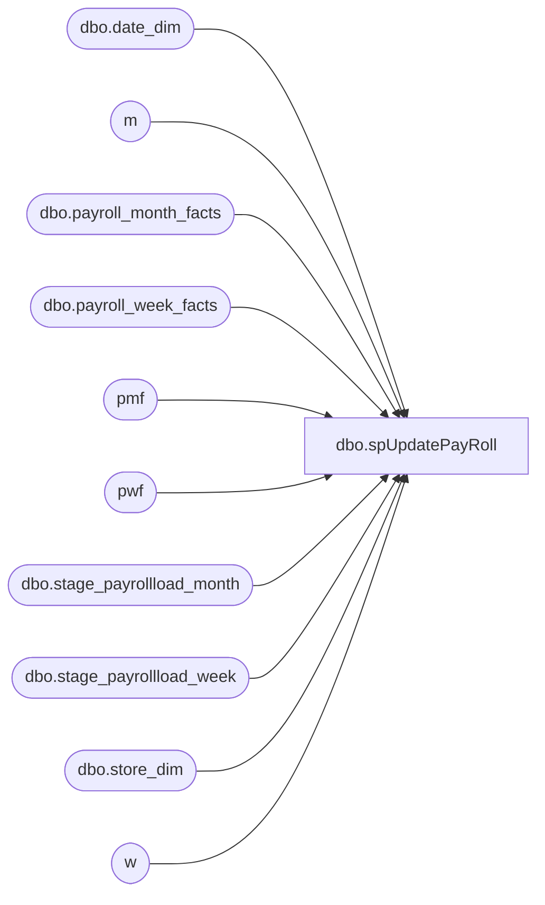

# dbo.spUpdatePayRoll

**Database:** payroll  
**Server:** papamart  

## Architecture Diagram



## Table Dependencies

| Referenced Table |
|---|
| dbo.date_dim |
| m |
| dbo.payroll_month_facts |
| dbo.payroll_week_facts |
| pmf |
| pwf |
| dbo.stage_payrollload_month |
| dbo.stage_payrollload_week |
| dbo.store_dim |
| w |

## Stored Procedure Code

```sql
CREATE PROC [dbo].[spUpdatePayRoll]
AS 
--Month
Update m
Set m.store_key=sd.store_key
from dbo.stage_payrollload_month m
INNER JOIN dw.dbo.store_dim sd
ON m.store_id=sd.store_id

Update m
Set m.period_id=dd.period_id
from dw.dbo.date_dim dd
INNER JOIN  dbo.stage_payrollload_month m
ON month_first_day=actual_date

UPDATE pmf
SET adj_actual=spm.monthly_adj_actual, 
adj_earned=spm.monthly_adj_earned, 
actual=spm.monthly_actual, 
earned=spm.monthly_earned
FROM payroll.dbo.payroll_month_facts pmf
INNER JOIN dbo.stage_payrollload_month spm
ON pmf.store_key= spm.store_key and pmf.period_id= spm.period_id 


INSERT INTO payroll.dbo.payroll_month_facts(store_key, period_id, adj_actual, adj_earned, actual, earned)
Select spm.store_key,spm.period_id,spm.monthly_adj_actual, 
spm.monthly_adj_earned, 
spm.monthly_actual, 
spm.monthly_earned
FROM dbo.stage_payrollload_month spm
Left JOIN payroll.dbo.payroll_month_facts pmf
ON pmf.store_key= spm.store_key and pmf.period_id= spm.period_id 
WHERE pmf.store_key is null
and spm.store_key is not null


--Week
--Set Store Key
Update w
Set w.store_key=sd.store_key
from dbo.stage_payrollload_week w
INNER JOIN dw.dbo.store_dim sd
ON w.store_id=sd.store_id

--Set Week ID
Update w
Set w.period_id=dd.period_id,w.week_id=dd.week_id
from dw.dbo.date_dim dd
INNER JOIN  dbo.stage_payrollload_week w
ON week_begin_date=actual_date

Update pwf
Set pwf.actual=week_actual,pwf.earned=week_earned
from dbo.stage_payrollload_week w
INNER JOIN dbo.payroll_week_facts pwf
ON pwf.store_key=w.store_key and
pwf.week_id=w.week_id

Delete dbo.stage_payrollload_week 
Where week_actual=0 and week_earned=0

INSERT INTO payroll.dbo.payroll_week_facts
(store_key, period_id, week_id, actual, earned)
SELECT w.store_key,w.period_id,w.week_id,week_actual,week_earned
from dbo.stage_payrollload_week w
left join dbo.payroll_week_facts pwf
ON pwf.store_key=w.store_key and
pwf.week_id=w.week_id 
where pwf.store_key is null


dbo,dt_generateansiname,/* 
**	Generate an ansi name that is unique in the dtproperties.value column 
*/ 
create procedure dbo.dt_generateansiname(@name varchar(255) output) 
as 
	declare @prologue varchar(20) 
	declare @indexstring varchar(20) 
	declare @index integer 
 
	set @prologue = 'MSDT-A-' 
	set @index = 1 
 
	while 1 = 1 
	begin 
		set @indexstring = cast(@index as varchar(20)) 
		set @name = @prologue + @indexstring 
		if not exists (select value from dtproperties where value = @name) 
			break 
		 
		set @index = @index + 1 
 
		if (@index = 10000) 
			goto TooMany 
	end 
 
Leave: 
 
	return 
 
TooMany: 
 
	set @name = 'DIAGRAM' 
	goto Leave 

dbo,dt_adduserobject,/*
**	Add an object to the dtproperties table
*/
create procedure dbo.dt_adduserobject
as
	set nocount on
	/*
	** Create the user object if it does not exist already
	*/
	begin transaction
		insert dbo.dtproperties (property) VALUES ('DtgSchemaOBJECT')
		update dbo.dtproperties set objectid=@@identity 
			where id=@@identity and property='DtgSchemaOBJECT'
	commit
	return @@identity

dbo,dt_setpropertybyid,/*
**	If the property already exists, reset the value; otherwise add property
**		id -- the id in sysobjects of the object
**		property -- the name of the property
**		value -- the text value of the property
**		lvalue -- the binary value of the property (image)
*/
create procedure dbo.dt_setpropertybyid
	@id int,
	@property varchar(64),
	@value varchar(255),
	@lvalue image
as
	set nocount on
	declare @uvalue nvarchar(255) 
	set @uvalue = convert(nvarchar(255), @value) 
	if exists (select * from dbo.dtproperties 
			where objectid=@id and property=@property)
	begin
		--
		-- bump the version count for this row as we update it
		--
		update dbo.dtproperties set value=@value, uvalue=@uvalue, lvalue=@lvalue, version=version+1
			where objectid=@id and property=@property
	end
	else
	begin
		--
		-- version count is auto-set to 0 on initial insert
		--
		insert dbo.dtproperties (property, objectid, value, uvalue, lvalue)
			values (@property, @id, @value, @uvalue, @lvalue)
	end


dbo,dt_getobjwithprop,/*
**	Retrieve the owner object(s) of a given property
*/
create procedure dbo.dt_getobjwithprop
	@property varchar(30),
	@value varchar(255)
as
	set nocount on

	if (@property is null) or (@property = '')
	begin
		raiserror('Must specify a property name.',-1,-1)
		return (1)
	end

	if (@value is null)
		select objectid id from dbo.dtproperties
			where property=@property

	else
		select objectid id from dbo.dtproperties
			where property=@property and value=@value

dbo,dt_getpropertiesbyid,/*
**	Retrieve properties by id's
**
**	dt_getproperties objid, null or '' -- retrieve all properties of the object itself
**	dt_getproperties objid, property -- retrieve the property specified
*/
create procedure dbo.dt_getpropertiesbyid
	@id int,
	@property varchar(64)
as
	set nocount on

	if (@property is null) or (@property = '')
		select property, version, value, lvalue
			from dbo.dtproperties
			where  @id=objectid
	else
		select property, version, value, lvalue
			from dbo.dtproperties
			where  @id=objectid and @property=property

dbo,dt_setpropertybyid_u,/*
**	If the property already exists, reset the value; otherwise add property
**		id -- the id in sysobjects of the object
**		property -- the name of the property
**		uvalue -- the text value of the property
**		lvalue -- the binary value of the property (image)
*/
create procedure dbo.dt_setpropertybyid_u
	@id int,
	@property varchar(64),
	@uvalue nvarchar(255),
	@lvalue image
as
	set nocount on
	-- 
	-- If we are writing the name property, find the ansi equivalent. 
	-- If there is no lossless translation, generate an ansi name. 
	-- 
	declare @avalue varchar(255) 
	set @avalue = null 
	if (@uvalue is not null) 
	begin 
		if (convert(nvarchar(255), convert(varchar(255), @uvalue)) = @uvalue) 
		begin 
			set @avalue = convert(varchar(255), @uvalue) 
		end 
		else 
		begin 
			if 'DtgSchemaNAME' = @property 
			begin 
				exec dbo.dt_generateansiname @avalue output 
			end 
		end 
	end 
	if exists (select * from dbo.dtproperties 
			where objectid=@id and property=@property)
	begin
		--
		-- bump the version count for this row as we update it
		--
		update dbo.dtproperties set value=@avalue, uvalue=@uvalue, lvalue=@lvalue, version=version+1
			where objectid=@id and property=@property
	end
	else
	begin
		--
		-- version count is auto-set to 0 on initial insert
		--
		insert dbo.dtproperties (property, objectid, value, uvalue, lvalue)
			values (@property, @id, @avalue, @uvalue, @lvalue)
	end

dbo,dt_getobjwithprop_u,/*
**	Retrieve the owner object(s) of a given property
*/
create procedure dbo.dt_getobjwithprop_u
	@property varchar(30),
	@uvalue nvarchar(255)
as
	set nocount on

	if (@property is null) or (@property = '')
	begin
		raiserror('Must specify a property name.',-1,-1)
		return (1)
	end

	if (@uvalue is null)
		select objectid id from dbo.dtproperties
			where property=@property

	else
		select objectid id from dbo.dtproperties
			where property=@property and uvalue=@uvalue

dbo,dt_getpropertiesbyid_u,/*
**	Retrieve properties by id's
**
**	dt_getproperties objid, null or '' -- retrieve all properties of the object itself
**	dt_getproperties objid, property -- retrieve the property specified
*/
create procedure dbo.dt_getpropertiesbyid_u
	@id int,
	@property varchar(64)
as
	set nocount on

	if (@property is null) or (@property = '')
		select property, version, uvalue, lvalue
			from dbo.dtproperties
			where  @id=objectid
	else
		select property, version, uvalue, lvalue
			from dbo.dtproperties
			where  @id=objectid and @property=property
```

