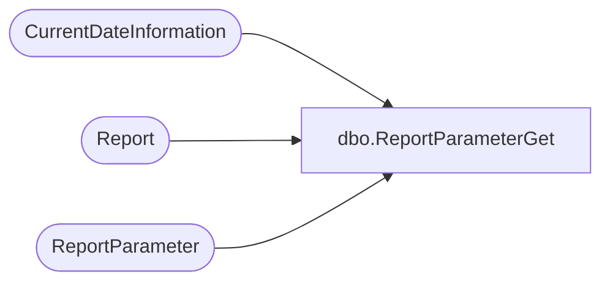

# dbo.ReportParameterGet

**Database:** reportingservices_subscription  
**Server:** papamart  

## Architecture Diagram



## Table Dependencies

| Referenced Table |
|---|
| CurrentDateInformation |
| Report |
| ReportParameter |

## Stored Procedure Code

```sql
-- =============================================
-- Author:		Zac Doerr
-- Create date: Oct 23 2008
-- This gets the parameters for the Sunday Morning Merch Reports
-- =============================================
CREATE PROCEDURE [dbo].[ReportParameterGet]
AS
BEGIN
	-- SET NOCOUNT ON added to prevent extra result sets from
	-- interfering with SELECT statements.
	SET NOCOUNT ON;

	SELECT
		r.ReportId,
		rp.ParameterName,
		rp.ParameterLabel,
		CASE
			WHEN rp.ParameterValue = '$MDXFiscal' THEN currDt.[MDX Fiscal]
			ELSE rp.ParameterValue
		END AS ParameterValue
	FROM
		ReportParameter rp WITH (NOLOCK)
		INNER JOIN Report r WITH (NOLOCK)
			ON r.ReportId = rp.ReportId
			AND r.enabled = 1
		CROSS JOIN CurrentDateInformation currDt WITH (NOLOCK)
	WHERE
		rp.enabled = 1
		AND r.rptGroupID = 1


END
```

