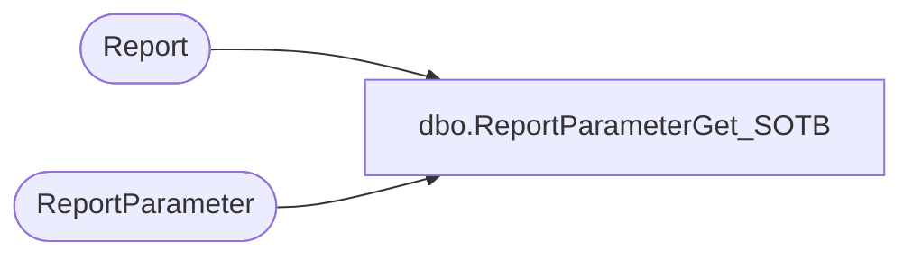

# dbo.ReportParameterGet_SOTB

**Database:** reportingservices_subscription  
**Server:** papamart  

## Architecture Diagram



## Table Dependencies

| Referenced Table |
|---|
| Report |
| ReportParameter |

## Stored Procedure Code

```sql
-- =============================================
-- Author:		Gary Murrish
-- Create date: 6/28/2012
-- This gets the parameters for the State of the Business Reporting
-- =============================================
CREATE PROCEDURE [dbo].[ReportParameterGet_SOTB]
AS
BEGIN
	-- SET NOCOUNT ON added to prevent extra result sets from
	-- interfering with SELECT statements.
	SET NOCOUNT ON;

	SELECT	
		r.ReportId,
		rp.ParameterName,
		rp.ParameterLabel,
		rp.ParameterValue
	FROM ReportParameter rp
		INNER JOIN Report r on r.ReportId = rp.ReportID and r.Enabled = 1
	WHERE
		rp.Enabled = 1
		AND r.rptGroupID = 2
	ORDER BY r.ReportId, rp.ParameterName


END
```

