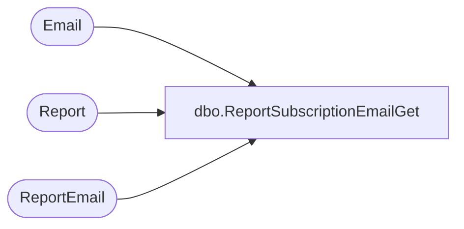

# dbo.ReportSubscriptionEmailGet

**Database:** reportingservices_subscription  
**Server:** papamart  

## Architecture Diagram



## Table Dependencies

| Referenced Table |
|---|
| Email |
| Report |
| ReportEmail |

## Stored Procedure Code

```sql
-- =============================================
-- Author:		Zac Doerr
-- Create date: Oct 17 2008
-- Description:	Retrieves the list of email users associated with each report
-- Restricted just to the Sunday Morning Merch Reports
-- =============================================
CREATE PROCEDURE [dbo].[ReportSubscriptionEmailGet]
AS
BEGIN
	-- SET NOCOUNT ON added to prevent extra result sets from
	-- interfering with SELECT statements.
	SET NOCOUNT ON;

SELECT 
	r.ReportId,
	e.Email,
	e.Name
FROM Report r
INNER JOIN ReportEmail re on re.ReportId = r.ReportID and re.Enabled = 1
INNER JOIN Email e ON e.EmailId = re.EmailId AND e.Enabled = 1
WHERE
	r.Enabled = 1
	AND r.rptGroupID = 1

END
```

