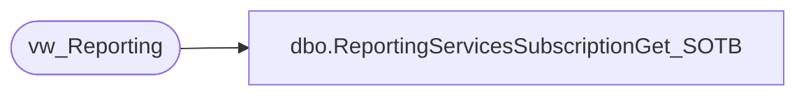

# dbo.ReportingServicesSubscriptionGet_SOTB

**Database:** reportingservices_subscription  
**Server:** papamart  

## Architecture Diagram



## Table Dependencies

| Referenced Table |
|---|
| vw_Reporting |

## Stored Procedure Code

```sql
-- =============================================
-- Author:		Gary Murrish
-- Create date: Oct 17 2008	
-- Description:	Gather all reporting service subscriptions with a given caption for the State of the Business Reports
-- =============================================


CREATE PROCEDURE [dbo].[ReportingServicesSubscriptionGet_SOTB]
AS
BEGIN
	-- SET NOCOUNT ON added to prevent extra result sets from
	-- interfering with SELECT statements.
	SET NOCOUNT ON;

SELECT 
	ReportId,
	FileName,
	Path,
	FileExtension,
	ReportingServiceReportName
FROM vw_Reporting
WHERE rptGroupID = 2

END
```

