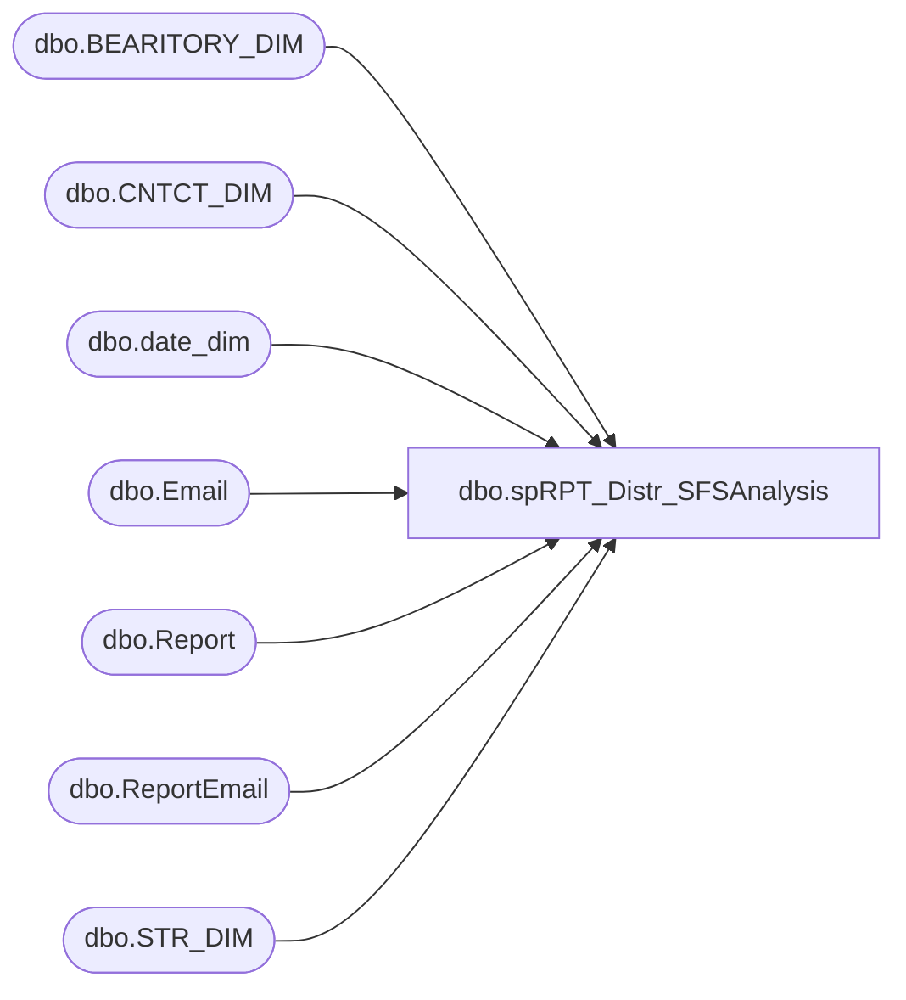

# dbo.spRPT_Distr_SFSAnalysis

**Database:** reportingservices_subscription  
**Server:** papamart  

## Architecture Diagram



## Table Dependencies

| Referenced Table |
|---|
| dbo.BEARITORY_DIM |
| dbo.CNTCT_DIM |
| dbo.date_dim |
| dbo.Email |
| dbo.Report |
| dbo.ReportEmail |
| dbo.STR_DIM |

## Stored Procedure Code

```sql
CREATE PROCEDURE [dbo].[spRPT_Distr_SFSAnalysis]
AS
-- =============================================
-- Author:		Gary Murrish
-- Create date: 5/6/2013
-- Description:	Generate Distribution List for SFS Analysis Report
-- Changes:
--	Date		By						Change
--	9/12/2013	G. Murrish			Moved to Papamart.Reportingservices_Subscription
--	2/17/2014	G. Murrish			Added Gary Roberts in additionto Roger Parry
--		Mike Pelikan	04/29/2014		Changed BABWMSTRDATA linked server reference
--  6/6/2014    Kevin Shyr          Changed email from garymu to BIAdmin
--  8/12/2014    Kevin Shyr          Add Linda Keeney to recipient list
--	2/21/2024	Tim Callahan		Added Darilyss Moreno to recipient list
--	2/26/2024	Tim Callahan		Removed Darilyss Moreno to recipient list as she complained about now receiving all reports 
-- =============================================
BEGIN
	-- SET NOCOUNT ON added to prevent extra result sets from
	-- interfering with SELECT statements.
	SET NOCOUNT ON;

	IF 1 = 0
	--	This is so that the data-driven subscription will detect the table to be returned
	BEGIN
		SELECT
			CAST(NULL AS varchar(MAX)) AS EMail,
			CAST(NULL AS varchar(MAX)) AS SortDateKey,
			CAST(NULL AS varchar(MAX)) AS GeogSortKey
	END

	DECLARE @SortDateKey varchar(255)

	SELECT
		@sortDateKey = CAST(fiscal_year AS varchar) + '|' + CAST(1 AS varchar) + '|' + CAST(org_fiscal_period AS varchar)
	FROM
		dw.dbo.date_dim d WITH (NOLOCK)
	WHERE
		(DATEDIFF(DAY, GETDATE(), d.actual_date) <= 0
		AND DATEDIFF(DAY, GETDATE(), d.actual_date) > -7
		AND d.week_id IS NOT NULL
		AND d.day_of_week = 2
		)

	IF OBJECT_ID('tempdb..#tmpDistrList') IS NOT NULL
	BEGIN
		DROP TABLE #tmpDistrList
	END


	-- Get the Folks from the Corporate Level
	SELECT
		e.name,e.Email,
		CAST('0|All BABW' AS varchar(50)) AS GeogSortKey
	INTO #tmpDistrList
	FROM
		dbo.Email e WITH (NOLOCK)
		JOIN dbo.ReportEmail re WITH (NOLOCK)
			ON (e.EmailId = re.EmailId)
		JOIN dbo.Report r WITH (NOLOCK)
			ON (re.ReportId = r.ReportId)

	WHERE
		r.ReportingServiceReportName = 'SFS Activity'
		AND r.Enabled = 1
		AND re.Enabled = 1
		

	-- Get the Region Directors
	INSERT INTO #tmpDistrList
		(	Email ,
			GeogSortKey)

		--SELECT
		--	--CASE when CD.EMAIL = 'rogerp@buildabear.co.uk' THEN 'rogerp@buildabear.co.uk;'+ + 'garyr@buildabear.co.uk' ELSE CD.EMAIL END  + ';lindak@buildabear.com;BIAdmin@buildabear.com' AS EMail,
		--	CASE when CD.EMAIL = 'rogerp@buildabear.co.uk' THEN 'rogerp@buildabear.co.uk;'+ + 'garyr@buildabear.co.uk' ELSE CD.EMAIL END  + ';lindak@buildabear.com;BIAdmin@buildabear.com' AS EMail,
		--	'1|' + RD.NM AS GeogSortKey
		--FROM
		--	KODIAK.babwmstrdata.dbo.RGN_DIM RD WITH (NOLOCK)
		--	INNER JOIN KODIAK.babwmstrdata.dbo.CNTCT_DIM CD WITH (NOLOCK)
		--		ON RD.CNTCT_ID = CD.CNTCT_ID
		--	INNER JOIN (SELECT DISTINCT
		--			BD.rgn_id
		--		FROM
		--			KODIAK.babwmstrdata.dbo.BEARITORY_DIM BD WITH (NOLOCK)
		--			INNER JOIN KODIAK.babwmstrdata.dbo.STR_DIM SD WITH (NOLOCK)
		--				ON BD.bearitory_id = SD.bearitory_id)
		--	used
		--		ON used.rgn_id = RD.rgn_id
		--WHERE
		--	CD.Email IS NOT NULL
		---------------------------------------------------------------------------
		-- Justin wasn't assigned to any UK Bearitory in the database, this is a 
		-- Temp fix to get him the report and limit the other people requested by
		-- Ryan Grist on 11/16/2015
		---------------------------------------------------------------------------
		SELECT
			CD.Email + ';lindak@buildabear.com;BIAdmin@buildabear.com' AS EMail,
			'2|' + BD.NM AS GeogSortKey
		FROM
			KODIAK.babwmstrdata.dbo.BEARITORY_DIM BD WITH (NOLOCK)
			INNER JOIN KODIAK.babwmstrdata.dbo.CNTCT_DIM CD WITH (NOLOCK)
				ON BD.CNTCT_ID = CD.CNTCT_ID
			INNER JOIN (SELECT DISTINCT
					bearitory_id
				FROM
					KODIAK.babwmstrdata.dbo.STR_DIM SD WITH (NOLOCK))
			used
				ON used.bearitory_id = BD.bearitory_id
		WHERE
			CD.Email IS NOT NULL
		AND CD.Email NOT like '%UK%'		-- Limit other 7 people
UNION ALL
SELECT
			'justinc@buildabear.co.uk' + ';lindak@buildabear.com;BIAdmin@buildabear.com' AS EMail,
			'2|' + BD.NM AS GeogSortKey 
			FROM
			KODIAK.babwmstrdata.dbo.BEARITORY_DIM BD WITH (NOLOCK)
			INNER JOIN KODIAK.babwmstrdata.dbo.CNTCT_DIM CD WITH (NOLOCK)
				ON BD.CNTCT_ID = CD.CNTCT_ID
			INNER JOIN (SELECT DISTINCT
					bearitory_id
				FROM
					KODIAK.babwmstrdata.dbo.STR_DIM SD WITH (NOLOCK))
			used
				ON used.bearitory_id = BD.bearitory_id
		WHERE
			CD.Email IS NOT NULL
		AND CD.Email like '%UK%'


	-- Get the Bearitory Leaders
	INSERT INTO #tmpDistrList
		(	Email,
			GeogSortKey)

		SELECT
			CD.Email + ';lindak@buildabear.com;BIAdmin@buildabear.com' AS EMail,
			'2|' + BD.NM AS GeogSortKey
		FROM
			KODIAK.babwmstrdata.dbo.BEARITORY_DIM BD WITH (NOLOCK)
			INNER JOIN KODIAK.babwmstrdata.dbo.CNTCT_DIM CD WITH (NOLOCK)
				ON BD.CNTCT_ID = CD.CNTCT_ID
			INNER JOIN (SELECT DISTINCT
					bearitory_id
				FROM
					KODIAK.babwmstrdata.dbo.STR_DIM SD WITH (NOLOCK))
			used
				ON used.bearitory_id = BD.bearitory_id
		WHERE
			CD.Email IS NOT NULL

	-- Now generate the distibution list
	SELECT
		(SELECT
				CAST(EMail + ';' AS varchar(MAX))
			FROM
				#tmpDistrList dlin WITH (NOLOCK)
			WHERE
				dl.GeogSortKey = dlin.GeogSortKey
			ORDER BY EMail
			FOR xml PATH (''))
		AS EMail,
		@SortDateKey AS SortDateKey,
		--dl.GeogSortKey
		case when dl.GeogSortKey = '2|SOCAL/VEGAS'
			then '2|SOCAL/Vegas'
		else dl.GeogSortKey end as GeogSortKey -- The SSRS report did not like something about the casing of this -- Added 2/27/2024 -- Will not go live until Darilyss submits a service desk ticket
	FROM
		#tmpDistrList dl WITH (NOLOCK)
	--where dl.GeogSortKey = '2|SOCAL/VEGAS' -- For Testing Particular Entries 
	GROUP BY dl.GeogSortKey
END
```

