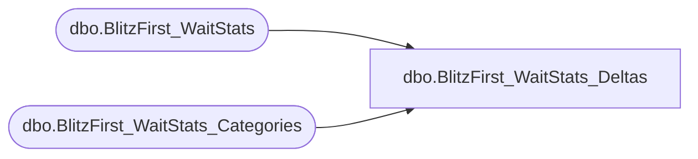

# dbo.BlitzFirst_WaitStats_Deltas

**Database:** DBAUtility  
**Server:** papamart  

## Architecture Diagram



## Table Dependencies

| Referenced Table |
|---|
| dbo.BlitzFirst_WaitStats |
| dbo.BlitzFirst_WaitStats_Categories |

## View Code

```sql
CREATE VIEW [dbo].[BlitzFirst_WaitStats_Deltas] AS 
WITH RowDates as
(
        SELECT 
                ROW_NUMBER() OVER (ORDER BY [ServerName], [CheckDate]) ID,
                [CheckDate]
        FROM [dbo].[BlitzFirst_WaitStats]
        GROUP BY [ServerName], [CheckDate]
),
CheckDates as
(
        SELECT ThisDate.CheckDate,
               LastDate.CheckDate as PreviousCheckDate
        FROM RowDates ThisDate
        JOIN RowDates LastDate
        ON ThisDate.ID = LastDate.ID + 1
)
SELECT w.ServerName, w.CheckDate, w.wait_type, COALESCE(wc.WaitCategory, 'Other') AS WaitCategory, COALESCE(wc.Ignorable,0) AS Ignorable
, DATEDIFF(ss, wPrior.CheckDate, w.CheckDate) AS ElapsedSeconds
, (w.wait_time_ms - wPrior.wait_time_ms) AS wait_time_ms_delta
, (w.wait_time_ms - wPrior.wait_time_ms) / 60000.0 AS wait_time_minutes_delta
, (w.wait_time_ms - wPrior.wait_time_ms) / 1000.0 / DATEDIFF(ss, wPrior.CheckDate, w.CheckDate) AS wait_time_minutes_per_minute
, (w.signal_wait_time_ms - wPrior.signal_wait_time_ms) AS signal_wait_time_ms_delta
, (w.waiting_tasks_count - wPrior.waiting_tasks_count) AS waiting_tasks_count_delta
FROM [dbo].[BlitzFirst_WaitStats] w
INNER HASH JOIN CheckDates Dates
ON Dates.CheckDate = w.CheckDate
INNER JOIN [dbo].[BlitzFirst_WaitStats] wPrior ON w.ServerName = wPrior.ServerName AND w.wait_type = wPrior.wait_type AND Dates.PreviousCheckDate = wPrior.CheckDate
LEFT OUTER JOIN [dbo].[BlitzFirst_WaitStats_Categories] wc ON w.wait_type = wc.WaitType
WHERE DATEDIFF(MI, wPrior.CheckDate, w.CheckDate) BETWEEN 1 AND 60
AND [w].[wait_time_ms] >= [wPrior].[wait_time_ms];
```

