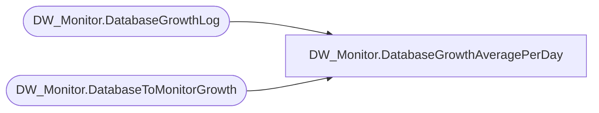

# DW_Monitor.DatabaseGrowthAveragePerDay

**Database:** DWStaging  
**Server:** papamart  

## Architecture Diagram



## Table Dependencies

| Referenced Table |
|---|
| DW_Monitor.DatabaseGrowthLog |
| DW_Monitor.DatabaseToMonitorGrowth |

## View Code

```sql
CREATE VIEW DW_Monitor.DatabaseGrowthAveragePerDay
AS
SELECT db.ServerName
	, db.DatabaseName
	, (MAX(dgl.SizeInMB) - MIN(dgl.SizeInMB)) / (MAX(dgl.DateKey) - MIN(dgl.DateKey)) AS AverageDailyGrowthInMB
FROM [DW_Monitor].[DatabaseGrowthLog] dgl WITH(NOLOCK)
	INNER JOIN DW_Monitor.DatabaseToMonitorGrowth db WITH(NOLOCK)
		ON dgl.DatabaseToMonitorGrowthKey = db.DatabaseToMonitorGrowthKey
GROUP BY db.ServerName
	, db.DatabaseName
```

