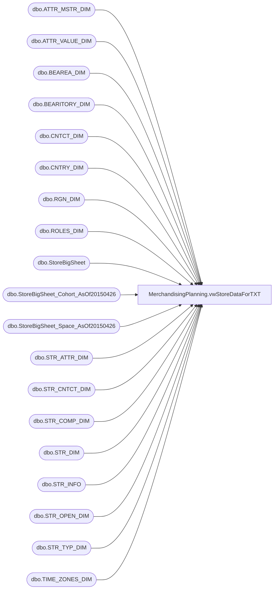

# MerchandisingPlanning.vwStoreDataForTXT

**Database:** DWStaging  
**Server:** papamart  

## Architecture Diagram



## Table Dependencies

| Referenced Table |
|---|
| dbo.ATTR_MSTR_DIM |
| dbo.ATTR_VALUE_DIM |
| dbo.BEAREA_DIM |
| dbo.BEARITORY_DIM |
| dbo.CNTCT_DIM |
| dbo.CNTRY_DIM |
| dbo.RGN_DIM |
| dbo.ROLES_DIM |
| dbo.StoreBigSheet |
| dbo.StoreBigSheet_Cohort_AsOf20150426 |
| dbo.StoreBigSheet_Space_AsOf20150426 |
| dbo.STR_ATTR_DIM |
| dbo.STR_CNTCT_DIM |
| dbo.STR_COMP_DIM |
| dbo.STR_DIM |
| dbo.STR_INFO |
| dbo.STR_OPEN_DIM |
| dbo.STR_TYP_DIM |
| dbo.TIME_ZONES_DIM |

## View Code

```sql
/***********************************************************************************************
Object Name:			dbo.[vwStoreDataForTXT]
Description/Purpose:	view used for TXT location

-- Dependencies: 
--
-- Revision History
--		Name:					Date:			Comments:
--		Kevin Shyr			2015-05-07		Original Creation
--      Gary Murrish		2015-07-13		Added STR_DIM.NM_FULL
--		Gary Murrish		2015-07-14		Added STR_INFO Address Detail
--		Gary Murrish		2015-08-06		Added fields from TIME_ZONES_DIM and RGN_DIM
--		Gary Murrish		2015-08-20		Added fields from BEAREA_DIM
--		Anthony Delgado		2015-10-20		Added Zone (Region) and District (Bearitory)
--		Brian Byas			2015-10-23		Added WITH (NOLOCK) on all DB references
--		Anthony Delgado		2015-12-21		Modified to use CTEs; Added StoreDesign, LocationType, PricingModel, Hispanic
--		Brian Byas			2016-01-22		Modified to  add TXTLocationPlanning
**********************************************************************************************/
CREATE VIEW [MerchandisingPlanning].[vwStoreDataForTXT]
AS
--- ekkada
WITH st_sub AS (
	SELECT	s.STR_NUM
			, MIN(c.CNTCT_ID) AS CNTCT_ID
	FROM Kodiak.BABWMstrData.dbo.STR_DIM s WITH (NOLOCK)
		LEFT JOIN Kodiak.BABWMstrData.dbo.STR_CNTCT_DIM sc WITH (NOLOCK)
				ON s.STR_ID = sc.STR_ID
		LEFT JOIN Kodiak.BABWMstrData.dbo.CNTCT_DIM c WITH (NOLOCK)
				ON sc.CNTCT_ID = c.CNTCT_ID
		LEFT JOIN Kodiak.BABWMstrData.dbo.ROLES_DIM r WITH (NOLOCK)
				ON c.ROLE_ID = r.ROLE_ID
	WHERE r.R_POSITION = 'CWM'
		AND s.STR_NUM > 0
		AND (c.END_DATE IS NULL OR c.END_DATE > GETDATE())
	GROUP BY s.STR_NUM
	),
strmang AS (
	SELECT st_sub.STR_NUM
			, c_sub.LAST_NM
			, c_sub.FRST_NM
	FROM st_sub 
	LEFT JOIN Kodiak.BABWMstrData.dbo.CNTCT_DIM c_sub WITH (NOLOCK)
			ON st_sub.CNTCT_ID = c_sub.CNTCT_ID
    ),
StrComp AS (
	SELECT DISTINCT STR_ID ,Start_Comp_Date, End_Comp_Date
	FROM Kodiak.BABWMstrData.dbo.STR_COMP_DIM WITH (NOLOCK)
	WHERE GETDATE() BETWEEN DATEADD(year, -1, Start_Comp_Date) AND End_Comp_Date
	),
spa AS (
	SELECT    CAST(s1.StoreNum AS INT) AS STR_NUM
              , SUM(ISNULL(s1.Stockroom, 0)) AS StockingSpace
              , SUM(ISNULL(s1.[Sales Floor], 0)) AS SellingSpace
    FROM Kodiak.BABWMstrData.dbo.StoreBigSheet_Space_AsOf20150426 s1 WITH (NOLOCK)
    GROUP BY CAST(s1.StoreNum AS INT)                             
    ),
StoreAttributes AS (
	SELECT	sd.STR_NUM, 
			avd.ATTR_MSTR_ID AS AttributeID, 
			amd.TITLE AS AttributeName, 
			avd.ATTR_VALUE_ID AS AttributeValueID, 
			avd.TITLE AS AttributeValueName
	FROM Kodiak.[BABWMstrData].[dbo].[ATTR_MSTR_DIM] amd WITH (NOLOCK)	 
	INNER JOIN Kodiak.[BABWMstrData].[dbo].[ATTR_VALUE_DIM] avd	WITH (NOLOCK)
		ON avd.ATTR_MSTR_ID=amd.ATTR_MSTR_ID
	INNER JOIN Kodiak.[BABWMstrData].[dbo].[STR_ATTR_DIM] sad	WITH (NOLOCK)
		ON sad.ATTR_MSTR_ID=avd.ATTR_MSTR_ID
		AND sad.ATTR_VALUE_ID=avd.ATTR_VALUE_ID
	INNER JOIN Kodiak.[BABWMstrData].[dbo].[STR_DIM] sd	WITH (NOLOCK)
		ON sd.STR_ID=sad.STR_ID
	WHERE amd.ATTR_MSTR_ID IN (19,20,21,22,24)	
	),
StoreAttributePivot (StoreNumber, StoreDesign, LocationType, PricingModel, Hispanic, TXTLocationPlanning) AS (
	SELECT STR_NUM, [19], [20], [21], [22], [24]
	FROM 
		(
		SELECT	STR_NUM,
				AttributeID,
				AttributeValueName
		FROM StoreAttributes ) SourceTable
		PIVOT 
		(
			MAX(AttributeValueName)
			FOR AttributeID IN ([19],[20],[21],[22],[24])
		) PivotTable
	)
SELECT 
	CASE WHEN (isnull(coh.Cohort,0)) = 'Canada' THEN 1  ELSE 0 END AS CANADA_COHORT,
	CASE WHEN (isnull(coh.Cohort,0)) = 'US Core'THEN 1   ELSE 0 END AS CORE_COHORT,
	CASE WHEN (isnull(coh.Cohort,0)) = 'UK' THEN 1      ELSE 0 END AS OTHER1_COHORT,
	CASE WHEN (isnull(coh.Cohort,0)) = 'Shop In Shop' THEN 1 ELSE 0  END AS OTHER2_COHORT,
	CASE WHEN (isnull(coh.Cohort,0)) = 'Outlier' THEN 1 ELSE 0 END AS OTHER3_COHORT,
	CASE WHEN (isnull(coh.Cohort,0)) = 'Outlet'  THEN 1 ELSE 0 END AS OUTLET_COHORT,
	CASE WHEN coh.Cohort = 'Tourism' THEN 1 ELSE 0 END AS TOURISM_COHORT,
	spa.SellingSpace AS SELLING_SPACE,
	spa.SellingSpace + spa.StockingSpace as SPACE, 
	spa.StockingSpace AS STOCK_ROOM_SPACE,
	StrMang.FRST_NM + ' ' + StrMang.LAST_NM AS STORE_MANAGER,
	CASE WHEN sd.STR_CLOSE_DT < GETDATE()
			THEN 'Permanently Closed'
		 WHEN StrComp.STR_ID IS NULL 
			THEN 'Temporarily Closed'
		 ELSE 'Open'
	END AS STORE_STATUS
	,std.STR_TYP_NM AS STORE_TYPE
	,sd.STR_NUM AS STR_NUM
	,sd.NM_FULL AS STR_NAME -- ADDED BY GM 07/13/2015
	--  fields below added by GM 07/13/2015
	,RIGHT ('000' + CONVERT(VARCHAR,sd.STR_NUM),4)   as STORE_NUM
	,RIGHT ('000' + CONVERT(VARCHAR,sd.STR_NUM),4) AS STORE_SEQUENCE
	,sd.str_open_dt as open_dt 
	,sd.str_close_dt as close_dt 
	,sinfo.address 
    ,sinfo.CNTRY_NM  
    ,sinfo.ST_NM  
    ,sinfo.CTY_NM  
	,cd.NM_ABBRV AS StoreAddressCountry
	--,sd.tm_zn_id
	,td.tm_zn_id 
	,td.descr
	,td.tm_zn_cd
	,sd.rgn_id
	,rd.nm as REGION_NM
	,StrComp.Start_Comp_Date as str_cmp_dt
	,StrComp.End_Comp_Date as end_cmp_dt
	,bea.bearea_num
	,bea.nm as bearea_name 
	,rd.nm as ZoneName -- added by Anthony Delgado 10/21/15
	,bd.NM AS DistrictName -- added by Anthony Delgado 10/21/15
	,sap.StoreDesign -- added by Anthony Delgado 12/21/2015
	,sap.LocationType -- added by Anthony Delgado 12/21/2015
	,sap.PricingModel -- added by Anthony Delgado 12/21/2015
	,sap.Hispanic -- added by Anthony Delgado 12/21/2015
	,sap.TXTLocationPlanning --added by Brian Byas 1/13/2016
FROM Kodiak.BABWMstrData.dbo.STR_DIM sd WITH (NOLOCK)
	LEFT OUTER JOIN Kodiak.BABWMstrData.dbo.CNTRY_DIM cd WITH (NOLOCK)
			ON sd.CNTRY_ID = cd.CNTRY_ID
	LEFT OUTER JOIN Kodiak.BABWMstrData.dbo.TIME_ZONES_DIM td WITH (NOLOCK)
			ON sd.TM_ZN_ID = td.TM_ZN_ID  -- added by GM 08/06/2015
	LEFT OUTER JOIN Kodiak.[BABWMstrData].[dbo].[RGN_DIM] rd WITH (NOLOCK)
			ON sd.RGN_ID = rd.RGN_ID   -- added by GM 08/06/2015
	LEFT OUTER JOIN Kodiak.[BABWMstrData].[dbo].[BEAREA_DIM] bea WITH (NOLOCK)
			ON sd.bearea_id = bea.bearea_id  -- added by GM 08/20/2015
    LEFT OUTER JOIN Kodiak.BABWMstrData.dbo.STR_OPEN_DIM sod WITH (NOLOCK)
            ON sd.STR_ID = sod.STR_KEY
            AND GETDATE() BETWEEN sod.OPEN_DT AND sod.CLOSE_DT
	LEFT OUTER JOIN Kodiak.BABWMstrData.dbo.STR_INFO sinfo  WITH (NOLOCK) -- ADDED BY GM 07/14/2015
			ON sd.STR_ID = sinfo.STR_ID   -- ADDED BY GM 07/14/2015
    LEFT OUTER JOIN Kodiak.BABWMstrData.dbo.STR_TYP_DIM std WITH (NOLOCK)
            ON std.STR_TYP_KEY = sod.STR_TYPE_KEY
    LEFT OUTER JOIN Kodiak.BABWMstrData.dbo.StoreBigSheet sbs WITH (NOLOCK)
            ON sd.STR_NUM = sbs.StoreID
    LEFT OUTER JOIN strmang 
            ON StrMang.STR_NUM = sd.STR_NUM
	LEFT OUTER JOIN StrComp
			ON sd.STR_ID = StrComp.STR_ID
    LEFT OUTER JOIN Kodiak.BABWMstrData.dbo.StoreBigSheet_Cohort_AsOf20150426 coh WITH (NOLOCK)
            ON sd.STR_NUM = CAST(coh.StoreNum AS INT)
    LEFT OUTER JOIN spa 
            ON sd.STR_NUM = spa.STR_NUM
	LEFT OUTER JOIN Kodiak.BABWMstrData.dbo.BEARITORY_DIM bd WITH (NOLOCK)-- added by Anthony Delgado 10/21/15
			ON bd.BEARITORY_ID=sd.BEARITORY_ID
	LEFT OUTER JOIN StoreAttributePivot sap -- added by Anthony Delgado 12/21/2015
			ON sap.StoreNumber=sd.STR_NUM
WHERE sd.STR_NUM > 0
```

