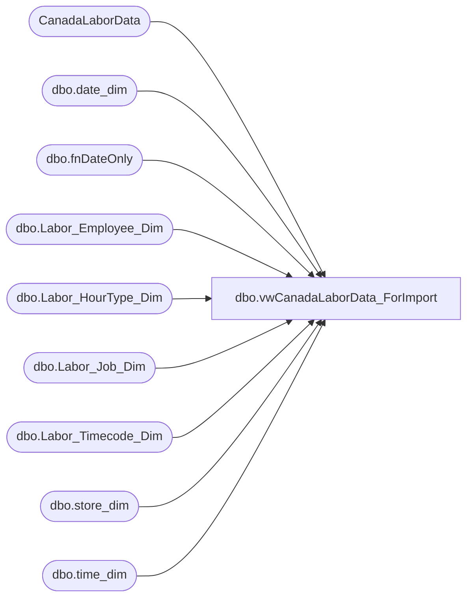

# dbo.vwCanadaLaborData_ForImport

**Database:** DWStaging  
**Server:** papamart  

## Architecture Diagram



## Table Dependencies

| Referenced Table |
|---|
| CanadaLaborData |
| dbo.date_dim |
| dbo.fnDateOnly |
| dbo.Labor_Employee_Dim |
| dbo.Labor_HourType_Dim |
| dbo.Labor_Job_Dim |
| dbo.Labor_Timecode_Dim |
| dbo.store_dim |
| dbo.time_dim |

## View Code

```sql
/***********************************************************************************************
Object Name:			dbo.vwCanadaLaborData_ForImport
Description/Purpose:	View used for importing Canada Labor Data.
--						This does the lookups for importing. If there is a problem, then the variable
--							canProcess = 0

-- Dependencies: 
--
-- Revision History
--		Name:					Date:			Comments:
--		Gary Murrish			10/17/2013		Original Creation

**********************************************************************************************/
CREATE VIEW [dbo].[vwCanadaLaborData_ForImport]
AS
SELECT
	sd.store_key,
	dd.date_key,
	led.emp_key,
	ljd.job_key,
	lhtd.HOURTYPE_KEY,
	ltd.timecode_key,
	cld.clockInTimeOnly AS start_Time,
	cld.clockOutTimeOnly AS end_time,
	DATEDIFF(MINUTE, cld.clockInTimeOnly, cld.clockOutTimeOnly) AS wrkd_minutes,
	CASE
		WHEN sd.store_key + dd.date_key + led.emp_key + ljd.job_key + lhtd.HOURTYPE_KEY + ltd.timecode_key IS NULL THEN 0
		ELSE 1
	END AS canProcess,
	cld.SourceFile,
	cld.Processed,
	cld.LaborId
FROM
	(SELECT
			*,
			dw.dbo.fnDateOnly(cld.ClockInDate) AS clockInDateOnly,
			cld.ClockInDate - dw.dbo.fnDateOnly(cld.ClockInDate) AS clockInTimeOnly,
			cld.ClockOutDate - dw.dbo.fnDateOnly(cld.ClockInDate) AS clockOutTimeOnly
		FROM
			CanadaLaborData cld WITH (NOLOCK)) cld
	LEFT JOIN dw.dbo.store_dim sd WITH (NOLOCK)
		ON sd.store_id = cld.StoreId
	LEFT JOIN dw.dbo.Labor_Employee_Dim led WITH (NOLOCK)
		ON sd.store_key = led.store_key
		AND led.emp_id = cld.EmployeeId
	LEFT JOIN dw.dbo.date_dim dd WITH (NOLOCK)
		ON dd.actual_date = cld.clockInDateOnly
	LEFT JOIN dw.dbo.Labor_Timecode_Dim ltd WITH (NOLOCK)
		ON ltd.abrv = cld.Status
	LEFT JOIN dw.dbo.Labor_Job_Dim ljd WITH (NOLOCK)
		ON ljd.DESCR = cld.JobCode
	LEFT JOIN dw.dbo.time_dim td WITH (NOLOCK)
		ON DATEPART(HOUR, cld.ClockInDate) = td.hour
		AND DATEPART(MINUTE, cld.ClockInDate) = td.minute
	LEFT JOIN dw.dbo.Labor_HourType_Dim lhtd WITH (NOLOCK)
		ON lhtd.abrv = 'REG'
	where sd.country <> 'CA' -->excludes canada, they use ultipro
```

