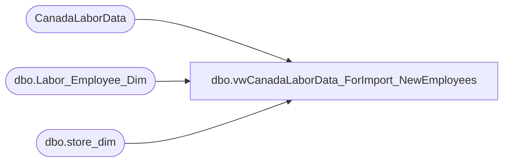

# dbo.vwCanadaLaborData_ForImport_NewEmployees

**Database:** DWStaging  
**Server:** papamart  

## Architecture Diagram



## Table Dependencies

| Referenced Table |
|---|
| CanadaLaborData |
| dbo.Labor_Employee_Dim |
| dbo.store_dim |

## View Code

```sql
/***********************************************************************************************
Object Name:			dbo.vwCanadaLaborData_ForImport_NewEmployees
Description/Purpose:	View used for importing new employees for the Canadian Labor Import.
--						This returns only the employees that don't exist so that they
--							can be inserted.

-- Dependencies: 
--
-- Revision History
--		Name:					Date:			Comments:
--		Gary Murrish			10/17/2013		Original Creation

**********************************************************************************************/
CREATE VIEW [dbo].[vwCanadaLaborData_ForImport_NewEmployees]
AS
SELECT DISTINCT
	sd.store_key,
	CAST(cld.EmployeeId AS bigint) AS emp_id,
	cld.SourceFile
FROM
	CanadaLaborData cld WITH (NOLOCK)
	INNER JOIN dw.dbo.store_dim sd WITH (NOLOCK)
		ON cld.StoreId = sd.store_id
	LEFT JOIN dw.dbo.Labor_Employee_Dim led WITH (NOLOCK)
		ON sd.store_key = led.store_key
		AND cld.EmployeeId = led.emp_id
WHERE
	cld.Processed = 0
	AND led.emp_key IS NULL
	and sd.country<> 'ca' -->excludes canada, they use ultipro
```

