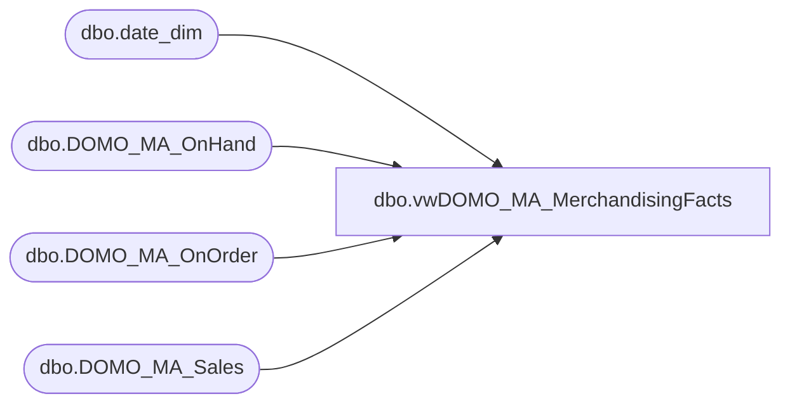

# dbo.vwDOMO_MA_MerchandisingFacts

**Database:** DWStaging  
**Server:** papamart  

## Architecture Diagram



## Table Dependencies

| Referenced Table |
|---|
| dbo.date_dim |
| dbo.DOMO_MA_OnHand |
| dbo.DOMO_MA_OnOrder |
| dbo.DOMO_MA_Sales |

## View Code

```sql
CREATE view [dbo].[vwDOMO_MA_MerchandisingFacts]

as


WITH 

PSDK as 
	(
		select distinct 
			ProductStoreDateKey, 
			ProductKey,
			StoreKey,
			DateKey
		from
			dwstaging.dbo.DOMO_MA_Sales
		UNION
		select distinct 
			ProductStoreDateKey, 
			ProductKey,
			StoreKey,
			DateKey
		from
			dwstaging.dbo.DOMO_MA_OnOrder
		UNION
		select distinct 
			ProductStoreDateKey, 
			ProductKey,
			StoreKey,
			DateKey
		from
			dwstaging.dbo.DOMO_MA_OnHand
	),
PDSKActualDate as
	(
		SELECT	PSDK.ProductStoreDateKey, 
				PSDK.ProductKey,
				PSDK.StoreKey,
				PSDK.DateKey,
				cast(dd.actual_date as date) ActualDate
		from PSDK 
		join dw.dbo.date_dim dd on PSDK.DateKey = dd.date_key
	)
SELECT
	PSDK.ProductStoreDateKey, 
	PSDK.ProductKey,
	PSDK.StoreKey,
	PSDK.DateKey,
	PSDK.ActualDate,

	--SALES
	isnull(S.PermRetailTe, 0) as PermRetailTe,
	isnull(S.PromoPcTotalRetailTe, 0) as PromoPcTotalRetailTe,
	isnull(S.ReceivedUnits, 0) as ReceivedUnits,
	isnull(S.ReceivedRetailTe, 0) as ReceivedRetailTe,
	isnull(S.ReceivedCost, 0) as ReceivedCost,
	isnull(S.NetSalesUnits, 0) as NetSalesUnits,
	isnull(S.NetSalesRetailTe, 0) as NetSalesRetailTe,
	isnull(S.NetSalesRetailNativeTe, 0) as NetSalesRetailNativeTe,
	isnull(S.NetSalesCost, 0) as NetSalesCost,
	isnull(S.ShrinkActualUnits, 0) as ShrinkActualUnits,
	isnull(S.ShrinkActualRetailTe, 0) as ShrinkActualRetailTe,
	
	--ON ORDER,
	isnull(OO.OnOrderUnits, 0) as OnOrderUnits,
	isnull(OO.OnOrderRetailTE, 0) as OnOrderRetailTe,
	isnull(OO.OnOrderCost, 0) as OnOrderCost,
	
	--ON HAND,
	ISNULL(OH.OnHandUnits, 0) as OnHandUnits,
	ISNULL(OH.OnHandRetailTe, 0) as OnHandRetailTe,
	ISNULL(OH.OnHandCost, 0) as OnHandCost

FROM
	PDSKActualDate PSDK
	LEFT JOIN dwstaging.dbo.DOMO_MA_Sales S on PSDK.ProductStoreDateKey = S.ProductStoreDateKey
	LEFT JOIN dwstaging.dbo.DOMO_MA_OnOrder OO on PSDK.ProductStoreDateKey = OO.ProductStoreDateKey
	LEFT JOIN dwstaging.dbo.DOMO_MA_OnHand OH on PSDK.ProductStoreDateKey = OH.ProductStoreDateKey
```

