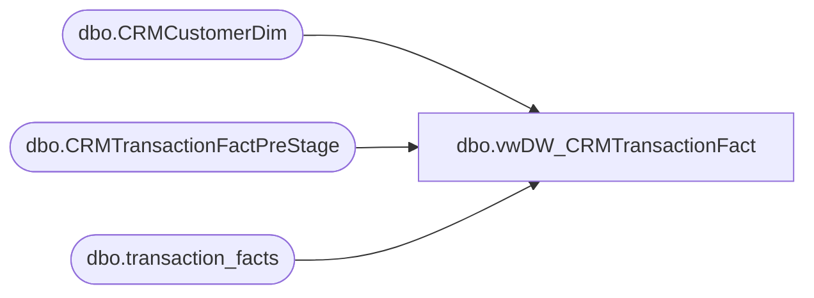

# dbo.vwDW_CRMTransactionFact

**Database:** DWStaging  
**Server:** papamart  

## Architecture Diagram



## Table Dependencies

| Referenced Table |
|---|
| dbo.CRMCustomerDim |
| dbo.CRMTransactionFactPreStage |
| dbo.transaction_facts |

## View Code

```sql
CREATE view [dbo].[vwDW_CRMTransactionFact]

as

--==================================================================================================
--	Author			Date			Details
--	Dan Tweedie		09/23/2016		Created view to serve as source view for papamart.dwstaging.dbo.CRMTransactionFactStage
--==================================================================================================


with 
TransID as 
	(
		select 
			crm.ID,
			max(tf.transaction_id) as TransactionID
		from 
			dwstaging.dbo.CRMTransactionFactPreStage crm
			--join dw.dbo.CRMCustomerDim cd with (nolock) on crm.CustomerNumber=cd.CustomerNumber --ensures we only include transactions for customers in CRMCustomerDim
			join dw.dbo.transaction_facts tf with (nolock) on 1=1
				--and	crm.DateKey = tf.date_key
				and crm.TransactionIDTF=tf.transaction_id
				and crm.StoreKey = tf.store_key
				and crm.POSRegisterNumber = tf.register_no
				and crm.POSTransactionNumber = tf.transaction_no
		where exists (select c.CustomerNumber from dw.dbo.CRMCustomerDim c with (nolock) where crm.CustomerNumber=c.CustomerNumber)
		group by crm.ID
	)
select
	ti.TransactionID,
	tf.gaap_sales_amount as GaapSales,
	tf.gaap_units as GaapUnits,
	crm.CRMTransactionID,
	crm.StoreKey,
	crm.TransactionDate,
	crm.TransactionPostedDate,
	crm.CRMTransactionType,
	crm.POSTransactionNumber,
	crm.POSRegisterNumber,
	crm.CustomerNumber,
	crm.PointsEarned,
	crm.InsertedDate,
	crm.ETLLogID,
	crm.ETLEventID
from dwstaging.dbo.CRMTransactionFactPreStage crm
join TransID ti on crm.ID = ti.ID
join dw.dbo.transaction_facts tf with (nolock) on ti.TransactionID=tf.transaction_id
```

